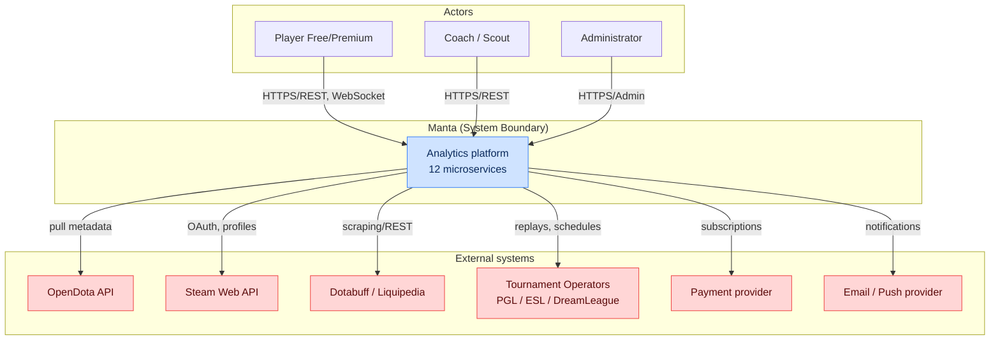
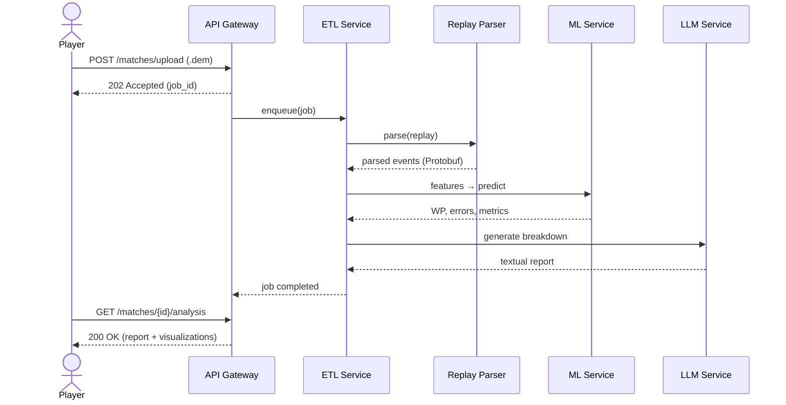

# Chapter 1. General Provisions and System Context

## 1.1. Business goals and platform purpose

This specification defines the architectural, functional, technical and mathematical requirements
for the **Manta** intelligent analytics platform. The project's goal is the aggregation,
processing, long-term storage and deep intelligent analysis of Dota 2 game data.

The system is intended to address the following key business tasks:

- **Professional analytics (B2B)** — providing esports organizations, coaches and scouts with an
  automated tool for dissecting opponents' strategies, match preparation and evaluating potential
  recruits.
- **Personal training (B2C)** — providing ordinary players with an interactive AI Coach to detect
  systematic mistakes, build individual training plans and raise their matchmaking rating (MMR).
- **Meta-trend forecasting** — mathematically modeling game balance to predict changes in hero and
  item effectiveness when updates (patches) are released.
- **Media and broadcasting** — supplying data and visualizations to studios and casters to enrich
  broadcasts (real-time win probability, heatmaps, timings).

### 1.1.1. Value proposition by segment

| Segment | Core pain | Platform solution | Key value metric |
|---|---|---|---|
| Professional teams | Manual replay review takes hours | Automated strategy and draft diffing | Analyst hours saved per match |
| Coaches / analysts | No objective error metrics | Error Detection Engine + Win Probability | Error classification accuracy |
| Casual players (Pub) | Unclear "why we lost" | AI Coach with textual breakdown | MMR gain per season |
| Scouts | Hard to compare players | Similarity Engine + radar profiles | Time to scout one player |
| Bookmakers / betting analysts | No live probability | Win Probability API | Calibration (Brier score) |
| Media / broadcasters | Dull static graphics | Live visualizations and overlays | Viewer engagement |

### 1.1.2. Product success metrics (North Star)

| Identifier | Metric | Target (12 months) |
|---|---|---|
| KPI-01 | Number of processed matches in DB | > 100,000,000 |
| KPI-02 | Median express replay analysis time | < 10 s |
| KPI-03 | Win Probability calibration (Brier score) | < 0.18 |
| KPI-04 | Error Detection Engine accuracy (F1) | > 0.82 |
| KPI-05 | Monthly active users (MAU) | > 250,000 |
| KPI-06 | Free → paid conversion | > 4.5% |
| KPI-07 | API Gateway uptime | ≥ 99.95% |

---

## 1.2. System constraints and non-functional requirements (NFRs)

Non-functional requirements are release acceptance criteria and are subject to mandatory automated
validation in the CI/CD loop and load testing.

### 1.2.1. Performance and scalability

| Identifier | Category | Validation criterion / Target |
|---|---|---|
| NFR-PERF-01 | Parsing performance | Processing one `.dem` replay of ~40 minutes ≤ **10 s** from ingestion into the pipeline. |
| NFR-PERF-02 | Recommendation speed | Similarity Engine and Draft Engine response time ≤ **2 s** (p95). |
| NFR-PERF-03 | REST API latency | p95 ≤ **300 ms**, p99 ≤ **800 ms** for read endpoints. |
| NFR-PERF-04 | Parsing throughput | ≥ **2,000** replays/hour per parser cluster. |
| NFR-SCAL-01 | Storage scalability | Indexing and analytical queries over > **100,000,000** matches without degradation. |
| NFR-SCAL-02 | Horizontal scaling | All stateless services scale linearly up to 50 replicas via HPA. |

### 1.2.2. Reliability and availability

| Identifier | Category | Validation criterion / Target |
|---|---|---|
| NFR-SLA-01 | API Gateway and UI availability | Uptime ≥ **99.95%** in 24/7/365 mode (≤ 21.9 min downtime/month). |
| NFR-REL-01 | Fault tolerance | Failure of one node of any stateless service causes no request loss. |
| NFR-REL-02 | Event delivery guarantees | Kafka: at-least-once for all topics; idempotent consumers. |
| NFR-REL-03 | Recovery (RPO/RTO) | RPO ≤ **5 min**, RTO ≤ **30 min** for critical stores. |
| NFR-REL-04 | Parse deduplication | Re-uploading the same replay creates no duplicates (idempotency key). |

### 1.2.3. Extensibility, maintainability, security

| Identifier | Category | Validation criterion / Target |
|---|---|---|
| NFR-EXT-01 | Extensibility (Multi-game) | Isolation of the core from Dota 2 specifics via abstract data interfaces. Porting to Deadlock/LoL without changing ML Service and API Gateway. |
| NFR-EXT-02 | Model pluggability | Adding a new ML model without changing consumer service code (via Model Registry). |
| NFR-MNT-01 | Test coverage | Line coverage of critical modules ≥ **80%**. |
| NFR-MNT-02 | Traceability | Every request carries an end-to-end `trace_id` across all services. |
| NFR-SEC-01 | Encryption in transit | TLS 1.3 for all external and mTLS for all internal connections. |
| NFR-SEC-02 | Encryption at rest | All PII and credentials encrypted at rest (AES-256). |
| NFR-SEC-03 | Compliance | GDPR compliance for deletion and export of personal data. |

### 1.2.4. NFR prioritization (MoSCoW)

| Priority | Requirements |
|---|---|
| **Must** | NFR-PERF-01, NFR-PERF-02, NFR-SCAL-01, NFR-SLA-01, NFR-REL-02, NFR-SEC-01 |
| **Should** | NFR-PERF-03, NFR-PERF-04, NFR-REL-03, NFR-EXT-01, NFR-MNT-01 |
| **Could** | NFR-SCAL-02, NFR-EXT-02, NFR-MNT-02, NFR-SEC-03 |

---

## 1.3. Roles, actors and stakeholders

### 1.3.1. Human actors

| Actor | Role | Key scenarios |
|---|---|---|
| Player (Free) | Casual user | Upload replay, view basic breakdown |
| Player (Premium) | Paying user | AI Coach, training plans, metric history |
| Coach / Analyst | Professional | Draft analysis, team comparison, export |
| Scout | Professional | Find similar players, radar profiles |
| Administrator | System operator | User management, moderation |
| ML engineer | Internal | Train/deploy models, monitor drift |
| SRE / DevOps | Internal | Operations, incident response |

### 1.3.2. External systems (system actors)

| System | Integration type | Purpose |
|---|---|---|
| OpenDota API | REST (pull) | Match metadata, public statistics |
| Steam Web API | REST + OAuth | Steam authentication, player profiles |
| Dotabuff | HTML/REST | Additional meta statistics |
| Liquipedia | REST/MediaWiki | Tournament data, rosters |
| Tournament Operators (PGL, ESL, DreamLeague) | REST/webhooks | Official replays and schedules |
| Payment provider | REST + webhooks | Subscriptions and billing |
| Email/push provider | REST | User notifications |

---

## 1.4. System boundaries and context diagram (C4 — Level 1)

### 1.4.1. In scope vs. out of scope

| In scope | Out of scope |
|---|---|
| Collection, parsing and storage of matches | Anti-cheat / Valve game-client moderation |
| Analytics, ML evaluation, AI Coach | Modifying the Dota 2 gameplay |
| Web interface and visualizations | Native mobile apps (phase 2+) |
| Subscription billing (via provider) | In-house payment processing |
| Meta and draft forecasting | Guaranteeing real betting outcomes |

---

## 1.5. Key user scenarios (Use Cases)

### 1.5.1. UC-01 — Express analysis of an uploaded replay

| Field | Value |
|---|---|
| **ID** | UC-01 |
| **Actor** | Player (Free/Premium) |
| **Precondition** | User authenticated; file is a valid `.dem` |
| **Main flow** | Upload → parse → features → prediction → report |
| **Postcondition** | Analysis available in the user's history |
| **NFR** | NFR-PERF-01 (≤ 10 s parsing) |

### 1.5.2. Catalog of main scenarios

| ID | Scenario | Primary actor | Related services |
|---|---|---|---|
| UC-01 | Express replay analysis | Player | ETL, Parser, ML, LLM |
| UC-02 | Real-time draft simulation | Coach | Draft Engine, Meta Engine |
| UC-03 | Personal training plan | Premium player | Recommendation, ML |
| UC-04 | Search for similar matches/players | Scout | Similarity Engine |
| UC-05 | AI Coach report over a game series | Premium player | LLM, Feature Store |
| UC-06 | Meta-trend monitoring | Analyst | Meta Engine |
| UC-07 | Live Win Probability for broadcast | Media | ML, API Gateway (WS) |
| UC-08 | Subscription management | Player | API Gateway, Billing |

---

## 1.6. Glossary and terminology

| Term | Definition |
|---|---|
| **Tick** | Discrete frame of game state; Source 2 runs at 30 ticks/s. |
| **`.dem`** | Dota 2 replay file format (Source 2 Demo), a compressed Protobuf message stream. |
| **Win Probability (WP)** | Dynamic probability of a team winning at time `t`. |
| **ΔWP** | Increment of WP characterizing the value/mistake of a player's action. |
| **Safety Index (SI)** | Positional risk index of a hero being at a map point. |
| **Draft** | The hero pick/ban stage before a match. |
| **Meta** | Current balance state: popular heroes, items, strategies. |
| **Feature Store** | Centralized feature registry for training and inference. |
| **PSI** | Population Stability Index — a data distribution drift metric. |
| **GNN** | Graph Neural Network — models hero synergy. |
| **RAG** | Retrieval-Augmented Generation. |
| **MMR** | Matchmaking Rating. |
| **Last Hit (LH) / Deny (DN)** | Killing an allied/enemy creep. |
| **GPM / XPM** | Gold / Experience per minute. |
| **Buyback** | Instant hero respawn for gold. |
| **Roshan** | Key neutral boss granting a strategic advantage. |
| **SLO / SLA / SLI** | Service Level Objective / Agreement / Indicator. |

---

## 1.7. Assumptions, constraints and top-level risks

| Type | Statement | Impact |
|---|---|---|
| Assumption | Valve keeps the `.dem` format stable within Source 2 | High |
| Assumption | External APIs (OpenDota) keep availability and limits | Medium |
| Constraint | PII processing is governed by GDPR | High |
| Constraint | Replay parsing is CPU-intensive, requires horizontal scaling | High |
| Risk | Dota 2 network protocol change via a patch | Requires parser adapters |
| Risk | Meta drift after a major patch | Model auto-retraining (Ch. 10) |

A detailed risk register and mitigation strategies are in [Chapter 14](14-roadmap.md#146-risk-register).
