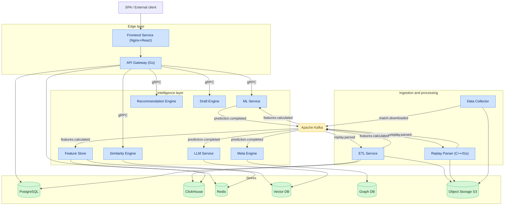
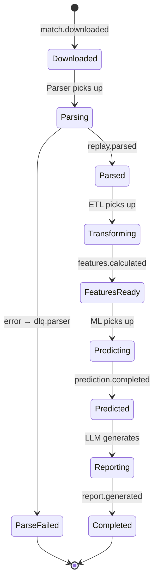

# Chapter 2. Microservice Architecture and Infrastructure

## 2.1. Global system topology

The platform implements a distributed microservice architecture. Inter-service communication is
split into two planes:

- A **synchronous high-performance RPC plane** based on **gRPC** — for low-latency request/response
  calls (e.g. ML inference, similar-match search).
- An **asynchronous event pipeline** based on **Apache Kafka** — for streaming processing, service
  decoupling and resilience under peak load.

### 2.1.1. Specification of the 12 key microservices

| # | Service | Core technology | Workload type | State |
|---|---|---|---|---|
| 1 | **API Gateway** | Go | I/O-bound | Stateless |
| 2 | **Data Collector** | Python / Go | I/O-bound | Stateful (scheduler) |
| 3 | **Replay Parser** | C++ / Go | CPU-bound | Stateless |
| 4 | **ETL Service** | Python (Faust/Flink) | CPU+I/O | Stateless |
| 5 | **Feature Store** | Python + Feast | I/O-bound | Stateful |
| 6 | **ML Service** | Python (PyTorch/LightGBM/XGBoost) | CPU/GPU | Stateless |
| 7 | **LLM Service** | Python (RAG orchestration) | I/O+GPU | Stateless |
| 8 | **Recommendation Engine** | Python | CPU-bound | Stateless |
| 9 | **Draft Engine** | Go / Python | CPU-bound | Stateless |
| 10 | **Meta Engine** | Python + Graph DB | I/O-bound | Stateful |
| 11 | **Similarity Engine** | Python + Vector DB | CPU-bound | Stateful |
| 12 | **Frontend Service** | React + TypeScript / Nginx | I/O-bound | Stateless |

### 2.1.2. Service roles

- **API Gateway** — the single entry point. Implements routing, authentication (JWT), rate limiting,
  TLS termination and response aggregation (BFF pattern).
- **Data Collector** — schedules and collects data from external sources (OpenDota API, Dotabuff,
  Liquipedia, official APIs of tournament operators PGL, ESL, DreamLeague).
- **Replay Parser** — an isolated high-performance service performing low-level parsing of binary
  `.dem` files.
- **ETL Service** — validation, cleaning, normalization of parsed data and routing to ClickHouse and
  PostgreSQL.
- **Feature Store** — a centralized feature registry serving ML models in real time and building
  training datasets.
- **ML Service** — a containerized runtime for predictive models (PyTorch, LightGBM, XGBoost).
- **LLM Service** — orchestration of large language models and a RAG architecture to generate AI
  Coach textual reports.
- **Recommendation Engine** — builds personal training plans and selects learning materials from a
  player profile.
- **Draft Engine** — real-time simulation of the hero pick/ban stage.
- **Meta Engine** — a graph analytics module tracking win-rate trends, strategy popularity and object
  distribution.
- **Similarity Engine** — search for spatiotemporal and strategic analogies in the historical match
  database.
- **Frontend Service** — a React + TypeScript SPA served behind a resilient Nginx cluster.

---

## 2.2. Container diagram (C4 — Level 2)



---

## 2.3. Inter-service communication and message queues

Asynchronous communication is implemented over the Apache Kafka data bus. The main topics and event
types are captured in the table below.

### 2.3.1. Kafka topic registry

| Topic | Producer | Consumers | Payload format | Partitions | Retention |
|---|---|---|---|---|---|
| `match.downloaded` | Data Collector | Replay Parser | JSON: match ID, `.dem` URL, tournament metadata | 24 | 7 days |
| `replay.parsed` | Replay Parser | ETL Service | Protobuf: binary stream of tick events | 48 | 3 days |
| `features.calculated` | ETL Service | Feature Store, ML Service | Avro: aggregated feature vectors by window | 24 | 14 days |
| `prediction.completed` | ML Service | LLM Service, Meta Engine | JSON: probability matrices, error IDs, anomaly vectors | 12 | 14 days |
| `report.generated` | LLM Service | API Gateway (notify) | JSON: report ID, link, summary | 6 | 7 days |
| `meta.updated` | Meta Engine | Draft Engine, Frontend | JSON: meta snapshot, win-rate deltas | 3 | 30 days |
| `dlq.parser` | Replay Parser | Ops monitoring | JSON: failure reason, payload | 6 | 30 days |

### 2.3.2. Message standards

- **Partition key** — `match_id` (guarantees per-match ordering).
- **Headers** — `trace_id`, `schema_version`, `producer`, `timestamp`, `content_type`.
- **Schema management** — Confluent Schema Registry; `BACKWARD` compatibility.
- **Serialization** — Avro for analytics, Protobuf for high-frequency streams, JSON for control events.

### 2.3.3. Event envelope

```json
{
  "event_id": "e2b1c9a4-6f0d-4b1a-9c5e-1f2a3b4c5d6e",
  "event_type": "replay.parsed",
  "schema_version": "1.3.0",
  "trace_id": "9f8e7d6c-...",
  "occurred_at": "2026-07-13T10:22:31.114Z",
  "producer": "replay-parser@2.0.0",
  "partition_key": "match_id:7654321098",
  "payload": { "...": "..." }
}
```

---

## 2.4. Synchronous plane: gRPC

Internal RPC calls use gRPC over HTTP/2 with mTLS. Contracts are defined in Protobuf files (see the
[proto appendix](../proto/)).

### 2.4.1. gRPC dependency matrix

| Caller | Callee | RPC method | Timeout | Retries |
|---|---|---|---|---|
| API Gateway | ML Service | `Predict` | 2 s | 1 |
| API Gateway | Similarity Engine | `FindSimilar` | 2 s | 2 |
| API Gateway | Draft Engine | `SimulateDraft` | 1.5 s | 1 |
| API Gateway | Recommendation | `BuildPlan` | 2 s | 1 |
| ETL Service | Feature Store | `WriteFeatures` | 3 s | 3 |
| ML Service | Feature Store | `GetOnlineFeatures` | 500 ms | 2 |
| LLM Service | Similarity Engine | `RetrieveContext` | 2 s | 1 |

### 2.4.2. Resilience policies

| Mechanism | Implementation | Parameters |
|---|---|---|
| Circuit breaker | gRPC interceptor | 50% error threshold / 10 s window |
| Retry with backoff | exponential + jitter | base 100 ms, max 3 attempts |
| Deadline propagation | gRPC context | inherited from incoming request |
| Bulkhead | per-dependency connection pool | max 100 conn/service |
| Rate limiting | token bucket at Gateway | per user and per endpoint |

---

## 2.5. Architectural patterns

| Pattern | Where applied | Why |
|---|---|---|
| **API Gateway / BFF** | Edge layer | Single entry point, aggregation, security |
| **Database per Service** | All stateful services | Schema isolation, independent deploys |
| **Event-driven / Pub-Sub** | Data pipeline | Decoupling, resilience, scaling |
| **CQRS** | Analytics vs. transactions | PostgreSQL (write) / ClickHouse (read-heavy) |
| **Saga (choreography)** | Match processing pipeline | Long distributed processes without 2PC |
| **Outbox** | ETL, Data Collector | Atomic DB write and event publish |
| **Sidecar** | All pods | mTLS, metrics, tracing (service mesh) |
| **Strangler Fig** | Multi-game extension | Gradual replacement of Dota specifics with abstractions |
| **Anti-Corruption Layer** | External API integration | Protect the core from foreign data models |

### 2.5.1. Match-processing saga (choreography)



---

## 2.6. Infrastructure landscape

### 2.6.1. Infrastructure technology stack

| Layer | Technology | Purpose |
|---|---|---|
| Orchestration | Kubernetes | Container management |
| Service Mesh | Istio / Linkerd | mTLS, tracing, traffic management |
| Ingress | Nginx Ingress / Envoy | TLS termination, routing |
| Message broker | Apache Kafka (KRaft) | Event pipeline |
| Schema Registry | Confluent Schema Registry | Avro/Protobuf schema management |
| Cache | Redis Cluster | Online features, sessions, rate-limit |
| OLTP | PostgreSQL (Patroni HA) | Transactional data |
| OLAP | ClickHouse (sharded) | Analytical queries |
| Vector DB | Qdrant / Milvus | Embeddings for Similarity/RAG |
| Graph DB | Neo4j / JanusGraph | Hero synergy graph |
| Object Storage | S3-compatible (MinIO) | Replays, model artifacts |
| Workflow | Apache Airflow | Batch pipelines and retraining |
| IaC | Terraform + Helm | Provisioning and deployment |
| Secrets | Vault / Sealed Secrets | Secret management |
| CI/CD | GitHub Actions + ArgoCD | Build and GitOps deploy |
| Observability | Prometheus, Grafana, Loki, Tempo | Metrics, logs, traces |

### 2.6.2. Environment matrix

| Environment | Purpose | Data | Scale |
|---|---|---|---|
| `dev` | Local development | Synthetic/sample | 1 replica/service |
| `staging` | Pre-release validation | Anonymized prod slice | ~30% of prod |
| `production` | Live operation | Full data | Autoscaling |
| `ml-training` | Model training | DVC datasets | GPU nodes on demand |

---

## 2.7. Design principles and ADRs

Key architectural decisions are recorded as **Architecture Decision Records (ADRs)** in `docs/adr/`.
Overview of the main decisions:

| ADR | Decision | Rationale |
|---|---|---|
| ADR-001 | Kafka as the main event bus | High throughput, retention, replay |
| ADR-002 | ClickHouse for replay events | Columnar storage, aggregation speed |
| ADR-003 | gRPC for internal calls | Latency, strict contracts, streaming |
| ADR-004 | Parser in C++/Go | CPU efficiency of binary stream parsing |
| ADR-005 | Feast as Feature Store | Unified online/offline feature registry |
| ADR-006 | Istio service mesh | mTLS and observability without code changes |
| ADR-007 | Core abstraction for Multi-game | NFR-EXT-01, porting to Deadlock/LoL |

Detailed responsibilities, SLOs and the internal structure of each service are covered in
[Chapter 3](03-service-specifications.md).
