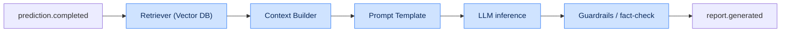

# Chapter 3. Detailed Microservice Specifications

Each service is described using a single template: purpose, responsibilities, technology stack,
input/output interfaces, data ownership, dependencies, scaling strategy, service level objectives
(SLOs) and failure modes.

---

## 3.1. Common template and summary matrix

### 3.1.1. Service summary matrix

| Service | Language/runtime | Protocols | Owns data | Key SLO |
|---|---|---|---|---|
| API Gateway | Go | REST, WS, gRPC-client | — | p95 ≤ 300 ms |
| Data Collector | Python/Go | REST-client, Kafka | Source registry | Collection completeness ≥ 99% |
| Replay Parser | C++/Go | Kafka, gRPC | — (stateless) | ≤ 10 s/replay |
| ETL Service | Python | Kafka, gRPC | Staging tables | Lag ≤ 30 s |
| Feature Store | Python+Feast | gRPC, Redis, CH | Feature registry | GetOnline p95 ≤ 50 ms |
| ML Service | Python | gRPC, Kafka | Model artifacts | Predict p95 ≤ 400 ms |
| LLM Service | Python | gRPC, Kafka, REST | Prompts, RAG cache | Report ≤ 8 s |
| Recommendation | Python | gRPC | Training plans | BuildPlan ≤ 2 s |
| Draft Engine | Go/Python | gRPC | Draft cache | SimulateDraft ≤ 1.5 s |
| Meta Engine | Python+Graph | gRPC, Kafka | Meta graph | Update ≤ 24 h |
| Similarity Engine | Python+Vector | gRPC | Embedding index | FindSimilar ≤ 2 s |
| Frontend Service | React/Nginx | HTTPS | — | LCP ≤ 2.5 s |

### 3.1.2. Service × store matrix (CRUD)

| Service / Store | PostgreSQL | ClickHouse | Redis | Vector DB | Graph DB | S3 | Kafka |
|---|---|---|---|---|---|---|---|
| API Gateway | R | — | RW | — | — | — | — |
| Data Collector | RW | — | R | — | — | W | P |
| Replay Parser | — | — | — | — | — | RW | P/C |
| ETL Service | RW | W | — | — | — | R | P/C |
| Feature Store | — | R | RW | — | — | — | C |
| ML Service | — | R | R | — | — | R | P/C |
| LLM Service | R | — | R | R | — | — | C |
| Recommendation | R | R | R | R | — | — | — |
| Draft Engine | R | R | RW | — | R | — | C |
| Meta Engine | R | R | — | — | RW | — | P/C |
| Similarity Engine | — | R | R | RW | — | — | — |

> R — read, W — write, P — Kafka producer, C — Kafka consumer.

---

## 3.2. API Gateway

| Attribute | Value |
|---|---|
| **Purpose** | Single entry point for all external clients. |
| **Technologies** | Go, Gin/Fiber, gRPC client, Redis. |
| **Type** | Stateless, horizontally scalable. |

**Responsibilities:**

- TLS 1.3 termination and proxying to internal services.
- Authentication (JWT validation) and authorization (RBAC checks).
- Rate limiting (token bucket) per user, IP and endpoint.
- Response aggregation (BFF) for composite frontend screens.
- WebSocket connection management for live updates (WP, draft).
- Propagating `trace_id` and collecting latency metrics.

**Main endpoints (overview; full contract in Ch. 7):**

| Method | Path | Purpose |
|---|---|---|
| POST | `/api/v1/matches/upload` | Upload replay |
| GET | `/api/v1/matches/{id}/analysis` | Analysis result |
| POST | `/api/v1/draft/simulate` | Draft simulation |
| GET | `/api/v1/players/{id}/profile` | Player profile |
| POST | `/api/v1/similarity/search` | Similar search |
| WS | `/api/v1/live/{match_id}` | Live win probability |

**SLO:** availability ≥ 99.95%, p95 ≤ 300 ms, error rate < 0.1%.

**Failure modes:** on downstream unavailability — graceful degradation (partial response + `partial:
true` flag), circuit breaker, cache fallback.

---

## 3.3. Data Collector

| Attribute | Value |
|---|---|
| **Purpose** | Scheduling and collecting data from external sources. |
| **Technologies** | Python (APScheduler/Celery) or Go, HTTP clients, S3. |
| **Type** | Stateful (stores cursors/schedules). |

**Responsibilities:**

- Periodic polling of OpenDota, Dotabuff, Liquipedia, tournament operator APIs.
- Deduplicating matches by `match_id` and idempotency keys.
- Downloading `.dem` into Object Storage, publishing `match.downloaded`.
- Respecting external API limits (adaptive rate limiting, backoff).
- Anti-Corruption Layer: mapping foreign models to the internal schema.

**Collection strategies:**

| Source | Mode | Frequency | Notes |
|---|---|---|---|
| OpenDota | pull (REST) | every 5 min | pagination by seq_num |
| Tournament Operators | webhook + pull | on event | priority queue |
| Dotabuff | scraping/REST | hourly | polite rate limit |
| Liquipedia | REST/MediaWiki | daily | rosters, schedules |

**SLO:** public match collection completeness ≥ 99%, new-match detection lag ≤ 10 min.

---

## 3.4. Replay Parser

| Attribute | Value |
|---|---|
| **Purpose** | Low-level parsing of binary `.dem` files (Source 2 Demo). |
| **Technologies** | C++17 (core) + Go (wrapper/gRPC), Protobuf. |
| **Type** | Stateless, CPU-bound, vertically boosted. |

**Responsibilities:**

- Decoding the compressed Protobuf message stream and networked entities.
- Extracting positions, economy, combat events, map vision (see Ch. 5).
- Serializing the normalized event stream to Protobuf → `replay.parsed`.
- Handling corrupted files → `dlq.parser`.

**Key NFRs:** NFR-PERF-01 (≤ 10 s per 40-min replay), NFR-PERF-04 (≥ 2000 replays/h per cluster).

**Internal submodules:**

| Module | Responsibility |
|---|---|
| `DemoReader` | Reading frames, decompression (snappy/LZ4) |
| `EntityDecoder` | Decoding networked entities and delta updates |
| `StringTables` | Parsing string tables (heroes, items) |
| `EventExtractor` | Combat log, purchases, wards, abilities |
| `Serializer` | Building the output Protobuf stream |

**SLO:** parse success ≥ 99.5%, parse-time p95 ≤ 10 s.

---

## 3.5. ETL Service

| Attribute | Value |
|---|---|
| **Purpose** | Validation, cleaning, normalization and routing of data. |
| **Technologies** | Python (Faust/Flink), Great Expectations, Avro. |
| **Type** | Stateless stream processor. |

**Responsibilities:**

- Consuming `replay.parsed`, deduplication and data-quality validation (see Ch. 5.4).
- Enrichment (join with match/player metadata).
- Windowed feature aggregation (temporal windows) → `features.calculated`.
- Writing raw events to ClickHouse and structured entities to PostgreSQL.
- Implementing the Outbox pattern for atomic write and publish.

**SLO:** end-to-end processing lag ≤ 30 s (p95), share of dropped "dirty" records < 0.5%.

---

## 3.6. Feature Store

| Attribute | Value |
|---|---|
| **Purpose** | Centralized feature registry (online/offline). |
| **Technologies** | Python + Feast, Redis (online), ClickHouse (offline). |
| **Type** | Stateful. |

**Responsibilities:**

- Registering feature definitions (feature views) and their versions.
- Online serving (`GetOnlineFeatures`) with p95 ≤ 50 ms latency.
- Building training datasets with point-in-time correctness (no leakage).
- Monitoring feature freshness and coverage.

**Feature categories (overview):**

| Group | Examples | Update |
|---|---|---|
| Laning | LH@5, DN@5, farm deviation | per match |
| Economy | GPM, XPM, net worth timeline | per window |
| Positioning | average position, Safety Index | per window |
| Draft | hero embeddings, synergy | per patch |
| Player | historical win rate, MMR | daily |

**SLO:** `GetOnlineFeatures` p95 ≤ 50 ms, online feature freshness ≤ 1 min.

---

## 3.7. ML Service

| Attribute | Value |
|---|---|
| **Purpose** | Executing predictive models. |
| **Technologies** | Python, PyTorch, LightGBM, XGBoost, Triton/ONNX Runtime. |
| **Type** | Stateless, CPU/GPU. |

**Responsibilities:**

- Loading model versions from the Model Registry (MLflow).
- Inference: Win Probability, Laning Evaluator, Draft Predictor, Error Detection.
- Publishing `prediction.completed`.
- A/B and shadow model deploys, collecting production quality metrics.

**Served models (details in Ch. 6):**

| Model | Algorithm | Task |
|---|---|---|
| Win Probability | ensemble (GBDT+NN) | probability regression |
| Laning Evaluator | XGBoost Regressor | laning evaluation |
| Draft Predictor | GNN (PyTorch) | draft win-rate prediction |
| Error Detection | LightGBM Classifier | error classification |

**SLO:** `Predict` p95 ≤ 400 ms, availability ≥ 99.9%.

---

## 3.8. LLM Service

| Attribute | Value |
|---|---|
| **Purpose** | Generating AI Coach textual breakdowns via RAG. |
| **Technologies** | Python, LLM orchestrator, Vector DB, prompt cache. |
| **Type** | Stateless, I/O+GPU. |

**Responsibilities:**

- Building RAG context: retrieving relevant match/meta facts from the Vector DB.
- Prompt templating and calling the LLM with cost/latency limits.
- Post-processing: structuring the report, fact validation (guardrails).
- Caching responses by request signature.

**RAG pipeline:**

**SLO:** report generation ≤ 8 s (p95), share of guardrail-rejected reports < 2%.

---

## 3.9. Recommendation Engine

| Attribute | Value |
|---|---|
| **Purpose** | Personal training plans and material selection. |
| **Technologies** | Python, hybrid (collaborative + content-based + rule). |
| **Type** | Stateless. |

**Responsibilities:**

- Analyzing a player's weakness profile (from Error Detection and metrics).
- Building a prioritized plan of exercises/materials.
- Ranking learning content by relevance and skill level.

**SLO:** `BuildPlan` p95 ≤ 2 s, recommendation coverage ≥ 95% of active players.

---

## 3.10. Draft Engine

| Attribute | Value |
|---|---|
| **Purpose** | Real-time pick/ban simulation. |
| **Technologies** | Go/Python, Redis cache, GNN inference (via ML Service). |
| **Type** | Stateless, CPU-bound. |

**Responsibilities:**

- Step-by-step draft simulation accounting for bans, synergy and counter-picks.
- Recommending the next pick/ban with an expected win-rate estimate.
- Accounting for the current meta (from Meta Engine) and patch.

**SLO:** `SimulateDraft` p95 ≤ 1.5 s, recommendation stability across calls.

---

## 3.11. Meta Engine

| Attribute | Value |
|---|---|
| **Purpose** | Tracking global meta trends. |
| **Technologies** | Python, Graph DB (Neo4j/JanusGraph), Airflow. |
| **Type** | Stateful. |

**Responsibilities:**

- Building and updating the hero synergy/counter-pick graph.
- Computing win-rate and popularity trends by patch and rank.
- Publishing `meta.updated` for Draft Engine and Frontend.

**SLO:** meta snapshot update ≤ 24 h after data availability, graph consistency.

---

## 3.12. Similarity Engine

| Attribute | Value |
|---|---|
| **Purpose** | Search for spatiotemporal and strategic analogies. |
| **Technologies** | Python, Vector DB (Qdrant/Milvus), ANN indexes (HNSW). |
| **Type** | Stateful. |

**Responsibilities:**

- Indexing embeddings of matches/players/situations.
- ANN search for similar matches and players by feature vector.
- Serving RAG retrieval for the LLM Service.

**SLO:** `FindSimilar` p95 ≤ 2 s, recall@10 ≥ 0.9 vs. exact search.

---

## 3.13. Frontend Service

| Attribute | Value |
|---|---|
| **Purpose** | Delivering the SPA and static assets. |
| **Technologies** | React + TypeScript, Zustand, Nginx. |
| **Type** | Stateless. |

**Responsibilities:**

- Serving the built SPA bundle and assets via CDN/Nginx.
- Interactive 2D map (Canvas/WebGL), radar profiles, dashboards.
- Managing client state and WebSocket subscriptions.

**SLO:** LCP ≤ 2.5 s, TTI ≤ 3.5 s, static availability ≥ 99.95%.
Frontend details are in [Chapter 8](08-frontend.md).

---

## 3.14. Service degradation matrix

| Failed service | User impact | Degradation strategy |
|---|---|---|
| ML Service | No fresh predictions | Serve cache + "updating" banner |
| LLM Service | No textual breakdown | Show metrics without narrative |
| Similarity Engine | No "similar" | Hide block, core still works |
| Draft Engine | No live simulation | Static meta recommendations |
| Meta Engine | Stale meta | Use last snapshot |
| Feature Store (online) | Slow inference | Fallback to offline features |
| Data Collector | No new matches | Process the accumulated queue |
