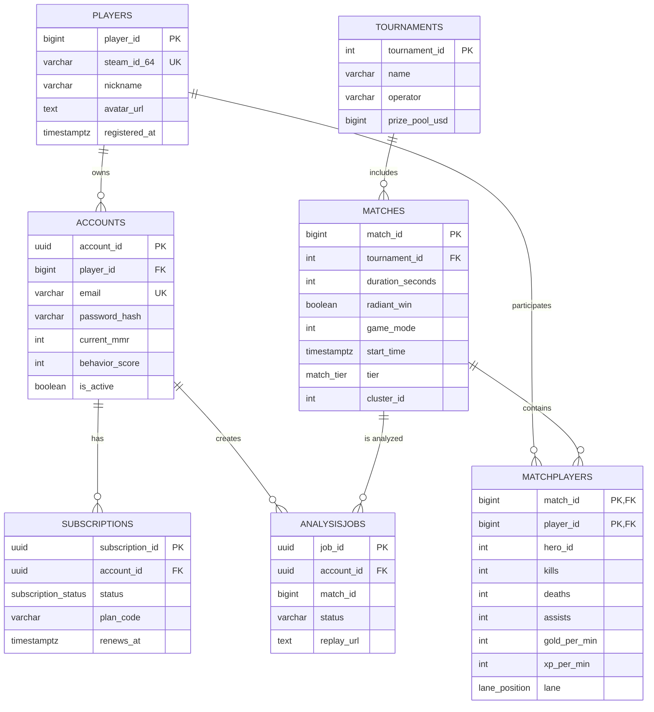
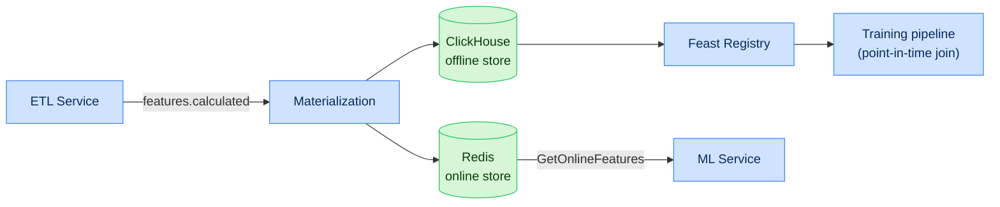

# Chapter 4. Data Storage Architecture and Feature Store

## 4.1. Storage strategy (Polyglot Persistence)

The platform uses polyglot persistence: each workload type is served by a specialized store.
Separation of reads and writes implements the **CQRS** pattern.

| Store | Model | Workload | Data |
|---|---|---|---|
| PostgreSQL | Relational (OLTP) | ACID transactions | Players, accounts, matches, subscriptions |
| ClickHouse | Columnar (OLAP) | Analytics, aggregations | Replay events, time series |
| Redis | Key-value | Cache, online features | Sessions, rate-limit, online features |
| Vector DB | Vector (ANN) | Similarity/RAG | Match/player embeddings |
| Graph DB | Graph | Relationship traversal | Hero synergy graph |
| Object Storage | BLOB | Large objects | `.dem` files, model artifacts |

---

## 4.2. Relational layer (PostgreSQL DDL)

The relational database stores structured entities requiring ACID transactions, uniqueness control
and strict relational links.

```sql
-- Base enumerations (Enums)
CREATE TYPE match_tier AS ENUM ('Pub', 'Premium', 'Professional', 'Tournament');
CREATE TYPE lane_position AS ENUM ('Safe_Safe', 'Safe_Mid', 'Mid', 'Off_Safe', 'Off_Mid', 'Roaming');
CREATE TYPE subscription_status AS ENUM ('active', 'past_due', 'canceled', 'trialing');

-- Players table
CREATE TABLE Players (
    player_id      BIGINT PRIMARY KEY,
    steam_id_64    VARCHAR(20) UNIQUE NOT NULL,
    nickname       VARCHAR(100) NOT NULL,
    avatar_url     TEXT,
    registered_at  TIMESTAMP WITH TIME ZONE DEFAULT NOW(),
    updated_at     TIMESTAMP WITH TIME ZONE DEFAULT NOW()
);

-- Platform accounts table
CREATE TABLE Accounts (
    account_id      UUID PRIMARY KEY DEFAULT gen_random_uuid(),
    player_id       BIGINT REFERENCES Players(player_id) ON DELETE CASCADE,
    email           VARCHAR(255) UNIQUE NOT NULL,
    password_hash   VARCHAR(255) NOT NULL,
    current_mmr     INT DEFAULT 0,
    behavior_score  INT DEFAULT 10000,
    is_active       BOOLEAN DEFAULT TRUE,
    created_at      TIMESTAMP WITH TIME ZONE DEFAULT NOW()
);

-- Matches table
CREATE TABLE Matches (
    match_id          BIGINT PRIMARY KEY,
    tournament_id     INT,
    duration_seconds  INT NOT NULL,
    radiant_win       BOOLEAN NOT NULL,
    game_mode         INT NOT NULL,
    lobby_type        INT NOT NULL,
    start_time        TIMESTAMP WITH TIME ZONE NOT NULL,
    tier              match_tier DEFAULT 'Pub',
    cluster_id        INT NOT NULL,
    patch_version     VARCHAR(16)
);

-- Match participants (M:N junction table)
CREATE TABLE MatchPlayers (
    match_id      BIGINT REFERENCES Matches(match_id) ON DELETE CASCADE,
    player_id     BIGINT REFERENCES Players(player_id) ON DELETE RESTRICT,
    hero_id       INT NOT NULL,
    player_slot   INT NOT NULL,
    kills         INT DEFAULT 0,
    deaths        INT DEFAULT 0,
    assists       INT DEFAULT 0,
    gold_per_min  INT NOT NULL,
    xp_per_min    INT NOT NULL,
    lane          lane_position,
    PRIMARY KEY (match_id, player_id)
);

-- Tournaments
CREATE TABLE Tournaments (
    tournament_id  INT PRIMARY KEY,
    name           VARCHAR(200) NOT NULL,
    operator       VARCHAR(50),
    prize_pool_usd BIGINT,
    start_date     DATE,
    end_date       DATE
);

-- Subscriptions
CREATE TABLE Subscriptions (
    subscription_id UUID PRIMARY KEY DEFAULT gen_random_uuid(),
    account_id      UUID REFERENCES Accounts(account_id) ON DELETE CASCADE,
    status          subscription_status NOT NULL DEFAULT 'trialing',
    plan_code       VARCHAR(50) NOT NULL,
    started_at      TIMESTAMP WITH TIME ZONE DEFAULT NOW(),
    renews_at       TIMESTAMP WITH TIME ZONE
);

-- Analysis jobs
CREATE TABLE AnalysisJobs (
    job_id          UUID PRIMARY KEY DEFAULT gen_random_uuid(),
    account_id      UUID REFERENCES Accounts(account_id),
    match_id        BIGINT,
    status          VARCHAR(20) NOT NULL DEFAULT 'queued',
    replay_url      TEXT,
    created_at      TIMESTAMP WITH TIME ZONE DEFAULT NOW(),
    completed_at    TIMESTAMP WITH TIME ZONE
);

-- Indexes
CREATE INDEX idx_matches_start_time ON Matches (start_time DESC);
CREATE INDEX idx_matches_tier ON Matches (tier);
CREATE INDEX idx_matchplayers_hero ON MatchPlayers (hero_id);
CREATE INDEX idx_jobs_account_status ON AnalysisJobs (account_id, status);
```

### 4.2.1. Key table dictionary

| Table | Purpose | Cardinality (estimate) |
|---|---|---|
| `Players` | Steam players | ~50M |
| `Accounts` | Platform accounts | ~1M |
| `Matches` | Matches | > 100M |
| `MatchPlayers` | Participants (10 per match) | > 1B |
| `Tournaments` | Tournaments | ~10K |
| `Subscriptions` | Subscriptions | ~1M |
| `AnalysisJobs` | Analysis jobs | tens of millions |

---

## 4.3. ER diagram of the relational model



---

## 4.4. Analytical layer (ClickHouse)

ClickHouse is used for columnar storage of high-intensity event streams from replays. The schema is
optimized for aggregating spatial coordinates.

```sql
CREATE TABLE default.ReplayEvents (
    match_id      UInt64,
    tick          UInt32,
    game_time     Int32,
    event_type    Enum8('DAMAGE'=1, 'HEAL'=2, 'KILL'=3, 'ABILITY_CAST'=4,
                        'ITEM_PURCHASE'=5, 'WARD_PLACE'=6),
    player_id     UInt64,
    target_id     UInt64,
    x             Float32,
    y             Float32,
    z             Float32,
    value_amount  Int32,
    inflictor     String
) ENGINE = ReplacingMergeTree()
PARTITION BY toYYYYMM(FROM_UNIXTIME(game_time))
ORDER BY (match_id, event_type, tick, player_id);
```

### 4.4.1. Additional analytical tables

```sql
-- Per-player economy time series (for WP and net worth charts)
CREATE TABLE default.EconomyTimeline (
    match_id       UInt64,
    player_id      UInt64,
    game_time      Int32,
    net_worth      Int32,
    total_gold     Int32,
    total_xp       Int32,
    lh             UInt16,
    dn             UInt16
) ENGINE = MergeTree()
PARTITION BY toYYYYMM(FROM_UNIXTIME(game_time))
ORDER BY (match_id, player_id, game_time);

-- Positions for heatmaps (downsampled)
CREATE TABLE default.PositionSnapshots (
    match_id   UInt64,
    player_id  UInt64,
    game_time  Int32,
    x          Float32,
    y          Float32,
    is_alive   UInt8
) ENGINE = MergeTree()
PARTITION BY toYYYYMM(FROM_UNIXTIME(game_time))
ORDER BY (match_id, game_time, player_id);

-- Materialized view of hero win rate by patch
CREATE MATERIALIZED VIEW default.HeroWinrateMV
ENGINE = SummingMergeTree()
ORDER BY (patch_version, hero_id)
AS SELECT
    patch_version, hero_id,
    countIf(won) AS wins,
    count() AS games
FROM default.HeroMatchResults
GROUP BY patch_version, hero_id;
```

### 4.4.2. ClickHouse modeling principles

| Principle | Implementation |
|---|---|
| Partitioning | by month (`toYYYYMM`) for efficient TTL |
| Sorting (ORDER BY) | by frequent filters: `match_id`, `event_type` |
| Deduplication | `ReplacingMergeTree` by sort key |
| Pre-aggregation | Materialized Views (`SummingMergeTree`) |
| TTL | raw events — 18 months, aggregates — indefinite |
| Sharding | by `match_id` (Distributed tables) |
| Compression codecs | `Delta`, `DoubleDelta`, `ZSTD` for time series |

---

## 4.5. Feature Store

The Feature Store (based on Feast) provides unified access to features for training (offline) and
inference (online), guaranteeing no training/serving skew.

### 4.5.1. Feature Store architecture



### 4.5.2. Feature View registry

| Feature View | Entity | Features | Online | TTL |
|---|---|---|---|---|
| `laning_fv` | (match_id, player_id) | lh_5, dn_5, dmg_5, consumables_5 | yes | 90 d |
| `economy_fv` | (match_id, player_id) | gpm, xpm, nw_10, nw_20 | yes | 90 d |
| `position_fv` | (match_id, player_id, window) | avg_x, avg_y, safety_index | yes | 30 d |
| `draft_fv` | (patch, hero_id) | hero_embedding, synergy_vec | yes | per patch |
| `player_fv` | (player_id) | hist_winrate, mmr, main_role | yes | 1 d |

### 4.5.3. Correctness guarantees

| Guarantee | Mechanism |
|---|---|
| No data leakage | Point-in-time correct join on `event_timestamp` |
| Online feature freshness | Materialization ≤ 1 min after `features.calculated` |
| Versioning | Each feature view is versioned; changes via PR |
| Drift detection | PSI on key features (see Ch. 10) |

---

## 4.6. Data lifecycle management

| Category | Store | Retention | Action on expiry |
|---|---|---|---|
| `.dem` files | S3 | 90 days (Pub), indefinite (Pro) | archive/delete |
| Raw events | ClickHouse | 18 months | TTL DROP |
| Aggregates/MVs | ClickHouse | indefinite | — |
| Online features | Redis | 24 hours | eviction |
| PII (accounts) | PostgreSQL | until deletion request | GDPR erasure |
| Model artifacts | S3 + MLflow | per version policy | archiving |

### 4.6.1. Backup and recovery

| Store | Strategy | RPO | RTO |
|---|---|---|---|
| PostgreSQL | WAL archiving + PITR | ≤ 5 min | ≤ 30 min |
| ClickHouse | incremental backups to S3 | ≤ 1 h | ≤ 2 h |
| Vector/Graph DB | snapshots | ≤ 6 h | ≤ 2 h |
| S3 | versioning + replication | ≈ 0 | ≤ 15 min |
