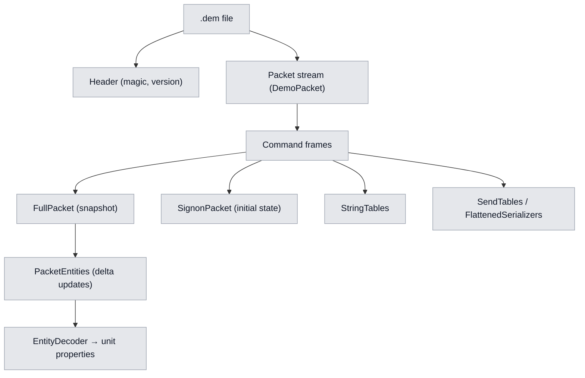
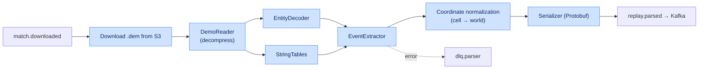
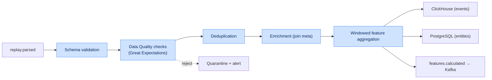
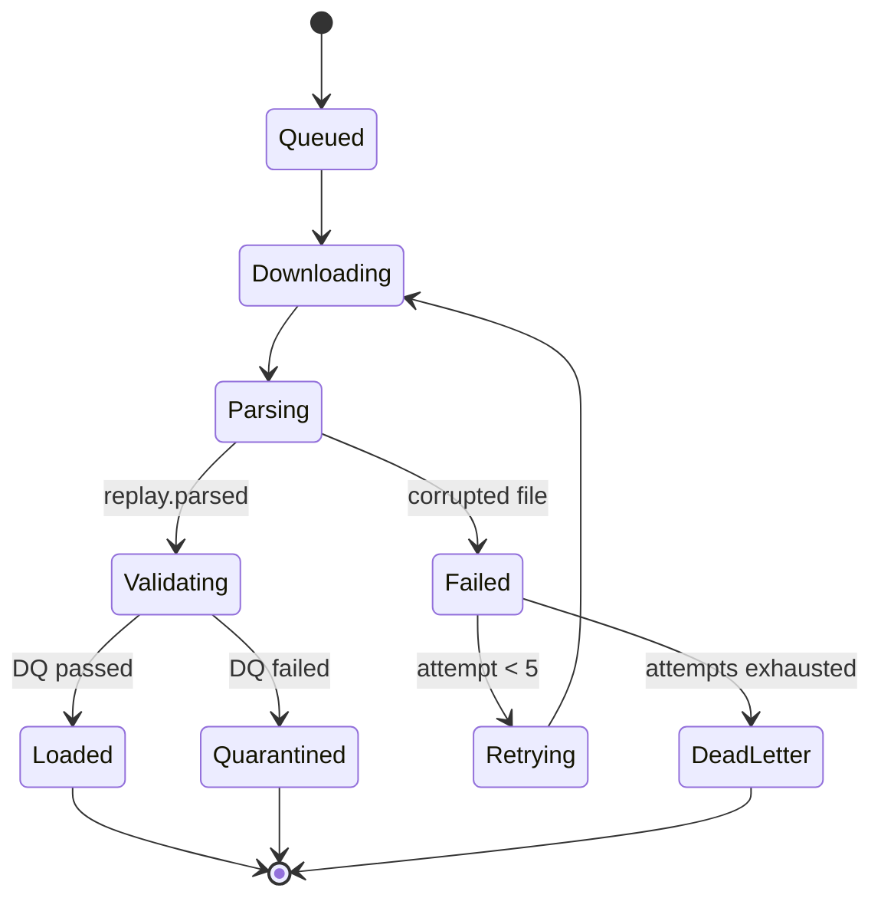

# Chapter 5. Data Processing Module and Replay Parser

## 5.1. Specification of low-level `.dem` parsing

Dota 2 replay files (Source 2 Demo format) are a compressed stream of messages packed with Google
Protocol Buffers. The parser reads ticks and networked entities.

### 5.1.1. Extracted data categories

| Data category | Extraction and processing method | Frequency / Trigger |
|---|---|---|
| **Object coordinates** | Reading networked properties `m_cellX`, `m_cellY`, `m_vecOrigin` for every active unit (heroes, creeps, wards, summoned units). | Every 3rd tick (~100 ms) |
| **Vision (map awareness)** | Tracking `CDOTA_NPC_Observer_Ward` and `CDOTA_NPC_Sentry_Ward`. Computing the visibility polygon accounting for terrain height (Grid Nav). | On entity creation/destruction |
| **Player economy** | Reading `m_iTotalEarnedGold`, `m_iCurrentGold`, `m_iTotalEarnedXP` from the player data table. | Every second (every 30th tick) |
| **Combat events** | Parsing the combat log: damage, healing, deaths, ability and item usage. | On combat-log event |
| **Item purchases** | `DOTA_COMBATLOG_PURCHASE` events and inventory changes. | On event |
| **Abilities** | Casts, skill levels, cooldowns from entity properties. | On event / change |
| **Objectives** | Tower/barracks destruction, Roshan, runes. | On event |

### 5.1.2. Source 2 Demo format (structure)



### 5.1.3. Internal parser pipeline



---

## 5.2. Coordinate transformation

Source 2 stores coordinates in a cell system (cell + offset). World coordinates are computed as:

$$
x_{world} = (cell_x - 2^{n-1}) \cdot S_{cell} + offset_x
$$

$$
y_{world} = (cell_y - 2^{n-1}) \cdot S_{cell} + offset_y
$$

where $S_{cell} = 128$ units is the cell size, $n$ is the bit width of cell coordinates, and
$offset$ is the fractional offset within the cell (`m_vecOrigin`). The resulting world coordinates
are then projected into minimap coordinates for heatmaps.

| Parameter | Value |
|---|---|
| Cell size `S_cell` | 128 game units |
| Full map size | ~16384 × 16384 units |
| Position sampling rate | every 3rd tick (~10 Hz) |
| Heatmap downsampling | to ~1 Hz on save |

---

## 5.3. Output event specification (Protobuf)

The parser serializes the normalized stream into the Protobuf message `ParsedReplay`.

```proto
syntax = "proto3";
package dota.replay.v1;

message ParsedReplay {
  uint64 match_id = 1;
  uint32 duration_ticks = 2;
  repeated PlayerMeta players = 3;
  repeated GameEvent events = 4;
  ReplayMeta meta = 5;
}

message GameEvent {
  uint32 tick = 1;
  int32 game_time = 2;
  EventType type = 3;
  uint64 player_id = 4;
  uint64 target_id = 5;
  Vec3 position = 6;
  int32 value_amount = 7;
  string inflictor = 8;
}

message Vec3 { float x = 1; float y = 2; float z = 3; }

enum EventType {
  UNKNOWN = 0;
  DAMAGE = 1;
  HEAL = 2;
  KILL = 3;
  ABILITY_CAST = 4;
  ITEM_PURCHASE = 5;
  WARD_PLACE = 6;
  POSITION = 7;
  ECONOMY = 8;
  OBJECTIVE = 9;
}
```

Mapping of event types to target tables:

| EventType | Target ClickHouse table | Comment |
|---|---|---|
| DAMAGE/HEAL/KILL | `ReplayEvents` | combat events |
| ABILITY_CAST | `ReplayEvents` | ability casts |
| ITEM_PURCHASE | `ReplayEvents` | purchases |
| WARD_PLACE | `ReplayEvents` | wards (vision) |
| POSITION | `PositionSnapshots` | positions (heatmap) |
| ECONOMY | `EconomyTimeline` | economy |
| OBJECTIVE | `ReplayEvents` | objectives |

---

## 5.4. ETL pipeline and data quality

The ETL Service consumes `replay.parsed`, validates and normalizes the data, then routes it to the
stores and publishes aggregated features.

### 5.4.1. ETL stages



### 5.4.2. Data quality rules

| Rule | Check | Action on violation |
|---|---|---|
| DQ-01 | `match_id` unique and present | reject → quarantine |
| DQ-02 | `duration_seconds` in [300, 7200] | flag as suspicious |
| DQ-03 | exactly 10 players per match | reject |
| DQ-04 | coordinates within map bounds | clip + flag |
| DQ-05 | `game_time` monotonicity | sort/correct |
| DQ-06 | GPM/XPM ≥ 0 and within sane bounds | flag anomaly |
| DQ-07 | no tick "gaps" > N | interpolate positions |

### 5.4.3. Windowed feature aggregation

| Window | Duration | Features |
|---|---|---|
| Laning | 0–10 min | LH/DN@5, damage, consumables, farm deviation |
| Mid-game | 10–25 min | net worth, rotations, fight participation |
| Late-game | 25+ min | objective control, teamfight WP deltas |
| Sliding | 2 min | average position, Safety Index |

---

## 5.5. Idempotency and error handling

| Mechanism | Implementation |
|---|---|
| Idempotency key | `match_id` + `schema_version` |
| Deduplication | `ReplacingMergeTree` in CH + upsert in PG |
| Reprocessing | reprocess endpoint with the same key (no duplicates) |
| DLQ | `dlq.parser` with reason and payload |
| Retries | exponential backoff, max 5 attempts |
| Poison-pill protection | attempt limit → quarantine + alert |

### 5.5.1. Parse job lifecycle



---

## 5.6. Parsing performance and scaling

| Parameter | Value / strategy |
|---|---|
| Workload type | CPU-bound |
| Scaling | Horizontal (Kafka partitions = degree of parallelism) |
| Target throughput | ≥ 2000 replays/hour per cluster (NFR-PERF-04) |
| Target time | ≤ 10 s per 40-min replay (NFR-PERF-01) |
| Autoscaling | HPA on the `replay.parsed` consumer group lag |
| Profiling | flamegraph over EntityDecoder hot paths |
| Optimizations | zero-copy reads, buffer pools, SIMD decoding |

Target parser pod resources and HPA policy are described in
[Chapter 12](12-deployment.md#124-autoscaling).
