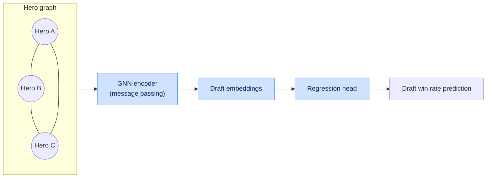

# Chapter 6. Mathematical Models, AI and Evaluation Modules

## 6.1. Mathematical apparatus for game evaluation

The central element of the analytics core is the calculation of the dynamic Win Probability ($WP$)
at each discrete time $t$. The change in win probability ($\Delta WP$) under a player's action $A$
determines the value or the fault of that action.

### 6.1.1. Dynamic Win Probability change

The formula for the dynamic change in win probability:

$$
\Delta WP(t) = WP(t) - WP(t - \Delta t)
$$

where $WP(t) = f(F_t, M_t)$, $F_t$ is the match-state feature vector from the Feature Store, and
$M_t$ is the trained ensemble model.

Interpretation of the increment sign:

| Condition | Interpretation | Use |
|---|---|---|
| $\Delta WP > 0$ | Action raised the team's chances | positive player contribution |
| $\Delta WP < 0$ | Action lowered the chances | error candidate |
| $\lvert \Delta WP \rvert > \tau$ | Critical moment | highlight in the breakdown |

Attribution of the increment to a specific player $p$ is computed as the share of their contribution
to the state change:

$$
\Delta WP_p(t) = \Delta WP(t) \cdot \frac{c_p(t)}{\sum_{k=1}^{10} c_k(t)}
$$

where $c_p(t)$ is the player's contribution to the event (damage dealt, kill participation, ward
placement, etc.).

### 6.1.2. Positional risk model (Safety Index)

The positional risk index $SI$ defines how dangerous it is for a hero to be at point $(x, y)$ at
time $t$ given no direct line of sight to enemy heroes:

$$
SI(x, y, t) = \sum_{i=1}^{5} P_{alive}(H_i) \cdot \int_{0}^{D_{max}} \mathcal{N}\!\left(\mu_{pos}(H_i), \sigma^2 \cdot \Delta t\right) \, d\mathbf{s}
$$

where:

- $P_{alive}(H_i)$ — the probability that enemy hero $H_i$ is alive;
- $\mathcal{N}(\mu_{pos}(H_i), \sigma^2 \cdot \Delta t)$ — the probability density of the enemy's
  spatial position distribution, computed from their last known position, movement speed and
  available teleports;
- $D_{max}$ — the maximum distance the enemy can cover within interval $\Delta t$.

| Symbol | Meaning | Source |
|---|---|---|
| $P_{alive}(H_i)$ | enemy alive probability | death/respawn timings |
| $\mu_{pos}(H_i)$ | expected enemy position | last vision + speed |
| $\sigma$ | position uncertainty | grows with time out of vision |
| $\Delta t$ | time since last vision | from combat/vision logs |
| $D_{max}$ | reach radius | speed + TP scrolls |

### 6.1.3. Other derived metrics

| Metric | Formula / definition | Purpose |
|---|---|---|
| Farm Efficiency | $FE = \dfrac{GPM_{actual}}{GPM_{ideal}(hero, t)}$ | farm evaluation |
| Lane Deviation | RMS deviation of the trajectory from the ideal | laning evaluation |
| Map Control | share of map area under team vision | map control |
| Tempo | rate of net worth advantage gain | game tempo |
| Impact Score | $\sum_t \Delta WP_p(t)$ over the match | total player contribution |

---

## 6.2. Machine learning architecture specification

### 6.2.1. Model catalog

| Model name | Algorithm stack | Input features | Output targets |
|---|---|---|---|
| **Win Probability** | Ensemble: LightGBM + NN calibrator | Net worth diff, objectives, alive heroes, timings, Map Control | Radiant win probability ∈ [0,1] |
| **Laning Evaluator** | XGBoost Regressor | LH/DN at minute 5, damage to opponent, consumables used, deviation from ideal farm trajectory | Laning efficiency coefficient (Score 0–1.0) |
| **Draft Predictor** | Graph Neural Network (GNN) + PyTorch | Hero synergy graph adjacency matrix, player embeddings, current bans, global hero win rate in the patch | Draft baseline win rate before match start |
| **Error Detection Engine** | LightGBM Classifier | Gold/XP increment vector, $\Delta WP$, positional risk index, buyback loss timing | Error class: positional failure, suboptimal macro rotation, critical death |

### 6.2.2. Win Probability model — details

**Target variable:** binary outcome (`radiant_win`), trained on historical matches.

**Features (main groups):**

| Group | Features |
|---|---|
| Economy | net worth diff, GPM/XPM diff, item difference |
| Objectives | towers, barracks, Roshan, runes |
| State | number of alive heroes, buyback availability, ult cooldowns |
| Time | game time, game phase |
| Positional | Map Control, average proximity to objectives |

**Calibration:** isotonic regression / Platt scaling over the GBDT output; target Brier ≤ 0.18.

**Inference:** streaming — WP is recomputed every N seconds of game time to build the curve.

### 6.2.3. Draft Predictor — synergy graph

| Graph component | Meaning |
|---|---|
| Node | hero (features: role, attributes, win rate) |
| Edge (within a team) | pair synergy |
| Edge (between teams) | counter-pick / counter-matchup |
| Edge weight | statistical link strength in the patch |

### 6.2.4. Error Detection Engine — error classes

| Error class | Trigger features | Example |
|---|---|---|
| Positional failure | high $SI$ + $\Delta WP < 0$ + death | death in fog of war without vision |
| Suboptimal rotation | low contribution + missed objective | fruitless gank, tempo loss |
| Critical death | death with buyback available but unused | high-ground loss |
| Economic error | negative GPM deviation + idle | inefficient farm pattern |
| Draft error | low synergy/counter | pick ignoring composition |

---

## 6.3. Training data and features

### 6.3.1. Building training datasets

| Aspect | Approach |
|---|---|
| Source | ClickHouse (offline store) via Feast |
| Correctness | point-in-time join (no future leakage) |
| Split | by time: train (old patches) / val / test (recent patch) |
| Balancing | stratification by rank and outcome |
| Versioning | DVC datasets, bound to a commit |

### 6.3.2. Model quality metrics

| Model | Primary metric | Target |
|---|---|---|
| Win Probability | Brier score / LogLoss | ≤ 0.18 |
| Laning Evaluator | RMSE / R² | R² ≥ 0.75 |
| Draft Predictor | AUC / accuracy@draft | AUC ≥ 0.70 |
| Error Detection | F1 (macro) | ≥ 0.82 |

### 6.3.3. Validation strategy

- **Time-series cross-validation** to exclude leakage.
- **Backtesting** on historical tournaments to check WP calibration.
- **Slice-based error analysis**: by rank, role, patch, duration.
- **Human-in-the-loop**: expert analyst labeling of an error sample as ground truth.

---

## 6.4. LLM Service RAG architecture (mathematical context)

The LLM Service uses numerical model outputs as facts for narrative generation. Context retrieval is
based on the proximity of situation embeddings:

$$
\text{score}(q, d) = \cos(\mathbf{e}_q, \mathbf{e}_d) = \frac{\mathbf{e}_q \cdot \mathbf{e}_d}{\lVert \mathbf{e}_q \rVert \, \lVert \mathbf{e}_d \rVert}
$$

where $\mathbf{e}_q$ is the embedding of the current game situation and $\mathbf{e}_d$ are the
embeddings of reference situations/knowledge in the Vector DB. The top-$k$ nearest are used as
prompt context.

| RAG parameter | Value |
|---|---|
| Embedding dimension | 768 / 1024 (configurable) |
| Index | HNSW (Qdrant/Milvus) |
| $k$ (top-k) | 5–10 |
| Metric | cosine similarity |
| Guardrails | reconcile report numbers with model facts |

---

## 6.5. Uncertainty management and explainability

| Aspect | Mechanism |
|---|---|
| WP confidence intervals | bootstrap ensemble / quantile regression |
| Prediction explainability | SHAP values for GBDT models |
| Feature importance | global and local feature importance |
| Abstaining from prediction | confidence threshold → "insufficient data" |
| Drift | PSI monitoring (see [Chapter 10](10-mlops-cicd.md)) |

Explainability is critical for user trust: each detected error is accompanied by a list of the
features that most influenced the model's decision (local SHAP values).
