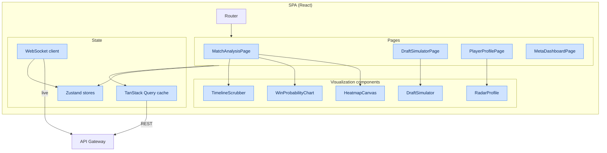
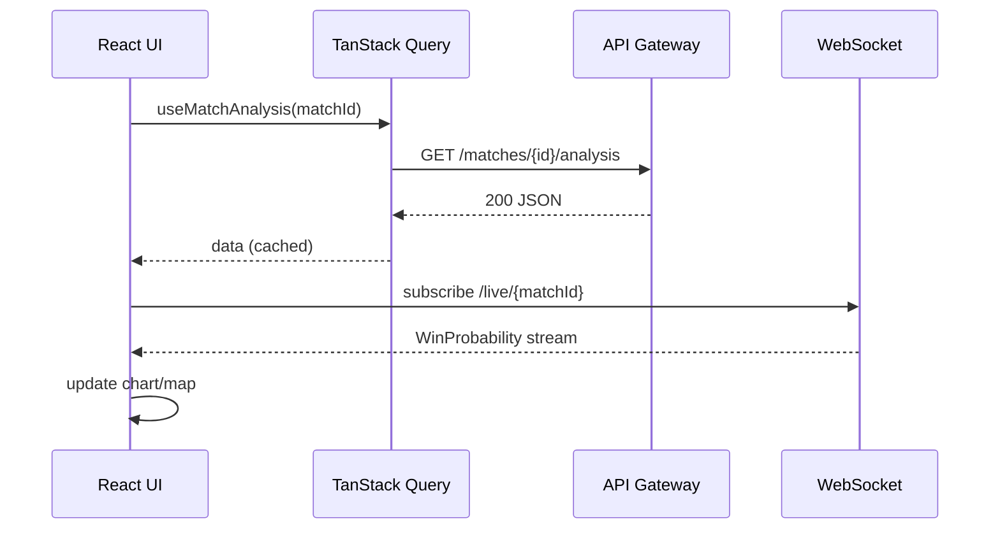

# Chapter 8. Frontend Architecture and Visualization

## 8.1. React + TypeScript application structure

The interface layer is built on a modular principle using the **Zustand** state manager to minimize
re-renders when rendering interactive maps.

### 8.1.1. Frontend technology stack

| Layer | Technology | Purpose |
|---|---|---|
| Language | TypeScript (strict) | Type safety |
| UI framework | React 18 | Component rendering |
| State manager | Zustand | Local/global state |
| Server state | TanStack Query | Cache and API sync |
| Map rendering | Canvas 2D / WebGL (PixiJS) | Heatmaps, trajectories |
| Charts | Recharts / D3 | Radar, line charts |
| Routing | React Router | SPA navigation |
| Build | Vite | Bundling and HMR |
| Styling | CSS Modules / Tailwind | Style isolation |
| Transport | REST (TanStack Query) + WebSocket | Data and live updates |
| Tests | Vitest + Testing Library + Playwright | Unit/component/e2e |

### 8.1.2. Component architecture diagram

---

## 8.2. Key visualization components

### 8.2.1. Interactive 2D map (Canvas/WebGL)

Component-based rendering of the Dota 2 minimap with several layers:

| Layer | Content | Technology |
|---|---|---|
| Base | minimap texture | Canvas/WebGL |
| Heatmap | player/team position density | WebGL shader |
| Trajectories | team movement during teamfights | Canvas paths |
| Vision | ward vision polygons | Canvas polygons |
| Events | death and objective markers | sprites |
| Time scrubber | binding to `game_time` | overlay |

**Render performance requirements:**

| Metric | Target |
|---|---|
| FPS during playback | ≥ 60 |
| Heatmap points without lag | ≥ 50,000 |
| Initial map render time | ≤ 200 ms |

### 8.2.2. Profile comparison component (Radar Charts)

A graphical module overlaying the current user's metrics onto professional players' polygons (Radar
Charts) using the **Recharts** library.

| Radar axis | Metric |
|---|---|
| Farming | Farm Efficiency |
| Fighting | Impact Score in fights |
| Laning | Laning Evaluator score |
| Vision | contribution to Map Control |
| Objectives | objective participation |
| Positioning | 1 − average Safety Index risk |

### 8.2.3. Win Probability Chart and Timeline

- Line chart of WP over game time with highlighted critical moments ($\lvert\Delta WP\rvert > \tau$).
- The scrubber synchronizes the position on the chart, map and event list.
- Overlay of net worth advantage and objective timings.

### 8.2.4. Draft Simulator

Interactive pick/ban interface:

- Hero grid with filters by role/attribute.
- Live request to `POST /draft/simulate` with debounce.
- Display of win-rate prediction and recommendations (via WebSocket for live mode).

---

## 8.3. State management

### 8.3.1. Zustand stores

| Store | Responsibility |
|---|---|
| `useMatchStore` | current match, selected `game_time`, map layers |
| `useDraftStore` | draft state, recommendations |
| `usePlayerStore` | profile, metrics, training plan |
| `useAuthStore` | JWT, user, permissions |
| `useUIStore` | theme, modals, toasts |

### 8.3.2. Separation of server and client state

| Data type | Tool |
|---|---|
| Cacheable server data | TanStack Query |
| Live stream (WP, draft) | WebSocket → Zustand |
| Local UI state | Zustand |
| Form/validation | component-local state |

---

## 8.4. API interaction

### 8.4.1. Handling loading/error states

| State | UI behavior |
|---|---|
| loading | component skeletons |
| partial (`partial:true`) | "data updating" banner |
| error 4xx | message with a user action |
| error 5xx/503 | retry + degradation (show cache) |
| rate-limited 429 | "too frequent" toast, backoff |

---

## 8.5. Frontend performance and accessibility

### 8.5.1. Target metrics (Web Vitals)

| Metric | Target |
|---|---|
| LCP | ≤ 2.5 s |
| TTI | ≤ 3.5 s |
| CLS | ≤ 0.1 |
| INP | ≤ 200 ms |
| Initial bundle size | ≤ 250 KB gzip |

### 8.5.2. Optimizations

| Technique | Application |
|---|---|
| Code splitting | by routes and heavy components (map) |
| Lazy loading | Draft Simulator, WebGL layers |
| Memoization | `React.memo`, `useMemo` for heavy computations |
| Virtualization | long match/event lists |
| Web Workers | heatmap data prep off the main thread |
| CDN | static assets and minimap assets |

### 8.5.3. Accessibility (a11y) and i18n

| Aspect | Implementation |
|---|---|
| Keyboard navigation | all interactive elements focusable |
| ARIA | roles and labels for charts (alternative tables) |
| Contrast | WCAG AA compliance |
| Internationalization | translation keys (ru/en), number/date formats |
| Theme | light/dark, synced with the system |

---

## 8.6. Frontend build and deployment

| Aspect | Solution |
|---|---|
| Build | Vite → static assets |
| Serving | Nginx (cluster) + CDN |
| Caching | content hashes in filenames, `immutable` for assets |
| Configuration | runtime config via `/config.json` |
| Monitoring | Web Vitals → analytics, Sentry for errors |

The Frontend Service deployment infrastructure is described in [Chapter 12](12-deployment.md).
