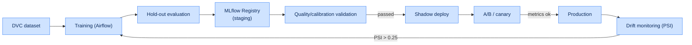
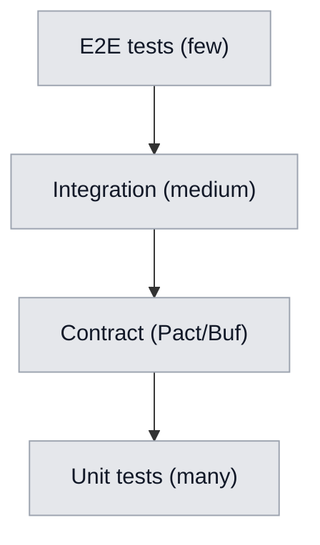

# Chapter 10. MLOps, Testing, Logging and CI/CD

## 10.1. MLOps pipeline and data drift management

To keep predictions stable as the game meta changes, the following technology stack is adopted:

- **MLflow Model Registry** — storage of model versions, neural-network weights and training-run
  artifacts.
- **DVC (Data Version Control)** — versioning of binary feature datasets extracted from ClickHouse.
- **Evidently AI / Monitoring Layer** — automatic computation of the **Population Stability Index
  (PSI)** every 24 hours. When the data drift threshold is exceeded ($PSI > 0.25$), an automatic
  model retraining pipeline is triggered on a fresh pool of matches from **Apache Airflow**.

### 10.1.1. Full model lifecycle



### 10.1.2. PSI formula

$$
PSI = \sum_{i=1}^{B} \left( p_i^{curr} - p_i^{ref} \right) \cdot \ln\!\left( \frac{p_i^{curr}}{p_i^{ref}} \right)
$$

where $B$ is the number of bins, and $p_i^{ref}$ and $p_i^{curr}$ are the shares of observations in
bin $i$ for the reference and current distributions.

| PSI range | Interpretation | Action |
|---|---|---|
| $PSI < 0.1$ | No drift | no action |
| $0.1 \le PSI \le 0.25$ | Moderate drift | observe, warning alert |
| $PSI > 0.25$ | Significant drift | auto-retrain |

### 10.1.3. Production model quality monitoring

| Metric | Model | Alert threshold |
|---|---|---|
| Brier score (rolling) | Win Probability | > 0.20 |
| F1 (on labeled) | Error Detection | < 0.78 |
| Feature drift (PSI) | all | > 0.25 |
| Prediction drift | all | sharp distribution shift |
| Latency p95 | all | > SLO |

---

## 10.2. Training pipelines (Airflow)

| DAG | Trigger | Action |
|---|---|---|
| `retrain_win_probability` | PSI alert / schedule | retrain WP model |
| `retrain_draft_gnn` | new patch | update graph + GNN |
| `refresh_meta_graph` | daily | recompute meta |
| `materialize_features` | scheduled | materialize features (Feast) |
| `data_quality_report` | daily | data quality report |

### 10.2.1. Model promotion gates

| Gate | Criterion |
|---|---|
| G1: quality | metric ≥ baseline on hold-out |
| G2: calibration | Brier ≤ threshold (for WP) |
| G3: slices | no degradation on key slices |
| G4: shadow | agreement with current ≥ threshold |
| G5: canary | no increase in errors/latency |

---

## 10.3. Testing strategy

### 10.3.1. Testing pyramid



| Level | Covers | Tools | Coverage target |
|---|---|---|---|
| Unit | functions, modules | pytest, go test, Vitest | ≥ 80% critical |
| Contract | REST/gRPC/Avro schemas | Pact, Buf, schema-compat | 100% of contracts |
| Integration | service + DB + Kafka | Testcontainers | key flows |
| E2E | user scenarios | Playwright | UC-01…UC-08 |
| Load | NFR-PERF/SCAL | k6, Locust | NFR thresholds |
| ML tests | data, model, invariance | Great Expectations, deepchecks | key models |

### 10.3.2. ML-specific tests

| Type | Check |
|---|---|
| Data tests | schema, ranges, missing rate |
| Invariance tests | invariance to irrelevant perturbations |
| Directional tests | expected direction of a feature's influence |
| Calibration tests | consistency of probabilities with frequencies |
| Regression tests | no worse than the previous version on the benchmark |

### 10.3.3. NFR validation in CI

| NFR | Automatic check |
|---|---|
| NFR-PERF-01 | parser load test on a reference replay |
| NFR-PERF-02/03 | k6 API latency profile |
| NFR-SCAL-01 | query test on a large synthetic dataset |
| NFR-SEC-* | SAST/SCA/secret scans, mTLS verification |

---

## 10.4. CI/CD and GitOps

### 10.4.1. CI/CD pipeline

```mermaid
flowchart LR
    PR["Pull Request"] --> LINT["Lint + format"]
    LINT --> TEST["Unit + contract tests"]
    TEST --> SEC["SAST/SCA/secret-scan"]
    SEC --> BUILD["Build images"]
    BUILD --> SIGN["Sign + SBOM"]
    SIGN --> PUSH["Push to registry"]
    PUSH --> ARGO["ArgoCD sync (GitOps)"]
    ARGO --> STG["Staging"]
    STG --> IT["Integration + e2e"]
    IT --> CAN["Canary → Production"]
    classDef svc fill:#cfe3ff,stroke:#3b82f6,color:#0b2a5b;
    class LINT,TEST,SEC,BUILD,SIGN,PUSH,ARGO,STG,IT,CAN svc;
```



### 10.4.2. Deployment strategies

| Strategy | Application |
|---|---|
| Rolling update | stateless services by default |
| Blue/Green | API Gateway, critical services |
| Canary | ML Service (models), risky changes |
| Shadow | new model versions (no user impact) |

### 10.4.3. CI pipeline example (`ci-cd-pipeline.yml`, fragment)

```yaml
name: ci-cd-pipeline
on: [push, pull_request]
jobs:
  test:
    runs-on: ubuntu-latest
    steps:
      - uses: actions/checkout@v4
      - name: Lint
        run: make lint
      - name: Unit tests
        run: make test
      - name: Contract tests
        run: make contract-test
  security:
    runs-on: ubuntu-latest
    steps:
      - name: SCA + SAST
        run: make security-scan
  build:
    needs: [test, security]
    runs-on: ubuntu-latest
    steps:
      - name: Build & sign images
        run: make build sign sbom
      - name: Push
        run: make push
```

---

## 10.5. Logging and observability (link to Ch. 11)

| Aspect | Standard |
|---|---|
| Log format | structured JSON |
| Mandatory fields | `timestamp`, `level`, `service`, `trace_id`, `span_id` |
| Levels | DEBUG/INFO/WARN/ERROR |
| PII in logs | forbidden (masking) |
| Correlation | end-to-end `trace_id` across all services |

The full metrics, tracing, alerting and error-budget strategy is described in
[Chapter 11](11-observability.md).

---

## 10.6. Artifact and version management

| Artifact | Store | Versioning |
|---|---|---|
| Models | MLflow + S3 | semver + run_id |
| Datasets | DVC + S3 | content hash |
| Images | Container Registry | tag = git sha |
| Schemas | Schema Registry | schema version |
| Helm charts | Chart repo | semver |
| IaC | Git (Terraform) | commit |
