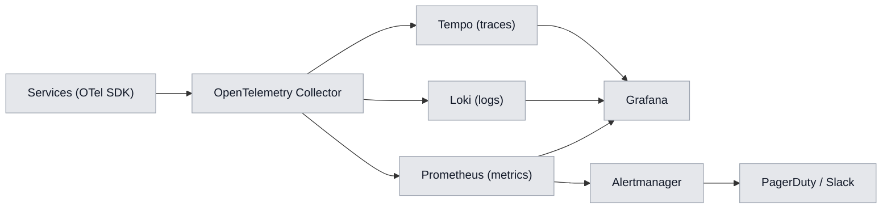

# Chapter 11. Observability, Monitoring and SRE

## 11.1. The three pillars of observability

Platform observability rests on three pillars — **metrics, logs, traces** — unified by an
end-to-end `trace_id` and a single visualization stack.

| Pillar | Technology | Purpose |
|---|---|---|
| Metrics | Prometheus + Grafana | numeric time series, alerts |
| Logs | Loki (+ Promtail) | structured events |
| Traces | Tempo + OpenTelemetry | distributed tracing |
| Profiling | Pyroscope (opt.) | CPU/mem profiles |

---

## 11.2. Metrics

### 11.2.1. Metric classification

| Type | Method (RED/USE) | Examples |
|---|---|---|
| Rate | RED | requests/s per endpoint |
| Errors | RED | 5xx share, ETL reject share |
| Duration | RED | latency p50/p95/p99 |
| Utilization | USE | CPU/mem/GPU |
| Saturation | USE | Kafka consumer lag, queue depth |
| Errors (resource) | USE | OOMKilled, pod restarts |

### 11.2.2. Key business and system metrics

| Metric | Type | Owner |
|---|---|---|
| `replay_parse_duration_seconds` | histogram | Replay Parser |
| `etl_consumer_lag` | gauge | ETL Service |
| `ml_predict_latency_seconds` | histogram | ML Service |
| `api_request_duration_seconds` | histogram | API Gateway |
| `wp_brier_score_rolling` | gauge | ML Service |
| `feature_freshness_seconds` | gauge | Feature Store |
| `kafka_topic_lag` | gauge | all consumers |
| `job_completion_rate` | counter | ETL/Gateway |

---

## 11.3. Distributed tracing

| Aspect | Implementation |
|---|---|
| Standard | W3C Trace Context (`traceparent`) |
| Propagation | via HTTP, gRPC metadata, Kafka headers |
| Instrumentation | OpenTelemetry SDK (auto + manual) |
| Sampling | tail-based (errors and slow — always) |
| Log correlation | `trace_id`/`span_id` in every log |

The end-to-end trace of scenario UC-01 spans Gateway → ETL → Parser → ML → LLM, revealing at which
step time is lost.

---

## 11.4. Logging

| Aspect | Standard |
|---|---|
| Format | JSON |
| Mandatory fields | `timestamp`, `level`, `service`, `trace_id`, `span_id`, `message` |
| Forbidden | PII, secrets, full payloads |
| Rotation/retention | hot 14 days, cold (S3) 90 days |
| Indexing | by `service`, `level`, `trace_id` |
| Correlation | click from trace → related logs |

---

## 11.5. SLO, SLI and Error Budget

### 11.5.1. SLO catalog

| Service | SLI | SLO | Window |
|---|---|---|---|
| API Gateway | availability | 99.95% | 30 days |
| API Gateway | latency p95 | ≤ 300 ms | 30 days |
| Replay Parser | parse success | ≥ 99.5% | 30 days |
| Replay Parser | parse time p95 | ≤ 10 s | 30 days |
| ML Service | Predict latency p95 | ≤ 400 ms | 30 days |
| ETL Service | end-to-end lag p95 | ≤ 30 s | 7 days |
| Feature Store | GetOnline p95 | ≤ 50 ms | 7 days |

### 11.5.2. Error Budget

For a 30-day window and a 99.95% SLO, the allowed downtime ≈ **21.9 min/month**. Error budget policy:

| Budget state | Policy |
|---|---|
| Budget healthy | normal release cadence |
| Budget < 25% | freeze risky changes |
| Budget exhausted | stop feature releases, focus on reliability |

---

## 11.6. Alerting

### 11.6.1. Principles

- Alert **on symptoms** (SLO violations), not on every metric spike.
- Each alert has a **runbook** and a severity level.
- Multi-tier: warning (Slack) → critical (PagerDuty).

### 11.6.2. Key alert catalog

| Alert | Condition | Severity | Runbook |
|---|---|---|---|
| API error budget burn | fast budget burn | critical | RB-API-01 |
| Parser SLO breach | p95 > 10 s | critical | RB-PARSE-01 |
| Kafka consumer lag | lag grows > threshold | warning | RB-KAFKA-01 |
| Model drift | PSI > 0.25 | warning | RB-ML-01 |
| WP calibration | Brier > 0.20 | warning | RB-ML-02 |
| DB replication lag | replica lag > threshold | critical | RB-DB-01 |
| Pod crashloop | restarts > N/5 min | critical | RB-K8S-01 |

---

## 11.7. Grafana dashboards

| Dashboard | Audience | Panels |
|---|---|---|
| Platform Overview | all | RED per service, SLO status |
| Ingestion Pipeline | backend/SRE | Kafka lag, parser throughput, ETL |
| ML Health | ML engineers | latency, drift, model quality |
| API Gateway | backend/SRE | latency, response codes, rate-limit |
| Data Stores | SRE/DBA | PG/CH load, replication, disk |
| Business KPIs | product | MAU, conversion, matches processed |

---

## 11.8. SRE practices

| Practice | Implementation |
|---|---|
| Runbooks | per alert, versioned in the repo |
| On-call | rotation, escalation, PagerDuty |
| Postmortems | blameless, with action items |
| Chaos engineering | scheduled fault injections in staging |
| Capacity planning | forecasting from metric and KPI trends |
| Game days | incident response drills |

### 11.8.1. Incident classification

| Severity | Description | Target response time |
|---|---|---|
| SEV-1 | Full outage / data loss | ≤ 15 min |
| SEV-2 | Partial degradation of a key function | ≤ 30 min |
| SEV-3 | Minor impact | ≤ 4 h |
| SEV-4 | Cosmetic | scheduled |

### 11.8.2. Health-check endpoints

| Endpoint | Purpose |
|---|---|
| `/healthz` | liveness (process alive) |
| `/readyz` | readiness (ready to accept traffic) |
| `/metrics` | Prometheus metric export |
| `/startupz` | startup probe for slow starts |
