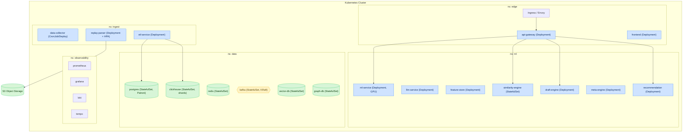

# Chapter 12. Deployment and Infrastructure (Kubernetes, IaC)

## 12.1. Deployment topology

The platform is deployed on Kubernetes. Logical separation by namespaces provides isolation and
resource governance.



---

## 12.2. Kubernetes manifests (examples)

### 12.2.1. ML Service Deployment

```yaml
apiVersion: apps/v1
kind: Deployment
metadata:
  name: ml-service
  namespace: ml
spec:
  replicas: 3
  selector:
    matchLabels: { app: ml-service }
  template:
    metadata:
      labels: { app: ml-service }
    spec:
      containers:
        - name: ml-service
          image: registry/ml-service:{{git_sha}}
          ports: [{ containerPort: 50051 }]
          resources:
            requests: { cpu: "2", memory: "4Gi" }
            limits: { cpu: "4", memory: "8Gi", nvidia.com/gpu: "1" }
          readinessProbe:
            grpc: { port: 50051 }
            initialDelaySeconds: 10
          livenessProbe:
            httpGet: { path: /healthz, port: 8080 }
```

### 12.2.2. Parser HPA (`hpa-parser.yaml`)

```yaml
apiVersion: autoscaling/v2
kind: HorizontalPodAutoscaler
metadata:
  name: replay-parser-hpa
  namespace: ingest
spec:
  scaleTargetRef:
    apiVersion: apps/v1
    kind: Deployment
    name: replay-parser
  minReplicas: 3
  maxReplicas: 50
  metrics:
    - type: External
      external:
        metric:
          name: kafka_consumergroup_lag
          selector:
            matchLabels: { topic: replay.parsed }
        target:
          type: AverageValue
          averageValue: "100"
```

---

## 12.3. Service resource profiles

| Service | CPU (req/limit) | Mem (req/limit) | GPU | Replicas (min/max) |
|---|---|---|---|---|
| api-gateway | 0.5 / 2 | 512Mi / 1Gi | — | 3 / 20 |
| replay-parser | 2 / 4 | 2Gi / 4Gi | — | 3 / 50 |
| etl-service | 1 / 3 | 2Gi / 4Gi | — | 3 / 20 |
| ml-service | 2 / 4 | 4Gi / 8Gi | 1 (opt.) | 3 / 15 |
| llm-service | 1 / 2 | 2Gi / 4Gi | 1 (opt.) | 2 / 10 |
| feature-store | 1 / 2 | 2Gi / 4Gi | — | 2 / 8 |
| similarity-engine | 2 / 4 | 4Gi / 8Gi | — | 2 / 8 |
| frontend | 0.25 / 1 | 256Mi / 512Mi | — | 3 / 10 |

---

## 12.4. Autoscaling

| Service | Scaling trigger | Metric |
|---|---|---|
| replay-parser | `replay.parsed` topic lag | `kafka_consumergroup_lag` |
| etl-service | `features.calculated` topic lag | lag + CPU |
| ml-service | RPS / latency | `ml_predict_latency` + CPU |
| api-gateway | RPS | CPU + RPS |
| frontend | RPS | CPU |

Additionally: **KEDA** for event-driven scaling on Kafka, **Cluster Autoscaler** for node scaling,
and **VPA** (recommendation mode) for tuning resource requests.

---

## 12.5. Infrastructure as Code (IaC)

| Layer | Tool | Describes |
|---|---|---|
| Cloud resources | Terraform | networks, clusters, DB instances, S3, IAM |
| Applications | Helm | service charts, per-environment values |
| Deployment | ArgoCD | GitOps state sync |
| Secrets | Vault / Sealed Secrets | secret injection |
| Policies | OPA/Gatekeeper | security admission policies |

### 12.5.1. Terraform structure (example)

```hcl
module "network"     { source = "./modules/network" }
module "kubernetes"  { source = "./modules/eks" }
module "postgres"    { source = "./modules/rds-postgres" }
module "clickhouse"  { source = "./modules/clickhouse" }
module "kafka"       { source = "./modules/msk" }
module "object_store"{ source = "./modules/s3" }
```

### 12.5.2. Helm chart structure

```
deployments/
  helm/
    api-gateway/
    replay-parser/
    ml-service/
    ...
    values/
      dev.yaml
      staging.yaml
      production.yaml
```

---

## 12.6. Docker Compose (local development)

For local development a `docker-compose.yml` brings up lightweight versions of dependencies (Kafka,
PostgreSQL, ClickHouse, Redis, MinIO) and the services in dev mode.

| Component | Image (dev) |
|---|---|
| kafka | KRaft single-node |
| postgres | postgres:16 |
| clickhouse | clickhouse/clickhouse-server |
| redis | redis:7 |
| minio | S3-compatible storage |
| kafka-ui / schema-registry | development tools |

---

## 12.7. Multi-region, resilience and DR

| Aspect | Strategy |
|---|---|
| Availability zones | pod distribution across AZs (anti-affinity) |
| PodDisruptionBudget | minimum available replicas during maintenance |
| Multi-region | active region + data replicas (phase 2+) |
| DB failover | Patroni (PG), CH replicas |
| DR | periodic recovery drills (RPO/RTO — Ch. 4.6) |
| Backups | automated + recovery verification |

---

## 12.8. Configuration and environment management

| Mechanism | Usage |
|---|---|
| ConfigMap | non-critical configuration |
| Secret (from Vault) | credentials, keys |
| Feature flags | gradual feature rollout |
| Frontend runtime config | `/config.json` without rebuild |
| Namespace isolation | edge / ingest / ml / data / observability |

The environment matrix (`dev`/`staging`/`production`/`ml-training`) is in
[Chapter 2](02-microservice-architecture.md#262-environment-matrix).
