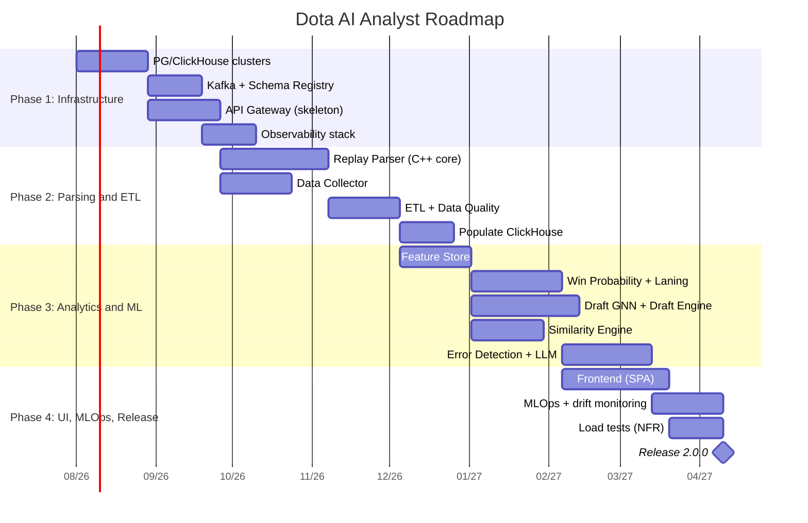
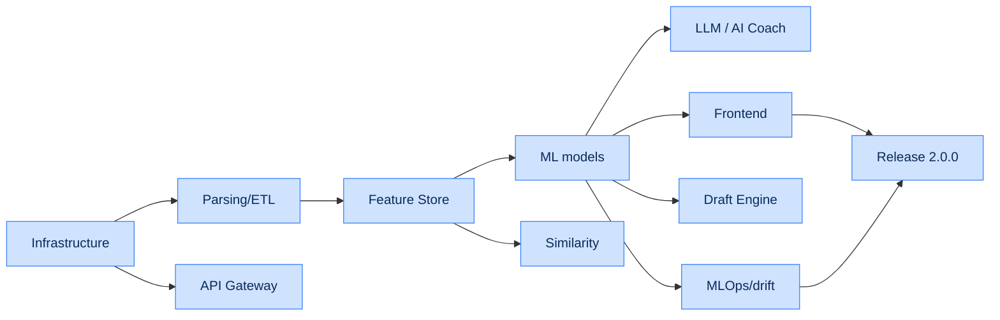

# Chapter 14. Implementation Roadmap

## 14.1. Project phases

| Phase | Key milestones | Duration |
|---|---|---|
| **Phase 1: Infrastructure** | Deploying PostgreSQL and ClickHouse clusters, baseline Apache Kafka and API Gateway setup. | Sprints 1–4 |
| **Phase 2: Parsing and ETL** | Completing the C++ Replay Parser core, building the Data Collector pipelines. Populating ClickHouse. | Sprints 5–8 |
| **Phase 3: Analytics and ML** | Training error-evaluation models, deploying the Feature Store, integrating the Draft Engine and Similarity Engine. | Sprints 9–14 |
| **Phase 4: UI, MLOps and Release** | Final React app build, configuring data-drift monitoring in MLflow, running load tests. | Sprints 15–20 |

---

## 14.2. Gantt chart

---

## 14.3. Sprint breakdown

| Sprint | Focus | Key deliverables |
|---|---|---|
| 1–2 | Bootstrap | repository, CI, K8s cluster, IaC skeleton |
| 3–4 | Stores | PG (Patroni), ClickHouse (shards), Kafka |
| 5–6 | Parser (core) | DemoReader, EntityDecoder, position extraction |
| 7–8 | ETL/Collector | Data Quality, sinks, CH population |
| 9–10 | Feature Store | feature views, online/offline, materialization |
| 11–12 | ML baseline | Win Probability, Laning Evaluator, calibration |
| 13–14 | Graph/search | Draft GNN, Meta Engine, Similarity Engine |
| 15–16 | Error/LLM | Error Detection, RAG, AI Coach |
| 17–18 | Frontend | map, charts, draft simulator |
| 19 | MLOps | drift monitoring, auto-retraining |
| 20 | Release | load tests, NFR acceptance, go-live |

---

## 14.4. Phase acceptance criteria (Definition of Done)

| Phase | Acceptance criteria |
|---|---|
| Phase 1 | DB clusters HA-available; Kafka accepts events; Gateway serves `/healthz`; observability works |
| Phase 2 | Parser meets NFR-PERF-01 on the reference replay; ETL populates CH; DQ rules active |
| Phase 3 | Models pass quality gates (Ch. 10.2.1); Feature Store serves online features within SLO |
| Phase 4 | UI passes e2e (UC-01…UC-08); NFR-PERF/SCAL validated by load; drift monitoring active |

---

## 14.5. Work-stream dependencies

---

## 14.6. Risk register

| ID | Risk | Likelihood | Impact | Mitigation strategy |
|---|---|---|---|---|
| R-01 | `.dem` format change via Valve patch | Medium | High | Parser adapters, fast release cycle, fixture tests |
| R-02 | Meta drift after a major patch | High | Medium | Auto-retraining (PSI), fast model rollout |
| R-03 | Insufficient model accuracy | Medium | High | Human-in-the-loop labeling, iterative improvement |
| R-04 | External API limits/outage | Medium | Medium | Cache, backoff, multiple sources, ACL |
| R-05 | Peak loads (tournaments) | High | Medium | Autoscaling, priority queues |
| R-06 | GPU/LLM inference cost | Medium | Medium | Response cache, batching, quotas, degradation |
| R-07 | PII leakage | Low | High | Encryption, RBAC, audit, GDPR processes |
| R-08 | Tech debt from rushing | Medium | Medium | ADRs, code review, test coverage threshold |

---

## 14.7. Release 2.0.0 metrics (Go-Live checklist)

| Category | Criterion |
|---|---|
| Functionality | UC-01…UC-08 pass e2e |
| Performance | NFR-PERF-01/02/03/04 validated |
| Scalability | NFR-SCAL-01 confirmed under load |
| Reliability | NFR-SLA-01 (99.95%) in staging ≥ 2 weeks |
| Security | SAST/SCA/pentest passed, GDPR processes |
| Observability | dashboards, alerts, runbooks ready |
| MLOps | drift monitoring and auto-retraining active |
| Documentation | specification, ADRs, runbooks up to date |

---

## 14.8. Post-release evolution (Multi-game and beyond)

| Direction | Description |
|---|---|
| Multi-game (NFR-EXT-01) | core abstraction, adapters for Deadlock/LoL |
| Mobile apps | native clients over the same API |
| Real-time on broadcasts | expanding the live plane (WP overlays) |
| Analytics marketplace | B2B API and partner integrations |
| AI Coach personalization | fine-tuning to a player's style |

This concludes the main body of the specification. The appendices (OpenAPI, gRPC proto) are located
in the [`openapi/`](../openapi/) and [`proto/`](../proto/) directories.
