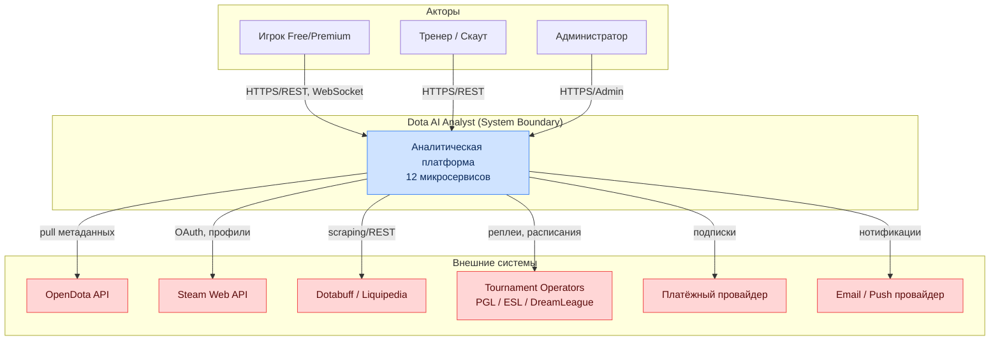
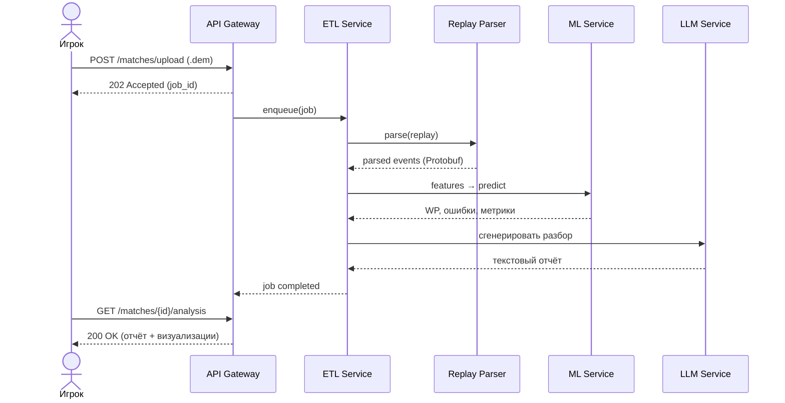

# Глава 1. Общие положения и системный контекст

## 1.1. Бизнес-цели и назначение платформы

Настоящая спецификация определяет архитектурные, функциональные, технические и математические
требования к интеллектуальной аналитической платформе **Dota AI Analyst**. Целью проекта является
агрегация, обработка, долгосрочное хранение и глубокий интеллектуальный анализ игровых данных
дисциплины Dota 2.

Система предназначена для решения следующих ключевых бизнес-задач:

- **Профессиональная аналитика (B2B)** — обеспечение киберспортивных организаций, тренеров и
  скаутов автоматизированным инструментом для разбора стратегий соперников, подготовки к матчам
  и оценки потенциальных новобранцев.
- **Персональное обучение (B2C)** — предоставление рядовым игрокам интерактивного ИИ-тренера
  (AI Coach) для выявления систематических ошибок, построения индивидуальных планов тренировок и
  повышения игрового рейтинга (MMR).
- **Прогнозирование мета-трендов** — математическое моделирование игрового баланса для
  предсказания изменений эффективности героев и предметов при выходе обновлений (патчей).
- **Медиа и вещание** — предоставление данных и визуализаций студиям и комментаторам для
  обогащения трансляций (win probability в реальном времени, тепловые карты, тайминги).

### 1.1.1. Ценностное предложение по сегментам

| Сегмент | Основная боль | Решение платформы | Ключевая метрика ценности |
|---|---|---|---|
| Профессиональные команды | Ручной разбор реплеев занимает часы | Автоматический дифф стратегий и драфтов | Часы аналитика, сэкономленные на матч |
| Тренеры / аналитики | Нет объективных метрик ошибок | Error Detection Engine + Win Probability | Точность классификации ошибок |
| Рядовые игроки (Pub) | Непонятно, «почему проиграл» | AI Coach с текстовым разбором | Прирост MMR за сезон |
| Скауты | Сложно сравнивать игроков | Similarity Engine + Radar-профили | Время на скаутинг одного игрока |
| Букмекеры / аналитики ставок | Нет живой оценки вероятности | Win Probability API | Калибровка (Brier score) |
| Медиа / вещатели | Скучные статичные графики | Live-визуализации и оверлеи | Вовлечённость зрителя |

### 1.1.2. Метрики успеха продукта (North Star)

| Идентификатор | Метрика | Целевое значение (12 мес.) |
|---|---|---|
| KPI-01 | Число обработанных матчей в БД | > 100 000 000 |
| KPI-02 | Медианное время экспресс-анализа реплея | < 10 с |
| KPI-03 | Калибровка Win Probability (Brier score) | < 0.18 |
| KPI-04 | Точность Error Detection Engine (F1) | > 0.82 |
| KPI-05 | Месячная активная аудитория (MAU) | > 250 000 |
| KPI-06 | Конверсия free → paid | > 4.5% |
| KPI-07 | Uptime API Gateway | ≥ 99.95% |

---

## 1.2. Ограничения системы и нефункциональные требования (NFR)

Нефункциональные требования являются приёмочными критериями релиза и подлежат обязательной
автоматизированной валидации в контуре CI/CD и нагрузочного тестирования.

### 1.2.1. Производительность и масштабируемость

| Идентификатор | Категория | Критерий валидации / Целевой показатель |
|---|---|---|
| NFR-PERF-01 | Производительность парсинга | Обработка одного `.dem`-реплея средней продолжительностью 40 минут ≤ **10 с** с момента загрузки в конвейер. |
| NFR-PERF-02 | Скорость рекомендаций | Время ответа Similarity Engine и Draft Engine ≤ **2 с** (p95). |
| NFR-PERF-03 | Латентность REST API | p95 ≤ **300 мс**, p99 ≤ **800 мс** для read-эндпоинтов. |
| NFR-PERF-04 | Пропускная способность парсинга | ≥ **2 000** реплеев/час на кластер парсера. |
| NFR-SCAL-01 | Масштабируемость хранилища | Индексация и аналитические выборки по базе > **100 000 000** матчей без деградации. |
| NFR-SCAL-02 | Горизонтальное масштабирование | Все stateless-сервисы масштабируются линейно до 50 реплик через HPA. |

### 1.2.2. Надёжность и доступность

| Идентификатор | Категория | Критерий валидации / Целевой показатель |
|---|---|---|
| NFR-SLA-01 | Доступность API Gateway и UI | Uptime ≥ **99.95%** в режиме 24/7/365 (≤ 21.9 мин простоя/мес). |
| NFR-REL-01 | Устойчивость к сбоям | Отказ одного узла любого stateless-сервиса не приводит к потере запросов. |
| NFR-REL-02 | Гарантии доставки событий | Kafka: at-least-once для всех топиков; идемпотентные консьюмеры. |
| NFR-REL-03 | Восстановление (RPO/RTO) | RPO ≤ **5 мин**, RTO ≤ **30 мин** для критических хранилищ. |
| NFR-REL-04 | Дедупликация парсинга | Повторная загрузка того же реплея не создаёт дублей (idempotency key). |

### 1.2.3. Расширяемость, поддерживаемость, безопасность

| Идентификатор | Категория | Критерий валидации / Целевой показатель |
|---|---|---|
| NFR-EXT-01 | Расширяемость (Multi-game) | Изоляция ядра от специфики Dota 2 через абстрактные интерфейсы данных. Перенос под Deadlock/LoL без изменения ML Service и API Gateway. |
| NFR-EXT-02 | Плагинность моделей | Добавление новой ML-модели без изменения кода сервисов-потребителей (через Model Registry). |
| NFR-MNT-01 | Покрытие тестами | Строчное покрытие критических модулей ≥ **80%**. |
| NFR-MNT-02 | Прослеживаемость | Каждый запрос имеет сквозной `trace_id` через все сервисы. |
| NFR-SEC-01 | Шифрование в транзите | TLS 1.3 для всех внешних и mTLS для внутренних соединений. |
| NFR-SEC-02 | Шифрование покоя | Все PII и креденшелы шифруются at-rest (AES-256). |
| NFR-SEC-03 | Соответствие | Соответствие GDPR в части удаления и экспорта персональных данных. |

### 1.2.4. Приоритизация NFR (метод MoSCoW)

| Приоритет | Требования |
|---|---|
| **Must** | NFR-PERF-01, NFR-PERF-02, NFR-SCAL-01, NFR-SLA-01, NFR-REL-02, NFR-SEC-01 |
| **Should** | NFR-PERF-03, NFR-PERF-04, NFR-REL-03, NFR-EXT-01, NFR-MNT-01 |
| **Could** | NFR-SCAL-02, NFR-EXT-02, NFR-MNT-02, NFR-SEC-03 |

---

## 1.3. Роли, акторы и заинтересованные стороны

### 1.3.1. Человеческие акторы

| Актор | Роль | Ключевые сценарии |
|---|---|---|
| Игрок (Free) | Рядовой пользователь | Загрузка реплея, просмотр базового разбора |
| Игрок (Premium) | Платный пользователь | AI Coach, планы тренировок, история метрик |
| Тренер / Аналитик | Профессионал | Разбор драфтов, сравнение команд, экспорт |
| Скаут | Профессионал | Поиск похожих игроков, radar-профили |
| Администратор | Оператор системы | Управление пользователями, модерация |
| ML-инженер | Внутренний | Обучение/деплой моделей, мониторинг дрейфа |
| SRE / DevOps | Внутренний | Эксплуатация, реагирование на инциденты |

### 1.3.2. Внешние системы (акторы-системы)

| Система | Тип интеграции | Назначение |
|---|---|---|
| OpenDota API | REST (pull) | Метаданные матчей, публичная статистика |
| Steam Web API | REST + OAuth | Аутентификация Steam, профили игроков |
| Dotabuff | HTML/REST | Дополнительная статистика меты |
| Liquipedia | REST/MediaWiki | Турнирные данные, ростеры |
| Tournament Operators (PGL, ESL, DreamLeague) | REST/webhooks | Официальные реплеи и расписания |
| Платёжный провайдер | REST + webhooks | Подписки и биллинг |
| Провайдер email/push | REST | Уведомления пользователям |

---

## 1.4. Границы системы и контекстная диаграмма (C4 — Level 1)

### 1.4.1. Что входит и не входит в границы системы (In/Out of Scope)

| В границах (In Scope) | Вне границ (Out of Scope) |
|---|---|
| Сбор, парсинг и хранение матчей | Античит / модерация игрового клиента Valve |
| Аналитика, ML-оценка, AI Coach | Модификация игрового процесса Dota 2 |
| Веб-интерфейс и визуализации | Нативные мобильные приложения (фаза 2+) |
| Биллинг подписок (через провайдера) | Собственный процессинг платежей |
| Прогноз меты и драфтов | Гарантии исхода реальных ставок |

---

## 1.5. Ключевые пользовательские сценарии (Use Cases)

### 1.5.1. UC-01 — Экспресс-анализ загруженного реплея

| Поле | Значение |
|---|---|
| **ID** | UC-01 |
| **Актор** | Игрок (Free/Premium) |
| **Предусловие** | Пользователь аутентифицирован; файл — валидный `.dem` |
| **Основной поток** | Загрузка → парсинг → фичи → предсказание → отчёт |
| **Постусловие** | Анализ доступен в истории пользователя |
| **NFR** | NFR-PERF-01 (≤ 10 с на парсинг) |

### 1.5.2. Каталог основных сценариев

| ID | Сценарий | Основной актор | Связанные сервисы |
|---|---|---|---|
| UC-01 | Экспресс-анализ реплея | Игрок | ETL, Parser, ML, LLM |
| UC-02 | Симуляция драфта в реальном времени | Тренер | Draft Engine, Meta Engine |
| UC-03 | Персональный план тренировок | Premium игрок | Recommendation, ML |
| UC-04 | Поиск похожих матчей/игроков | Скаут | Similarity Engine |
| UC-05 | Отчёт AI Coach по серии игр | Premium игрок | LLM, Feature Store |
| UC-06 | Мониторинг мета-трендов | Аналитик | Meta Engine |
| UC-07 | Live Win Probability для трансляции | Медиа | ML, API Gateway (WS) |
| UC-08 | Управление подпиской | Игрок | API Gateway, Billing |

---

## 1.6. Глоссарий и терминология

| Термин | Определение |
|---|---|
| **Tick (тик)** | Дискретный кадр игрового состояния; Source 2 работает на 30 тиков/с. |
| **`.dem`** | Формат файла реплея Dota 2 (Source 2 Demo), сжатый поток Protobuf-сообщений. |
| **Win Probability (WP)** | Динамическая вероятность победы команды в момент времени `t`. |
| **ΔWP** | Приращение WP, характеризующее ценность/ошибочность действия игрока. |
| **Safety Index (SI)** | Индекс позиционного риска нахождения героя в точке карты. |
| **Draft** | Стадия выбора/запрета героев (pick/ban) перед матчем. |
| **Meta** | Актуальное состояние баланса: популярные герои, предметы, стратегии. |
| **Feature Store** | Централизованный реестр признаков для обучения и инференса ML-моделей. |
| **PSI** | Population Stability Index — метрика дрейфа распределения данных. |
| **GNN** | Graph Neural Network — граф-нейросеть для моделирования синергии героев. |
| **RAG** | Retrieval-Augmented Generation — генерация с обогащением из базы знаний. |
| **MMR** | Matchmaking Rating — рейтинг игрока в системе подбора матчей. |
| **Last Hit (LH) / Deny (DN)** | Добивание союзного/вражеского крипа. |
| **GPM / XPM** | Gold / Experience per minute — золото/опыт в минуту. |
| **Buyback** | Мгновенное возрождение героя за золото. |
| **Roshan** | Ключевой нейтральный босс, дающий стратегическое преимущество. |
| **SLO / SLA / SLI** | Цель / соглашение / индикатор уровня обслуживания. |

---

## 1.7. Допущения, ограничения и риски верхнего уровня

| Тип | Формулировка | Влияние |
|---|---|---|
| Допущение | Valve сохраняет стабильность формата `.dem` в рамках Source 2 | Высокое |
| Допущение | Внешние API (OpenDota) сохраняют доступность и лимиты | Среднее |
| Ограничение | Обработка PII регулируется GDPR | Высокое |
| Ограничение | Парсинг реплеев CPU-интенсивен, требует горизонтального масштабирования | Высокое |
| Риск | Изменение сетевого протокола Dota 2 патчем | Требует адаптеров парсера |
| Риск | Дрейф меты после мажорного патча | Автопереобучение моделей (Гл. 10) |

Детальный реестр рисков и стратегии их митигации приведены в [Главе 14](14-roadmap.md#146-реестр-рисков).
