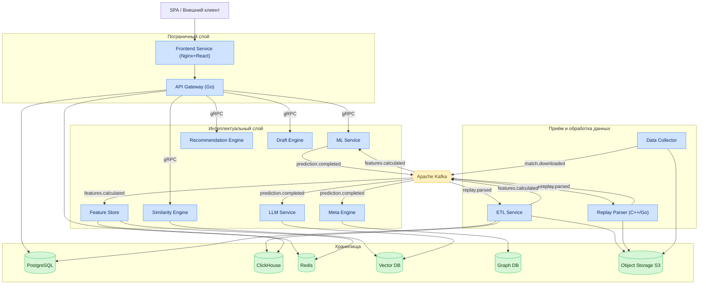
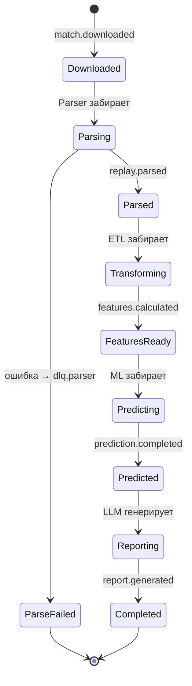

# Глава 2. Микросервисная архитектура и инфраструктура

## 2.1. Глобальная топология системы

Платформа реализует распределённую микросервисную архитектуру. Взаимодействие между сервисами
разделено на два контура:

- **Синхронный высокопроизводительный RPC-контур** на базе **gRPC** — для запросов «запрос-ответ»
  с низкой латентностью (например, ML-инференс, поиск похожих матчей).
- **Асинхронный событийный конвейер** на базе **Apache Kafka** — для потоковой обработки данных,
  развязки сервисов и обеспечения устойчивости к пиковым нагрузкам.

### 2.1.1. Спецификация 12 ключевых микросервисов

| № | Сервис | Основная технология | Тип нагрузки | Состояние |
|---|---|---|---|---|
| 1 | **API Gateway** | Go | I/O-bound | Stateless |
| 2 | **Data Collector** | Python / Go | I/O-bound | Stateful (планировщик) |
| 3 | **Replay Parser** | C++ / Go | CPU-bound | Stateless |
| 4 | **ETL Service** | Python (Faust/Flink) | CPU+I/O | Stateless |
| 5 | **Feature Store** | Python + Feast | I/O-bound | Stateful |
| 6 | **ML Service** | Python (PyTorch/LightGBM/XGBoost) | CPU/GPU | Stateless |
| 7 | **LLM Service** | Python (RAG-оркестрация) | I/O+GPU | Stateless |
| 8 | **Recommendation Engine** | Python | CPU-bound | Stateless |
| 9 | **Draft Engine** | Go / Python | CPU-bound | Stateless |
| 10 | **Meta Engine** | Python + Graph DB | I/O-bound | Stateful |
| 11 | **Similarity Engine** | Python + Vector DB | CPU-bound | Stateful |
| 12 | **Frontend Service** | React + TypeScript / Nginx | I/O-bound | Stateless |

### 2.1.2. Роли сервисов

- **API Gateway** — единая точка входа. Реализует маршрутизацию, аутентификацию (JWT),
  ограничение частоты запросов (Rate Limiting), терминацию TLS и агрегацию ответов (BFF-паттерн).
- **Data Collector** — модуль планирования и сбора данных из внешних источников (OpenDota API,
  Dotabuff, Liquipedia, официальные API турнирных операторов PGL, ESL, DreamLeague).
- **Replay Parser** — изолированный высокопроизводительный сервис, осуществляющий низкоуровневый
  разбор бинарных файлов `.dem`.
- **ETL Service** — валидация, очистка, нормализация распарсенных данных и их маршрутизация в
  ClickHouse и PostgreSQL.
- **Feature Store** — централизованный реестр признаков для обслуживания ML-моделей в реальном
  времени и формирования обучающих выборок.
- **ML Service** — контейнеризированная среда исполнения прогнозных моделей (PyTorch, LightGBM,
  XGBoost).
- **LLM Service** — оркестрация больших языковых моделей и RAG-архитектуры для генерации текстовых
  отчётов AI Coach.
- **Recommendation Engine** — построение персональных планов тренировок и подбор обучающих
  материалов на основе профиля игрока.
- **Draft Engine** — симуляция стадии выбора/запрета героев в реальном времени.
- **Meta Engine** — графовый аналитический модуль, отслеживающий тренды винрейтов, популярности
  стратегий и распределения объектов.
- **Similarity Engine** — поиск пространственно-временных и стратегических аналогий в базе
  исторических матчей.
- **Frontend Service** — SPA-приложение на React + TypeScript за отказоустойчивым кластером Nginx.

---

## 2.2. Контейнерная диаграмма (C4 — Level 2)



---

## 2.3. Межсервисное взаимодействие и очереди сообщений

Асинхронное взаимодействие реализуется через шину данных Apache Kafka. Основные топики и типы
событий зафиксированы в таблице.

### 2.3.1. Реестр топиков Kafka

| Топик | Продюсер | Консьюмеры | Формат payload | Партиций | Retention |
|---|---|---|---|---|---|
| `match.downloaded` | Data Collector | Replay Parser | JSON: ID матча, URL `.dem`, метаданные турнира | 24 | 7 дней |
| `replay.parsed` | Replay Parser | ETL Service | Protobuf: бинарный поток событий тиков | 48 | 3 дня |
| `features.calculated` | ETL Service | Feature Store, ML Service | Avro: агрегированные векторы признаков по окнам | 24 | 14 дней |
| `prediction.completed` | ML Service | LLM Service, Meta Engine | JSON: матрицы вероятностей, ID ошибок, векторы аномалий | 12 | 14 дней |
| `report.generated` | LLM Service | API Gateway (notify) | JSON: ID отчёта, ссылка, summary | 6 | 7 дней |
| `meta.updated` | Meta Engine | Draft Engine, Frontend | JSON: снимок меты, дельты винрейтов | 3 | 30 дней |
| `dlq.parser` | Replay Parser | Ops-мониторинг | JSON: причина сбоя, полезная нагрузка | 6 | 30 дней |

### 2.3.2. Стандарты сообщений

- **Ключ партиционирования** — `match_id` (обеспечивает ordering по матчу).
- **Заголовки (headers)** — `trace_id`, `schema_version`, `producer`, `timestamp`, `content_type`.
- **Управление схемами** — Confluent Schema Registry; совместимость `BACKWARD`.
- **Сериализация** — Avro для аналитики, Protobuf для высокочастотных потоков, JSON для событий
  управления.

### 2.3.3. Конверт события (envelope)

```json
{
  "event_id": "e2b1c9a4-6f0d-4b1a-9c5e-1f2a3b4c5d6e",
  "event_type": "replay.parsed",
  "schema_version": "1.3.0",
  "trace_id": "9f8e7d6c-...",
  "occurred_at": "2026-07-13T10:22:31.114Z",
  "producer": "replay-parser@2.0.0",
  "partition_key": "match_id:7654321098",
  "payload": { "...": "..." }
}
```

---

## 2.4. Синхронный контур: gRPC

Внутренние RPC-вызовы используют gRPC поверх HTTP/2 с mTLS. Контракты определяются в
Protobuf-файлах (см. [приложение proto](../proto/)).

### 2.4.1. Матрица gRPC-зависимостей

| Вызывающий | Вызываемый | RPC-метод | Таймаут | Ретраи |
|---|---|---|---|---|
| API Gateway | ML Service | `Predict` | 2 с | 1 |
| API Gateway | Similarity Engine | `FindSimilar` | 2 с | 2 |
| API Gateway | Draft Engine | `SimulateDraft` | 1.5 с | 1 |
| API Gateway | Recommendation | `BuildPlan` | 2 с | 1 |
| ETL Service | Feature Store | `WriteFeatures` | 3 с | 3 |
| ML Service | Feature Store | `GetOnlineFeatures` | 500 мс | 2 |
| LLM Service | Similarity Engine | `RetrieveContext` | 2 с | 1 |

### 2.4.2. Политики устойчивости

| Механизм | Реализация | Параметры |
|---|---|---|
| Circuit Breaker | gRPC interceptor | порог 50% ошибок / окно 10 с |
| Retry с backoff | экспоненциальный + jitter | base 100 мс, max 3 попытки |
| Deadline propagation | контекст gRPC | наследование от входящего запроса |
| Bulkhead | пул соединений на зависимость | max 100 conn/сервис |
| Rate limiting | token bucket на Gateway | по пользователю и по endpoint |

---

## 2.5. Архитектурные паттерны

| Паттерн | Где применяется | Зачем |
|---|---|---|
| **API Gateway / BFF** | Пограничный слой | Единая точка входа, агрегация, безопасность |
| **Database per Service** | Все сервисы с состоянием | Изоляция схем, независимый деплой |
| **Event-driven / Pub-Sub** | Конвейер данных | Развязка, устойчивость, масштабирование |
| **CQRS** | Аналитика vs. транзакции | PostgreSQL (write) / ClickHouse (read-heavy) |
| **Saga (хореография)** | Пайплайн обработки матча | Долгие распределённые процессы без 2PC |
| **Outbox** | ETL, Data Collector | Атомарность записи в БД и публикации события |
| **Sidecar** | Все поды | mTLS, метрики, трейсинг (service mesh) |
| **Strangler Fig** | Multi-game расширение | Постепенная замена Dota-специфики абстракциями |
| **Anti-Corruption Layer** | Интеграция внешних API | Защита ядра от чужих моделей данных |

### 2.5.1. Saga обработки матча (хореография)



---

## 2.6. Инфраструктурный ландшафт

### 2.6.1. Технологический стек инфраструктуры

| Слой | Технология | Назначение |
|---|---|---|
| Оркестрация | Kubernetes | Управление контейнерами |
| Service Mesh | Istio / Linkerd | mTLS, трейсинг, трафик-менеджмент |
| Ingress | Nginx Ingress / Envoy | Терминация TLS, маршрутизация |
| Брокер сообщений | Apache Kafka (KRaft) | Событийный конвейер |
| Schema Registry | Confluent Schema Registry | Управление схемами Avro/Protobuf |
| Кэш | Redis Cluster | Онлайн-фичи, сессии, rate-limit |
| OLTP | PostgreSQL (Patroni HA) | Транзакционные данные |
| OLAP | ClickHouse (шардированный) | Аналитические выборки |
| Vector DB | Qdrant / Milvus | Эмбеддинги для Similarity/RAG |
| Graph DB | Neo4j / JanusGraph | Граф синергии героев |
| Object Storage | S3-совместимое (MinIO) | Реплеи, артефакты моделей |
| Workflow | Apache Airflow | Пакетные пайплайны и переобучение |
| IaC | Terraform + Helm | Провижининг и деплой |
| Секреты | Vault / Sealed Secrets | Управление секретами |
| CI/CD | GitHub Actions + ArgoCD | Сборка и GitOps-деплой |
| Observability | Prometheus, Grafana, Loki, Tempo | Метрики, логи, трейсы |

### 2.6.2. Матрица окружений

| Окружение | Назначение | Данные | Масштаб |
|---|---|---|---|
| `dev` | Локальная разработка | Синтетические/семпл | 1 реплика/сервис |
| `staging` | Предрелизная валидация | Анонимизированный срез прод | ~30% прод |
| `production` | Боевая эксплуатация | Полные данные | Автоскейлинг |
| `ml-training` | Обучение моделей | DVC-датасеты | GPU-узлы по требованию |

---

## 2.7. Принципы проектирования и ADR

Ключевые архитектурные решения фиксируются в формате **Architecture Decision Record (ADR)** в
каталоге `docs/adr/`. Обзор основных решений:

| ADR | Решение | Обоснование |
|---|---|---|
| ADR-001 | Kafka как основная шина событий | Высокая пропускная способность, retention, replay |
| ADR-002 | ClickHouse для событий реплеев | Колоночное хранение, скорость агрегаций |
| ADR-003 | gRPC для внутренних вызовов | Латентность, строгие контракты, стриминг |
| ADR-004 | Парсер на C++/Go | CPU-эффективность разбора бинарного потока |
| ADR-005 | Feast как Feature Store | Единый онлайн/офлайн реестр признаков |
| ADR-006 | Istio service mesh | mTLS и наблюдаемость без изменения кода |
| ADR-007 | Абстракция ядра под Multi-game | NFR-EXT-01, перенос на Deadlock/LoL |

Детальные ответственности, SLO и внутренняя структура каждого сервиса раскрыты в
[Главе 3](03-specifikaciya-servisov.md).
