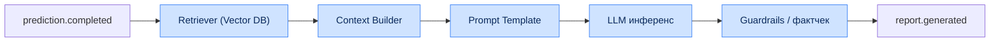

# Глава 3. Детальная спецификация микросервисов

Каждый сервис описан по единому шаблону: назначение, зоны ответственности, технологический стек,
входные/выходные интерфейсы, владение данными, зависимости, стратегия масштабирования, целевые
показатели уровня обслуживания (SLO) и режимы отказа.

---

## 3.1. Общий шаблон и сводная матрица

### 3.1.1. Сводная матрица сервисов

| Сервис | Язык/рантайм | Протоколы | Владеет данными | Ключевой SLO |
|---|---|---|---|---|
| API Gateway | Go | REST, WS, gRPC-client | — | p95 ≤ 300 мс |
| Data Collector | Python/Go | REST-client, Kafka | Реестр источников | Полнота сбора ≥ 99% |
| Replay Parser | C++/Go | Kafka, gRPC | — (stateless) | ≤ 10 с/реплей |
| ETL Service | Python | Kafka, gRPC | Staging-таблицы | Лаг ≤ 30 с |
| Feature Store | Python+Feast | gRPC, Redis, CH | Реестр фич | GetOnline p95 ≤ 50 мс |
| ML Service | Python | gRPC, Kafka | Артефакты моделей | Predict p95 ≤ 400 мс |
| LLM Service | Python | gRPC, Kafka, REST | Промпты, кэш RAG | Отчёт ≤ 8 с |
| Recommendation | Python | gRPC | Планы тренировок | BuildPlan ≤ 2 с |
| Draft Engine | Go/Python | gRPC | Кэш драфтов | SimulateDraft ≤ 1.5 с |
| Meta Engine | Python+Graph | gRPC, Kafka | Граф меты | Обновление ≤ 24 ч |
| Similarity Engine | Python+Vector | gRPC | Индекс эмбеддингов | FindSimilar ≤ 2 с |
| Frontend Service | React/Nginx | HTTPS | — | LCP ≤ 2.5 с |

### 3.1.2. Матрица «сервис × хранилище» (CRUD)

| Сервис / Хранилище | PostgreSQL | ClickHouse | Redis | Vector DB | Graph DB | S3 | Kafka |
|---|---|---|---|---|---|---|---|
| API Gateway | R | — | RW | — | — | — | — |
| Data Collector | RW | — | R | — | — | W | P |
| Replay Parser | — | — | — | — | — | RW | P/C |
| ETL Service | RW | W | — | — | — | R | P/C |
| Feature Store | — | R | RW | — | — | — | C |
| ML Service | — | R | R | — | — | R | P/C |
| LLM Service | R | — | R | R | — | — | C |
| Recommendation | R | R | R | R | — | — | — |
| Draft Engine | R | R | RW | — | R | — | C |
| Meta Engine | R | R | — | — | RW | — | P/C |
| Similarity Engine | — | R | R | RW | — | — | — |

> R — чтение, W — запись, P — продюсер Kafka, C — консьюмер Kafka.

---

## 3.2. API Gateway

| Атрибут | Значение |
|---|---|
| **Назначение** | Единая точка входа для всех внешних клиентов. |
| **Технологии** | Go, Gin/Fiber, gRPC-клиент, Redis. |
| **Тип** | Stateless, горизонтально масштабируемый. |

**Зоны ответственности:**

- Терминация TLS 1.3 и проксирование к внутренним сервисам.
- Аутентификация (валидация JWT) и авторизация (RBAC-проверки).
- Rate limiting (token bucket) по пользователю, IP и endpoint.
- Агрегация ответов (BFF) для составных экранов фронтенда.
- Управление WebSocket-соединениями для live-обновлений (WP, драфт).
- Прокидывание `trace_id` и сбор метрик задержек.

**Основные эндпоинты (обзор, полный контракт — Гл. 7):**

| Метод | Путь | Назначение |
|---|---|---|
| POST | `/api/v1/matches/upload` | Загрузка реплея |
| GET | `/api/v1/matches/{id}/analysis` | Результат анализа |
| POST | `/api/v1/draft/simulate` | Симуляция драфта |
| GET | `/api/v1/players/{id}/profile` | Профиль игрока |
| POST | `/api/v1/similarity/search` | Поиск похожих |
| WS | `/api/v1/live/{match_id}` | Live win probability |

**SLO:** доступность ≥ 99.95%, p95 ≤ 300 мс, error rate < 0.1%.

**Режимы отказа:** при недоступности downstream-сервиса — graceful degradation
(частичный ответ + флаг `partial: true`), circuit breaker, fallback на кэш.

---

## 3.3. Data Collector

| Атрибут | Значение |
|---|---|
| **Назначение** | Планирование и сбор данных из внешних источников. |
| **Технологии** | Python (APScheduler/Celery) или Go, HTTP-клиенты, S3. |
| **Тип** | Stateful (хранит курсоры/расписания). |

**Зоны ответственности:**

- Периодический опрос OpenDota, Dotabuff, Liquipedia, API турнирных операторов.
- Дедупликация матчей по `match_id` и idempotency-ключам.
- Скачивание `.dem` в Object Storage, публикация `match.downloaded`.
- Соблюдение лимитов внешних API (adaptive rate limiting, backoff).
- Anti-Corruption Layer: приведение чужих моделей к внутренней схеме.

**Стратегии сбора:**

| Источник | Режим | Частота | Особенности |
|---|---|---|---|
| OpenDota | pull (REST) | каждые 5 мин | пагинация по seq_num |
| Tournament Operators | webhook + pull | по событию | приоритетная очередь |
| Dotabuff | scraping/REST | каждый час | вежливый rate-limit |
| Liquipedia | REST/MediaWiki | ежедневно | ростеры, расписания |

**SLO:** полнота сбора публичных матчей ≥ 99%, лаг обнаружения нового матча ≤ 10 мин.

---

## 3.4. Replay Parser

| Атрибут | Значение |
|---|---|
| **Назначение** | Низкоуровневый разбор бинарных `.dem` (Source 2 Demo). |
| **Технологии** | C++17 (ядро) + Go (обвязка/gRPC), Protobuf. |
| **Тип** | Stateless, CPU-bound, вертикально усиленный. |

**Зоны ответственности:**

- Декодирование сжатого потока Protobuf-сообщений и сетевых сущностей.
- Извлечение позиций, экономики, событий боя, обзора карты (см. Гл. 5).
- Сериализация нормализованного потока событий в Protobuf → `replay.parsed`.
- Обработка повреждённых файлов → `dlq.parser`.

**Ключевые NFR:** NFR-PERF-01 (≤ 10 с/40-мин реплей), NFR-PERF-04 (≥ 2000 реплеев/ч на кластер).

**Внутренние подмодули:**

| Модуль | Ответственность |
|---|---|
| `DemoReader` | Чтение кадров, распаковка (snappy/LZ4) |
| `EntityDecoder` | Декодирование сетевых сущностей и delta-обновлений |
| `StringTables` | Разбор строковых таблиц (герои, предметы) |
| `EventExtractor` | Комбат-лог, покупки, варды, способности |
| `Serializer` | Формирование выходного Protobuf-потока |

**SLO:** успешность парсинга ≥ 99.5%, p95 времени парсинга ≤ 10 с.

---

## 3.5. ETL Service

| Атрибут | Значение |
|---|---|
| **Назначение** | Валидация, очистка, нормализация и маршрутизация данных. |
| **Технологии** | Python (Faust/Flink), Great Expectations, Avro. |
| **Тип** | Stateless стрим-процессор. |

**Зоны ответственности:**

- Потребление `replay.parsed`, дедупликация и валидация качества (см. Гл. 5.4).
- Обогащение (join с метаданными матча/игроков).
- Оконная агрегация признаков (temporal windows) → `features.calculated`.
- Запись сырых событий в ClickHouse, структурированных сущностей в PostgreSQL.
- Реализация Outbox-паттерна для атомарности записи и публикации.

**SLO:** сквозной лаг обработки ≤ 30 с (p95), доля отброшенных «грязных» записей < 0.5%.

---

## 3.6. Feature Store

| Атрибут | Значение |
|---|---|
| **Назначение** | Централизованный реестр признаков (online/offline). |
| **Технологии** | Python + Feast, Redis (online), ClickHouse (offline). |
| **Тип** | Stateful. |

**Зоны ответственности:**

- Регистрация определений признаков (feature views) и их версий.
- Онлайн-обслуживание (`GetOnlineFeatures`) с латентностью p95 ≤ 50 мс.
- Формирование обучающих выборок с корректностью point-in-time (no leakage).
- Мониторинг свежести и покрытия признаков.

**Категории признаков (обзор):**

| Группа | Примеры | Обновление |
|---|---|---|
| Лейнинг | LH@5, DN@5, отклонение фарма | по матчу |
| Экономика | GPM, XPM, net worth timeline | по окну |
| Позиционирование | средняя позиция, Safety Index | по окну |
| Драфт | эмбеддинги героев, синергия | по патчу |
| Игрок | исторический винрейт, MMR | ежедневно |

**SLO:** `GetOnlineFeatures` p95 ≤ 50 мс, свежесть онлайн-фич ≤ 1 мин.

---

## 3.7. ML Service

| Атрибут | Значение |
|---|---|
| **Назначение** | Исполнение прогнозных моделей. |
| **Технологии** | Python, PyTorch, LightGBM, XGBoost, Triton/ONNX Runtime. |
| **Тип** | Stateless, CPU/GPU. |

**Зоны ответственности:**

- Загрузка версий моделей из Model Registry (MLflow).
- Инференс: Win Probability, Laning Evaluator, Draft Predictor, Error Detection.
- Публикация `prediction.completed`.
- A/B и shadow-деплой моделей, сбор метрик качества в проде.

**Обслуживаемые модели (детали — Гл. 6):**

| Модель | Алгоритм | Задача |
|---|---|---|
| Win Probability | ансамбль (GBDT+NN) | регрессия вероятности |
| Laning Evaluator | XGBoost Regressor | оценка лейнинга |
| Draft Predictor | GNN (PyTorch) | прогноз винрейта драфта |
| Error Detection | LightGBM Classifier | классификация ошибок |

**SLO:** `Predict` p95 ≤ 400 мс, доступность ≥ 99.9%.

---

## 3.8. LLM Service

| Атрибут | Значение |
|---|---|
| **Назначение** | Генерация текстовых разборов AI Coach через RAG. |
| **Технологии** | Python, LLM-оркестратор, Vector DB, кэш промптов. |
| **Тип** | Stateless, I/O+GPU. |

**Зоны ответственности:**

- Формирование контекста RAG: извлечение релевантных фактов о матче/мете из Vector DB.
- Шаблонизация промптов и вызов LLM с ограничением стоимости/латентности.
- Пост-обработка: структурирование отчёта, валидация фактов (guardrails).
- Кэширование ответов по сигнатуре запроса.

**Конвейер RAG:**

**SLO:** генерация отчёта ≤ 8 с (p95), доля отчётов, отклонённых guardrails < 2%.

---

## 3.9. Recommendation Engine

| Атрибут | Значение |
|---|---|
| **Назначение** | Персональные планы тренировок и подбор материалов. |
| **Технологии** | Python, гибрид (collaborative + content-based + rule). |
| **Тип** | Stateless. |

**Зоны ответственности:**

- Анализ профиля слабых сторон игрока (по Error Detection и метрикам).
- Построение приоритезированного плана упражнений/материалов.
- Ранжирование обучающего контента по релевантности и уровню.

**SLO:** `BuildPlan` p95 ≤ 2 с, покрытие рекомендациями ≥ 95% активных игроков.

---

## 3.10. Draft Engine

| Атрибут | Значение |
|---|---|
| **Назначение** | Симуляция стадии pick/ban в реальном времени. |
| **Технологии** | Go/Python, кэш Redis, GNN-инференс (через ML Service). |
| **Тип** | Stateless, CPU-bound. |

**Зоны ответственности:**

- Пошаговая симуляция драфта с учётом банов, синергии и контр-пиков.
- Рекомендация следующего пика/бана с оценкой ожидаемого винрейта.
- Учёт текущей меты (из Meta Engine) и патча.

**SLO:** `SimulateDraft` p95 ≤ 1.5 с, стабильность рекомендаций между вызовами.

---

## 3.11. Meta Engine

| Атрибут | Значение |
|---|---|
| **Назначение** | Отслеживание глобальных мета-трендов. |
| **Технологии** | Python, Graph DB (Neo4j/JanusGraph), Airflow. |
| **Тип** | Stateful. |

**Зоны ответственности:**

- Построение и обновление графа синергии/контр-пиков героев.
- Расчёт трендов винрейтов и популярности по патчам и рангам.
- Публикация `meta.updated` для Draft Engine и Frontend.

**SLO:** обновление снимка меты ≤ 24 ч после набора данных, консистентность графа.

---

## 3.12. Similarity Engine

| Атрибут | Значение |
|---|---|
| **Назначение** | Поиск пространственно-временных и стратегических аналогий. |
| **Технологии** | Python, Vector DB (Qdrant/Milvus), ANN-индексы (HNSW). |
| **Тип** | Stateful. |

**Зоны ответственности:**

- Индексация эмбеддингов матчей/игроков/ситуаций.
- ANN-поиск похожих матчей и игроков по вектору признаков.
- Обслуживание RAG-извлечения для LLM Service.

**SLO:** `FindSimilar` p95 ≤ 2 с, recall@10 ≥ 0.9 против точного поиска.

---

## 3.13. Frontend Service

| Атрибут | Значение |
|---|---|
| **Назначение** | Доставка SPA и статики. |
| **Технологии** | React + TypeScript, Zustand, Nginx. |
| **Тип** | Stateless. |

**Зоны ответственности:**

- Раздача собранного SPA-бандла и ассетов через CDN/Nginx.
- Интерактивная 2D-карта (Canvas/WebGL), radar-профили, дашборды.
- Управление клиентским состоянием и WebSocket-подписками.

**SLO:** LCP ≤ 2.5 с, TTI ≤ 3.5 с, доступность статики ≥ 99.95%.
Детали фронтенда — [Глава 8](08-frontend.md).

---

## 3.14. Матрица деградации сервисов

| Отказавший сервис | Влияние на пользователя | Стратегия деградации |
|---|---|---|
| ML Service | Нет свежих предсказаний | Отдавать кэш + баннер «обновление» |
| LLM Service | Нет текстового разбора | Показать метрики без нарратива |
| Similarity Engine | Нет «похожих» | Скрыть блок, ядро работает |
| Draft Engine | Нет live-симуляции | Статические рекомендации меты |
| Meta Engine | Устаревшая мета | Использовать последний снимок |
| Feature Store (online) | Медленный инференс | Fallback на офлайн-фичи |
| Data Collector | Нет новых матчей | Обработка накопленной очереди |
