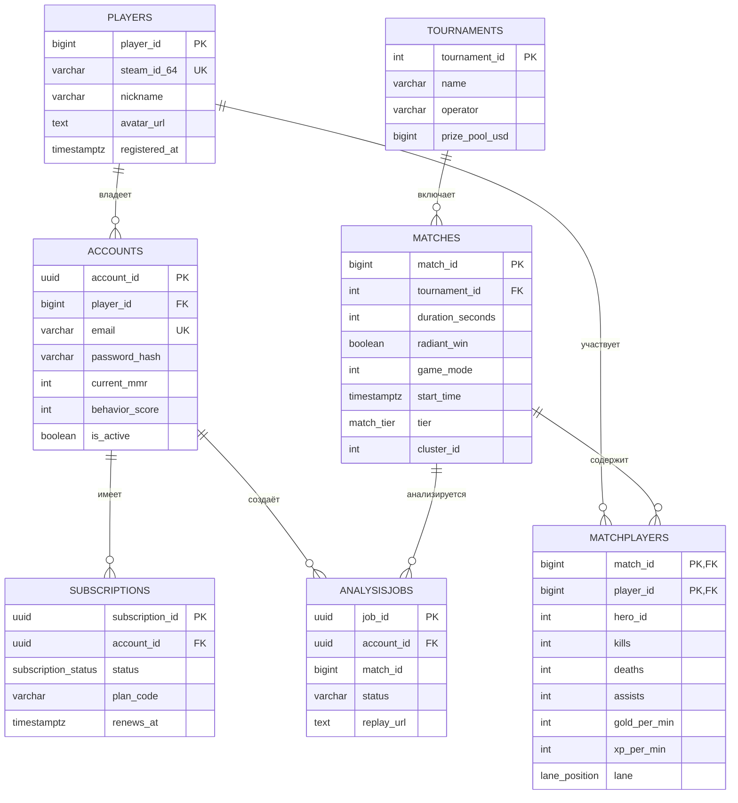
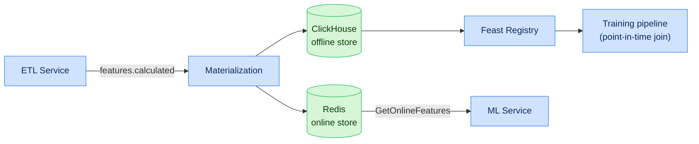

# Глава 4. Архитектура хранилища данных и Feature Store

## 4.1. Стратегия хранения (Polyglot Persistence)

Платформа применяет полиглотное хранение: каждый тип нагрузки обслуживается специализированным
хранилищем. Разделение чтения и записи реализует паттерн **CQRS**.

| Хранилище | Модель | Нагрузка | Данные |
|---|---|---|---|
| PostgreSQL | Реляционная (OLTP) | ACID-транзакции | Игроки, аккаунты, матчи, подписки |
| ClickHouse | Колоночная (OLAP) | Аналитика, агрегации | События реплеев, тайм-серии |
| Redis | Ключ-значение | Кэш, онлайн-фичи | Сессии, rate-limit, online features |
| Vector DB | Векторная (ANN) | Similarity/RAG | Эмбеддинги матчей/игроков |
| Graph DB | Графовая | Обход связей | Граф синергии героев |
| Object Storage | BLOB | Крупные объекты | `.dem`-файлы, артефакты моделей |

---

## 4.2. Реляционный слой (PostgreSQL DDL)

Реляционная СУБД хранит структурированные сущности, требующие ACID-транзакций, контроля
уникальности и строгих реляционных связей.

```sql
-- Создание базовых перечислений (Enums)
CREATE TYPE match_tier AS ENUM ('Pub', 'Premium', 'Professional', 'Tournament');
CREATE TYPE lane_position AS ENUM ('Safe_Safe', 'Safe_Mid', 'Mid', 'Off_Safe', 'Off_Mid', 'Roaming');
CREATE TYPE subscription_status AS ENUM ('active', 'past_due', 'canceled', 'trialing');

-- Таблица игроков
CREATE TABLE Players (
    player_id      BIGINT PRIMARY KEY,
    steam_id_64    VARCHAR(20) UNIQUE NOT NULL,
    nickname       VARCHAR(100) NOT NULL,
    avatar_url     TEXT,
    registered_at  TIMESTAMP WITH TIME ZONE DEFAULT NOW(),
    updated_at     TIMESTAMP WITH TIME ZONE DEFAULT NOW()
);

-- Таблица игровых аккаунтов системы
CREATE TABLE Accounts (
    account_id      UUID PRIMARY KEY DEFAULT gen_random_uuid(),
    player_id       BIGINT REFERENCES Players(player_id) ON DELETE CASCADE,
    email           VARCHAR(255) UNIQUE NOT NULL,
    password_hash   VARCHAR(255) NOT NULL,
    current_mmr     INT DEFAULT 0,
    behavior_score  INT DEFAULT 10000,
    is_active       BOOLEAN DEFAULT TRUE,
    created_at      TIMESTAMP WITH TIME ZONE DEFAULT NOW()
);

-- Таблица матчей
CREATE TABLE Matches (
    match_id          BIGINT PRIMARY KEY,
    tournament_id     INT,
    duration_seconds  INT NOT NULL,
    radiant_win       BOOLEAN NOT NULL,
    game_mode         INT NOT NULL,
    lobby_type        INT NOT NULL,
    start_time        TIMESTAMP WITH TIME ZONE NOT NULL,
    tier              match_tier DEFAULT 'Pub',
    cluster_id        INT NOT NULL,
    patch_version     VARCHAR(16)
);

-- Таблица участников матчей (Промежуточная таблица M:N)
CREATE TABLE MatchPlayers (
    match_id      BIGINT REFERENCES Matches(match_id) ON DELETE CASCADE,
    player_id     BIGINT REFERENCES Players(player_id) ON DELETE RESTRICT,
    hero_id       INT NOT NULL,
    player_slot   INT NOT NULL,
    kills         INT DEFAULT 0,
    deaths        INT DEFAULT 0,
    assists       INT DEFAULT 0,
    gold_per_min  INT NOT NULL,
    xp_per_min    INT NOT NULL,
    lane          lane_position,
    PRIMARY KEY (match_id, player_id)
);

-- Турниры
CREATE TABLE Tournaments (
    tournament_id  INT PRIMARY KEY,
    name           VARCHAR(200) NOT NULL,
    operator       VARCHAR(50),
    prize_pool_usd BIGINT,
    start_date     DATE,
    end_date       DATE
);

-- Подписки
CREATE TABLE Subscriptions (
    subscription_id UUID PRIMARY KEY DEFAULT gen_random_uuid(),
    account_id      UUID REFERENCES Accounts(account_id) ON DELETE CASCADE,
    status          subscription_status NOT NULL DEFAULT 'trialing',
    plan_code       VARCHAR(50) NOT NULL,
    started_at      TIMESTAMP WITH TIME ZONE DEFAULT NOW(),
    renews_at       TIMESTAMP WITH TIME ZONE
);

-- Задания анализа (jobs)
CREATE TABLE AnalysisJobs (
    job_id          UUID PRIMARY KEY DEFAULT gen_random_uuid(),
    account_id      UUID REFERENCES Accounts(account_id),
    match_id        BIGINT,
    status          VARCHAR(20) NOT NULL DEFAULT 'queued',
    replay_url      TEXT,
    created_at      TIMESTAMP WITH TIME ZONE DEFAULT NOW(),
    completed_at    TIMESTAMP WITH TIME ZONE
);

-- Индексы
CREATE INDEX idx_matches_start_time ON Matches (start_time DESC);
CREATE INDEX idx_matches_tier ON Matches (tier);
CREATE INDEX idx_matchplayers_hero ON MatchPlayers (hero_id);
CREATE INDEX idx_jobs_account_status ON AnalysisJobs (account_id, status);
```

### 4.2.1. Словарь ключевых таблиц

| Таблица | Назначение | Кардинальность (оценка) |
|---|---|---|
| `Players` | Игроки Steam | ~50M |
| `Accounts` | Аккаунты платформы | ~1M |
| `Matches` | Матчи | > 100M |
| `MatchPlayers` | Участники (10 на матч) | > 1B |
| `Tournaments` | Турниры | ~10K |
| `Subscriptions` | Подписки | ~1M |
| `AnalysisJobs` | Задания анализа | десятки млн |

---

## 4.3. ER-диаграмма реляционной модели



---

## 4.4. Аналитический слой (ClickHouse)

ClickHouse применяется для колоночного хранения высокоинтенсивных потоков событий из реплеев.
Схема оптимизирована под агрегацию пространственных координат.

```sql
CREATE TABLE default.ReplayEvents (
    match_id      UInt64,
    tick          UInt32,
    game_time     Int32,
    event_type    Enum8('DAMAGE'=1, 'HEAL'=2, 'KILL'=3, 'ABILITY_CAST'=4,
                        'ITEM_PURCHASE'=5, 'WARD_PLACE'=6),
    player_id     UInt64,
    target_id     UInt64,
    x             Float32,
    y             Float32,
    z             Float32,
    value_amount  Int32,
    inflictor     String
) ENGINE = ReplacingMergeTree()
PARTITION BY toYYYYMM(FROM_UNIXTIME(game_time))
ORDER BY (match_id, event_type, tick, player_id);
```

### 4.4.1. Дополнительные аналитические таблицы

```sql
-- Тайм-серия экономики по игроку (для WP и графиков net worth)
CREATE TABLE default.EconomyTimeline (
    match_id       UInt64,
    player_id      UInt64,
    game_time      Int32,
    net_worth      Int32,
    total_gold     Int32,
    total_xp       Int32,
    lh             UInt16,
    dn             UInt16
) ENGINE = MergeTree()
PARTITION BY toYYYYMM(FROM_UNIXTIME(game_time))
ORDER BY (match_id, player_id, game_time);

-- Позиции для тепловых карт (downsampled)
CREATE TABLE default.PositionSnapshots (
    match_id   UInt64,
    player_id  UInt64,
    game_time  Int32,
    x          Float32,
    y          Float32,
    is_alive   UInt8
) ENGINE = MergeTree()
PARTITION BY toYYYYMM(FROM_UNIXTIME(game_time))
ORDER BY (match_id, game_time, player_id);

-- Материализованное представление винрейта героев по патчам
CREATE MATERIALIZED VIEW default.HeroWinrateMV
ENGINE = SummingMergeTree()
ORDER BY (patch_version, hero_id)
AS SELECT
    patch_version, hero_id,
    countIf(won) AS wins,
    count() AS games
FROM default.HeroMatchResults
GROUP BY patch_version, hero_id;
```

### 4.4.2. Принципы моделирования ClickHouse

| Принцип | Реализация |
|---|---|
| Партиционирование | по месяцу (`toYYYYMM`) для эффективного TTL |
| Сортировка (ORDER BY) | по частым фильтрам: `match_id`, `event_type` |
| Дедупликация | `ReplacingMergeTree` по ключу сортировки |
| Предагрегация | Materialized Views (`SummingMergeTree`) |
| TTL | сырые события — 18 мес, агрегаты — бессрочно |
| Шардирование | по `match_id` (Distributed-таблицы) |
| Кодеки сжатия | `Delta`, `DoubleDelta`, `ZSTD` для тайм-серий |

---

## 4.5. Feature Store

Feature Store (на базе Feast) обеспечивает единый доступ к признакам для обучения (offline) и
инференса (online), гарантируя отсутствие рассинхронизации (training/serving skew).

### 4.5.1. Архитектура Feature Store



### 4.5.2. Реестр Feature Views

| Feature View | Сущность | Признаки | Online | TTL |
|---|---|---|---|---|
| `laning_fv` | (match_id, player_id) | lh_5, dn_5, dmg_5, consumables_5 | да | 90 дн |
| `economy_fv` | (match_id, player_id) | gpm, xpm, nw_10, nw_20 | да | 90 дн |
| `position_fv` | (match_id, player_id, window) | avg_x, avg_y, safety_index | да | 30 дн |
| `draft_fv` | (patch, hero_id) | hero_embedding, synergy_vec | да | по патчу |
| `player_fv` | (player_id) | hist_winrate, mmr, main_role | да | 1 дн |

### 4.5.3. Гарантии корректности

| Гарантия | Механизм |
|---|---|
| No data leakage | Point-in-time correct join по `event_timestamp` |
| Свежесть онлайн-фич | Материализация ≤ 1 мин после `features.calculated` |
| Версионирование | Каждый feature view версионируется; изменения через PR |
| Обнаружение дрейфа | PSI по ключевым фичам (см. Гл. 10) |

---

## 4.6. Управление жизненным циклом данных

| Категория | Хранилище | Retention | Действие по истечении |
|---|---|---|---|
| `.dem`-файлы | S3 | 90 дней (Pub), бессрочно (Pro) | перенос в архив/удаление |
| Сырые события | ClickHouse | 18 месяцев | TTL DROP |
| Агрегаты/MV | ClickHouse | бессрочно | — |
| Онлайн-фичи | Redis | 24 часа | eviction |
| PII (аккаунты) | PostgreSQL | до удаления по запросу | GDPR-erasure |
| Артефакты моделей | S3 + MLflow | по политике версий | архивирование |

### 4.6.1. Резервное копирование и восстановление

| Хранилище | Стратегия | RPO | RTO |
|---|---|---|---|
| PostgreSQL | WAL-архивация + PITR | ≤ 5 мин | ≤ 30 мин |
| ClickHouse | инкрементальные бэкапы в S3 | ≤ 1 ч | ≤ 2 ч |
| Vector/Graph DB | снапшоты | ≤ 6 ч | ≤ 2 ч |
| S3 | версионирование + репликация | ≈ 0 | ≤ 15 мин |
