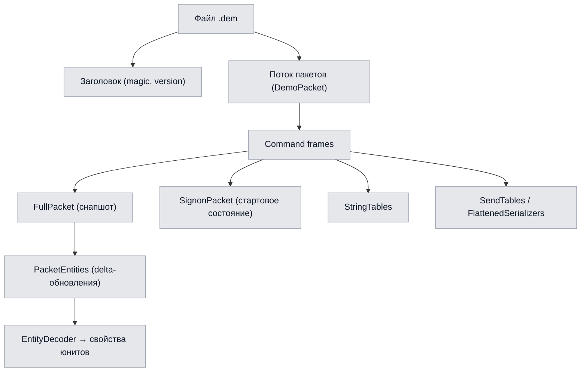
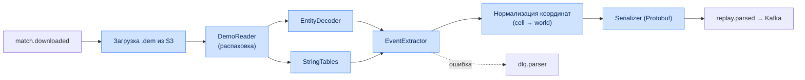
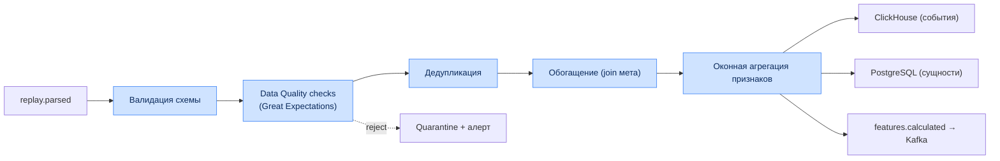
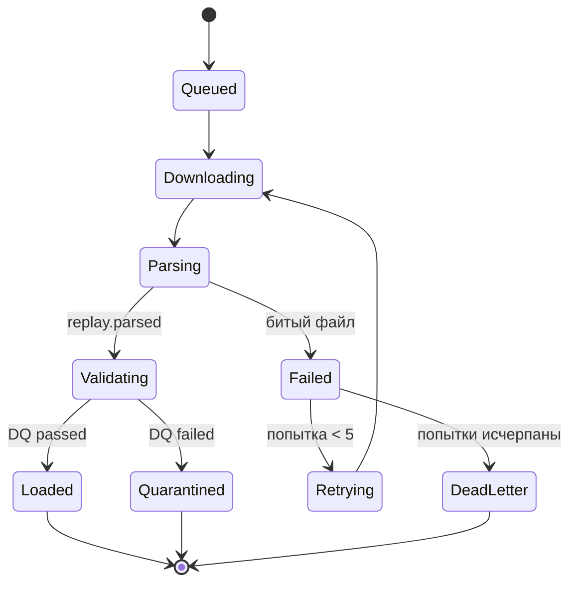

# Глава 5. Модуль обработки данных и Replay Parser

## 5.1. Спецификация низкоуровневого парсинга файлов .dem

Файлы реплеев Dota 2 (формат Source 2 Demo) представляют собой сжатый поток сообщений, упакованных
с помощью Google Protocol Buffers. Парсер считывает кадры (Ticks) и сетевые сущности
(Networked Entities).

### 5.1.1. Извлекаемые категории данных

| Категория данных | Метод извлечения и обработки | Периодичность / Триггер |
|---|---|---|
| **Координаты объектов** | Чтение сетевых свойств `m_cellX`, `m_cellY`, `m_vecOrigin` для каждого активного юнита (герои, крипы, варды, призванные существа). | Каждый 3-й тик (~100 мс) |
| **Vision (обзор карты)** | Отслеживание `CDOTA_NPC_Observer_Ward` и `CDOTA_NPC_Sentry_Ward`. Расчёт полигона видимости с учётом высоты ландшафта (Grid Nav). | При создании/уничтожении сущности |
| **Экономика игроков** | Чтение `m_iTotalEarnedGold`, `m_iCurrentGold`, `m_iTotalEarnedXP` из таблицы данных игрока. | Ежесекундно (каждый 30-й тик) |
| **Боевые события** | Разбор combat log: урон, лечение, смерти, применение способностей и предметов. | По событию combat log |
| **Покупки предметов** | События `DOTA_COMBATLOG_PURCHASE` и изменения инвентаря. | По событию |
| **Способности** | Касты, уровни прокачки, кулдауны из entity-свойств. | По событию / изменению |
| **Цели/объективы** | Разрушение башен, казармы, Рошан, руны. | По событию |

### 5.1.2. Формат Source 2 Demo (структура)



### 5.1.3. Внутренний конвейер парсера



---

## 5.2. Преобразование координат

Координаты в Source 2 хранятся в клеточной системе (cell + offset). Мировые координаты
вычисляются по формуле:

$$
x_{world} = (cell_x - 2^{n-1}) \cdot S_{cell} + offset_x
$$

$$
y_{world} = (cell_y - 2^{n-1}) \cdot S_{cell} + offset_y
$$

где $S_{cell} = 128$ юнитов — размер клетки, $n$ — разрядность клеточных координат, $offset$ —
дробное смещение внутри клетки (`m_vecOrigin`). Полученные мировые координаты далее проецируются
в координаты миникарты для тепловых карт.

| Параметр | Значение |
|---|---|
| Размер клетки `S_cell` | 128 игровых юнитов |
| Полный размер карты | ~16384 × 16384 юнитов |
| Частота дискретизации позиций | каждый 3-й тик (~10 Гц) |
| Downsampling для heatmap | до ~1 Гц при сохранении |

---

## 5.3. Спецификация выходных событий (Protobuf)

Парсер сериализует нормализованный поток в Protobuf-сообщение `ParsedReplay`.

```proto
syntax = "proto3";
package dota.replay.v1;

message ParsedReplay {
  uint64 match_id = 1;
  uint32 duration_ticks = 2;
  repeated PlayerMeta players = 3;
  repeated GameEvent events = 4;
  ReplayMeta meta = 5;
}

message GameEvent {
  uint32 tick = 1;
  int32 game_time = 2;
  EventType type = 3;
  uint64 player_id = 4;
  uint64 target_id = 5;
  Vec3 position = 6;
  int32 value_amount = 7;
  string inflictor = 8;
}

message Vec3 { float x = 1; float y = 2; float z = 3; }

enum EventType {
  UNKNOWN = 0;
  DAMAGE = 1;
  HEAL = 2;
  KILL = 3;
  ABILITY_CAST = 4;
  ITEM_PURCHASE = 5;
  WARD_PLACE = 6;
  POSITION = 7;
  ECONOMY = 8;
  OBJECTIVE = 9;
}
```

Соответствие типов событий и целевых таблиц:

| EventType | Целевая таблица ClickHouse | Комментарий |
|---|---|---|
| DAMAGE/HEAL/KILL | `ReplayEvents` | боевые события |
| ABILITY_CAST | `ReplayEvents` | касты способностей |
| ITEM_PURCHASE | `ReplayEvents` | покупки |
| WARD_PLACE | `ReplayEvents` | варды (vision) |
| POSITION | `PositionSnapshots` | позиции (heatmap) |
| ECONOMY | `EconomyTimeline` | экономика |
| OBJECTIVE | `ReplayEvents` | объективы |

---

## 5.4. ETL-конвейер и качество данных

ETL Service потребляет `replay.parsed`, валидирует и нормализует данные, после чего маршрутизирует
их в хранилища и публикует агрегированные признаки.

### 5.4.1. Стадии ETL



### 5.4.2. Правила качества данных (Data Quality)

| Правило | Проверка | Действие при нарушении |
|---|---|---|
| DQ-01 | `match_id` уникален и присутствует | reject → quarantine |
| DQ-02 | `duration_seconds` в диапазоне [300, 7200] | флаг подозрительного |
| DQ-03 | ровно 10 игроков на матч | reject |
| DQ-04 | координаты в границах карты | клиппинг + флаг |
| DQ-05 | монотонность `game_time` | сортировка/коррекция |
| DQ-06 | GPM/XPM ≥ 0 и в разумных пределах | флаг аномалии |
| DQ-07 | отсутствие «дыр» в тиках > N | интерполяция позиций |

### 5.4.3. Оконная агрегация признаков

| Окно | Длительность | Признаки |
|---|---|---|
| Laning | 0–10 мин | LH/DN@5, урон, расходники, отклонение фарма |
| Mid-game | 10–25 мин | net worth, ротации, участие в файтах |
| Late-game | 25+ мин | контроль объективов, teamfight WP-дельты |
| Скользящее | 2 мин | средняя позиция, Safety Index |

---

## 5.5. Идемпотентность и обработка ошибок

| Механизм | Реализация |
|---|---|
| Idempotency key | `match_id` + `schema_version` |
| Дедупликация | `ReplacingMergeTree` в CH + upsert в PG |
| Повторная обработка | reprocess-эндпоинт с тем же ключом (без дублей) |
| DLQ | `dlq.parser` с причиной и полезной нагрузкой |
| Ретраи | экспоненциальный backoff, max 5 попыток |
| Poison-pill защита | лимит попыток → карантин + алерт |

### 5.5.1. Жизненный цикл задания парсинга



---

## 5.6. Производительность и масштабирование парсинга

| Параметр | Значение / стратегия |
|---|---|
| Тип нагрузки | CPU-bound |
| Масштабирование | Горизонтальное (партиции Kafka = степень параллелизма) |
| Целевая пропускная способность | ≥ 2000 реплеев/час на кластер (NFR-PERF-04) |
| Целевое время | ≤ 10 с на 40-мин реплей (NFR-PERF-01) |
| Автоскейлинг | HPA по лагу консьюмер-группы `replay.parsed` |
| Профилирование | flamegraph по горячим путям EntityDecoder |
| Оптимизации | zero-copy чтение, пулы буферов, SIMD-декодинг |

Целевые ресурсы пода парсера и политика HPA описаны в
[Главе 12](12-razvertyvanie.md#124-автоскейлинг).
