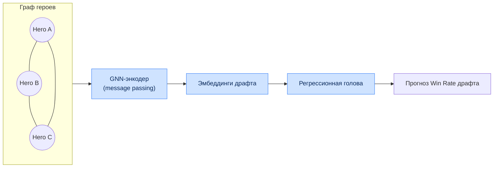

# Глава 6. Математические модели, ИИ и модули оценки

## 6.1. Математический аппарат оценки игры

Центральным элементом аналитического ядра является расчёт динамической вероятности победы
(Win Probability — $WP$) в каждый дискретный момент времени $t$. Изменение вероятности победы
($\Delta WP$) под влиянием действия игрока $A$ определяет ценность или ошибочность данного действия.

### 6.1.1. Динамическое изменение Win Probability

Формула динамического изменения вероятности победы:

$$
\Delta WP(t) = WP(t) - WP(t - \Delta t)
$$

где $WP(t) = f(F_t, M_t)$, $F_t$ — вектор признаков состояния матча из Feature Store, $M_t$ —
обученная ансамблевая модель.

Интерпретация знака приращения:

| Условие | Интерпретация | Использование |
|---|---|---|
| $\Delta WP > 0$ | Действие повысило шансы команды | положительный вклад игрока |
| $\Delta WP < 0$ | Действие снизило шансы | кандидат в ошибки |
| $\lvert \Delta WP \rvert > \tau$ | Критический момент | подсветка в разборе |

Атрибуция приращения конкретному игроку $p$ выполняется как доля его вклада в изменение состояния:

$$
\Delta WP_p(t) = \Delta WP(t) \cdot \frac{c_p(t)}{\sum_{k=1}^{10} c_k(t)}
$$

где $c_p(t)$ — вклад игрока в событие (нанесённый урон, участие в убийстве, установка варда и т.п.).

### 6.1.2. Модель позиционного риска (Safety Index)

Индекс позиционного риска $SI$ определяет степень опасности нахождения героя в точке $(x, y)$ в
момент $t$ при отсутствии прямой видимости вражеских героев:

$$
SI(x, y, t) = \sum_{i=1}^{5} P_{alive}(H_i) \cdot \int_{0}^{D_{max}} \mathcal{N}\!\left(\mu_{pos}(H_i), \sigma^2 \cdot \Delta t\right) \, d\mathbf{s}
$$

где:

- $P_{alive}(H_i)$ — вероятность того, что вражеский герой $H_i$ жив;
- $\mathcal{N}(\mu_{pos}(H_i), \sigma^2 \cdot \Delta t)$ — плотность вероятности пространственного
  распределения положения врага, рассчитанная по последней известной позиции, скорости
  передвижения и доступным телепортам;
- $D_{max}$ — максимальная дистанция, покрываемая врагом за интервал $\Delta t$.

| Символ | Смысл | Источник |
|---|---|---|
| $P_{alive}(H_i)$ | вероятность жизни врага | тайминги смертей/респауна |
| $\mu_{pos}(H_i)$ | ожидаемая позиция врага | последняя видимость + скорость |
| $\sigma$ | неопределённость позиции | растёт со временем невидимости |
| $\Delta t$ | время с последней видимости | из combat/vision-логов |
| $D_{max}$ | радиус досягаемости | скорость + TP-скроллы |

### 6.1.3. Прочие производные метрики

| Метрика | Формула / определение | Назначение |
|---|---|---|
| Farm Efficiency | $FE = \dfrac{GPM_{факт}}{GPM_{идеал}(hero, t)}$ | оценка фарма |
| Lane Deviation | среднеквадратичное отклонение траектории от идеальной | оценка лейнинга |
| Map Control | доля площади карты под обзором команды | контроль карты |
| Tempo | скорость набора net worth advantage | темп игры |
| Impact Score | $\sum_t \Delta WP_p(t)$ за матч | суммарный вклад игрока |

---

## 6.2. Спецификация архитектур машинного обучения

### 6.2.1. Каталог моделей

| Имя модели | Алгоритмический стек | Входные параметры (Features) | Выходные параметры (Targets) |
|---|---|---|---|
| **Win Probability** | Ансамбль: LightGBM + NN-калибратор | Net worth diff, объективы, состав живых героев, тайминги, Map Control | Вероятность победы Radiant ∈ [0,1] |
| **Laning Evaluator** | XGBoost Regressor | LH/DN на 5-й минуте, урон по оппоненту, использованные расходники, отклонение от идеальной траектории фарма | Коэффициент эффективности лейнинга (Score 0–1.0) |
| **Draft Predictor** | Graph Neural Network (GNN) + PyTorch | Матрица смежности графа синергии героев, эмбеддинги игроков, текущие баны, глобальный винрейт героев в патче | Прогноз базового Win Rate драфта до старта |
| **Error Detection Engine** | LightGBM Classifier | Вектор приращения золота/опыта, $\Delta WP$, индекс позиционного риска, тайминг потери выкупа (Buyback) | Класс ошибки: позиционный провал, неоптимальный макро-ротейшн, критическая смерть |

### 6.2.2. Модель Win Probability — детализация

**Целевая переменная:** бинарный исход (`radiant_win`), обучение на исторических матчах.

**Признаки (основные группы):**

| Группа | Признаки |
|---|---|
| Экономика | net worth diff, GPM/XPM diff, разница по предметам |
| Объективы | башни, казармы, Рошан, руны |
| Состояние | число живых героев, доступность buyback, кулдауны ульт |
| Время | игровое время, фаза игры |
| Позиционные | Map Control, средняя близость к объективам |

**Калибровка:** изотоническая регрессия / Platt scaling поверх выхода GBDT; целевой Brier ≤ 0.18.

**Инференс:** потоковый — WP пересчитывается каждые N секунд игрового времени для построения кривой.

### 6.2.3. Draft Predictor — граф синергии

| Компонент графа | Смысл |
|---|---|
| Узел | герой (с фичами: роль, атрибуты, винрейт) |
| Ребро (внутри команды) | синергия пары героев |
| Ребро (между командами) | контр-пик / counter-matchup |
| Вес ребра | статистическая сила связи в патче |

### 6.2.4. Error Detection Engine — классы ошибок

| Класс ошибки | Триггерные признаки | Пример |
|---|---|---|
| Позиционный провал | высокий $SI$ + $\Delta WP < 0$ + смерть | смерть в тумане войны без обзора |
| Неоптимальный ротейшн | низкий вклад + упущенный объектив | ганк без результата, потеря темпа |
| Критическая смерть | смерть при доступном buyback не использован | потеря хайграунда |
| Экономическая ошибка | отрицательное отклонение GPM + простой | неэффективный фарм-паттерн |
| Драфт-ошибка | низкая синергия/контра | пик без учёта состава |

---

## 6.3. Обучающие данные и признаки

### 6.3.1. Формирование обучающих выборок

| Аспект | Подход |
|---|---|
| Источник | ClickHouse (offline store) через Feast |
| Корректность | point-in-time join (без утечки будущего) |
| Разбиение | по времени: train (старые патчи) / val / test (свежий патч) |
| Балансировка | стратификация по рангам и исходам |
| Версионирование | DVC-датасеты, привязка к commit |

### 6.3.2. Метрики качества моделей

| Модель | Основная метрика | Целевое значение |
|---|---|---|
| Win Probability | Brier score / LogLoss | ≤ 0.18 |
| Laning Evaluator | RMSE / R² | R² ≥ 0.75 |
| Draft Predictor | AUC / accuracy@draft | AUC ≥ 0.70 |
| Error Detection | F1 (macro) | ≥ 0.82 |

### 6.3.3. Стратегия валидации

- **Кросс-валидация по времени** (time-series split) для исключения утечки.
- **Backtesting** на исторических турнирах для проверки калибровки WP.
- **Ошибка на срезах** (slice-based): по рангам, ролям, патчам, длительности.
- **Human-in-the-loop**: разметка выборки ошибок экспертами-аналитиками для эталона.

---

## 6.4. RAG-архитектура LLM Service (математический контекст)

LLM Service использует численные выходы моделей как факты для генерации нарратива. Извлечение
контекста основано на близости эмбеддингов ситуаций:

$$
\text{score}(q, d) = \cos(\mathbf{e}_q, \mathbf{e}_d) = \frac{\mathbf{e}_q \cdot \mathbf{e}_d}{\lVert \mathbf{e}_q \rVert \, \lVert \mathbf{e}_d \rVert}
$$

где $\mathbf{e}_q$ — эмбеддинг текущей игровой ситуации, $\mathbf{e}_d$ — эмбеддинги эталонных
ситуаций/знаний в Vector DB. Top-$k$ ближайших используются как контекст для промпта.

| Параметр RAG | Значение |
|---|---|
| Размерность эмбеддинга | 768 / 1024 (конфигурируемо) |
| Индекс | HNSW (Qdrant/Milvus) |
| $k$ (top-k) | 5–10 |
| Метрика | косинусная близость |
| Guardrails | сверка чисел отчёта с фактами моделей |

---

## 6.5. Управление неопределённостью и объяснимость

| Аспект | Механизм |
|---|---|
| Доверительные интервалы WP | бутстрэп-ансамбль / квантильная регрессия |
| Объяснимость предсказаний | SHAP-значения для GBDT-моделей |
| Важность признаков | глобальный и локальный feature importance |
| Отказ от предсказания | порог уверенности → «недостаточно данных» |
| Дрейф | PSI-мониторинг (см. [Главу 10](10-mlops-cicd.md)) |

Объяснимость критична для доверия пользователей: каждая выявленная ошибка сопровождается
списком признаков, наиболее повлиявших на решение модели (локальные SHAP-значения).
