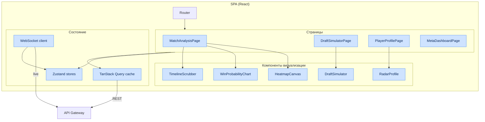
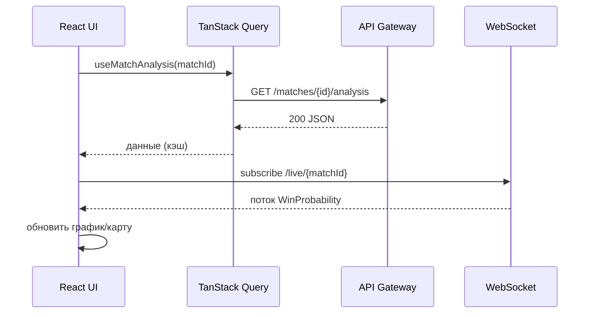

# Глава 8. Архитектура фронтенда и визуализация

## 8.1. Структура React + TypeScript приложения

Интерфейсный слой платформы строится на модульном принципе с использованием стейт-менеджера
**Zustand** для минимизации перерисовок при рендере интерактивных карт.

### 8.1.1. Технологический стек фронтенда

| Слой | Технология | Назначение |
|---|---|---|
| Язык | TypeScript (strict) | Типобезопасность |
| UI-фреймворк | React 18 | Компонентный рендер |
| Стейт-менеджер | Zustand | Локальное/глобальное состояние |
| Серверное состояние | TanStack Query | Кэш и синхронизация с API |
| Рендер карт | Canvas 2D / WebGL (PixiJS) | Тепловые карты, траектории |
| Графики | Recharts / D3 | Radar, линейные графики |
| Роутинг | React Router | Навигация SPA |
| Сборка | Vite | Бандлинг и HMR |
| Стилизация | CSS Modules / Tailwind | Изоляция стилей |
| Транспорт | REST (TanStack Query) + WebSocket | Данные и live-обновления |
| Тесты | Vitest + Testing Library + Playwright | Unit/component/e2e |

### 8.1.2. Диаграмма компонентной архитектуры

---

## 8.2. Ключевые компоненты визуализации

### 8.2.1. Интерактивная 2D-карта (Canvas/WebGL)

Покомпонентная отрисовка миникарты Dota 2 с несколькими слоями:

| Слой | Содержание | Технология |
|---|---|---|
| Базовый | текстура миникарты | Canvas/WebGL |
| Heatmap | плотность позиций игрока/команды | WebGL-шейдер |
| Траектории | движение команд во время тимфайтов | Canvas paths |
| Vision | полигоны зон обзора (варды) | Canvas polygons |
| События | маркеры смертей, объективов | спрайты |
| Тайм-скраббер | привязка к `game_time` | overlay |

**Требования к производительности рендера:**

| Метрика | Цель |
|---|---|
| FPS при воспроизведении | ≥ 60 |
| Точек в heatmap без лагов | ≥ 50 000 |
| Время первичной отрисовки карты | ≤ 200 мс |

### 8.2.2. Компонент сравнения профилей (Radar Charts)

Графический модуль, накладывающий метрики текущего пользователя на полигоны профессиональных
игроков (Radar Charts) с использованием библиотеки **Recharts**.

| Ось radar | Метрика |
|---|---|
| Farming | Farm Efficiency |
| Fighting | Impact Score в файтах |
| Laning | Laning Evaluator score |
| Vision | вклад в Map Control |
| Objectives | участие в объективах |
| Positioning | 1 − средний Safety Index риск |

### 8.2.3. Win Probability Chart и Timeline

- Линейный график WP по игровому времени с подсветкой критических моментов ($\lvert\Delta WP\rvert > \tau$).
- Скраббер синхронизирует позицию на графике, карте и списке событий.
- Наложение net worth advantage и таймингов объективов.

### 8.2.4. Draft Simulator

Интерактивный интерфейс pick/ban:

- Сетка героев с фильтрами по роли/атрибуту.
- Live-запрос к `POST /draft/simulate` с дебаунсом.
- Отображение прогноза винрейта и рекомендаций (через WebSocket для live-режима).

---

## 8.3. Управление состоянием

### 8.3.1. Zustand-хранилища

| Store | Ответственность |
|---|---|
| `useMatchStore` | текущий матч, выбранный `game_time`, слои карты |
| `useDraftStore` | состояние драфта, рекомендации |
| `usePlayerStore` | профиль, метрики, план тренировок |
| `useAuthStore` | JWT, пользователь, права |
| `useUIStore` | тема, модалки, тосты |

### 8.3.2. Разделение серверного и клиентского состояния

| Тип данных | Инструмент |
|---|---|
| Данные с сервера (кэшируемые) | TanStack Query |
| Live-поток (WP, драфт) | WebSocket → Zustand |
| Локальный UI-стейт | Zustand |
| Форма/валидация | локальный стейт компонента |

---

## 8.4. Взаимодействие с API

### 8.4.1. Обработка состояний загрузки/ошибок

| Состояние | UI-поведение |
|---|---|
| loading | скелетоны компонентов |
| partial (`partial:true`) | баннер «данные обновляются» |
| error 4xx | сообщение с действием пользователя |
| error 5xx/503 | ретрай + деградация (показ кэша) |
| rate-limited 429 | тост «слишком часто», backoff |

---

## 8.5. Производительность и доступность фронтенда

### 8.5.1. Целевые метрики (Web Vitals)

| Метрика | Цель |
|---|---|
| LCP | ≤ 2.5 с |
| TTI | ≤ 3.5 с |
| CLS | ≤ 0.1 |
| INP | ≤ 200 мс |
| Размер начального бандла | ≤ 250 КБ gzip |

### 8.5.2. Оптимизации

| Техника | Применение |
|---|---|
| Code splitting | по маршрутам и тяжёлым компонентам (карта) |
| Lazy loading | Draft Simulator, WebGL-слои |
| Memoization | `React.memo`, `useMemo` для тяжёлых расчётов |
| Виртуализация | длинные списки матчей/событий |
| Web Workers | подготовка данных heatmap вне main-thread |
| CDN | статика и ассеты миникарты |

### 8.5.3. Доступность (a11y) и i18n

| Аспект | Реализация |
|---|---|
| Клавиатурная навигация | все интерактивные элементы фокусируемы |
| ARIA | роли и метки для графиков (альтернативные таблицы) |
| Контраст | соответствие WCAG AA |
| Интернационализация | ключи перевода (ru/en), формат чисел/дат |
| Тема | светлая/тёмная, синхронизация с системой |

---

## 8.6. Сборка и развёртывание фронтенда

| Аспект | Решение |
|---|---|
| Сборка | Vite → статические ассеты |
| Раздача | Nginx (кластер) + CDN |
| Кэширование | хеши в именах файлов, `immutable` для ассетов |
| Конфигурация | runtime-config через `/config.json` |
| Мониторинг | Web Vitals → аналитика, Sentry для ошибок |

Инфраструктура развёртывания Frontend Service описана в
[Главе 12](12-razvertyvanie.md).
