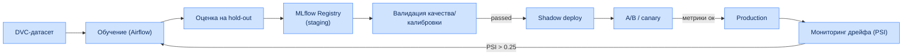
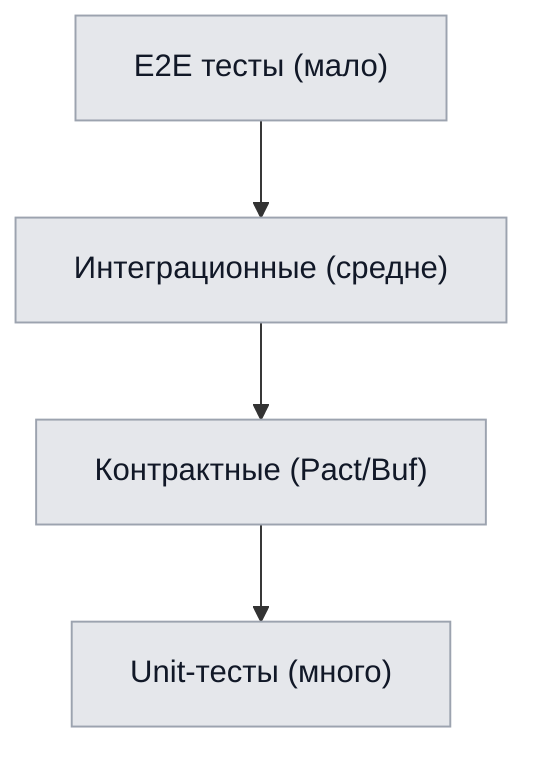

# Глава 10. MLOps, тестирование, логирование и CI/CD

## 10.1. Конвейер MLOps и управление дрейфом данных

Для обеспечения стабильности предсказаний в условиях изменения игровой меты внедряется следующий
технологический стек:

- **MLflow Model Registry** — хранение версий моделей, весов нейросетей и артефактов запусков
  обучения.
- **DVC (Data Version Control)** — версионирование бинарных датасетов признаков, извлечённых из
  ClickHouse.
- **Evidently AI / Monitoring Layer** — автоматический расчёт метрики **Population Stability Index
  (PSI)** каждые 24 часа. При превышении порога дрейфа данных ($PSI > 0.25$) инициируется пайплайн
  автоматического переобучения моделей на свежем пуле матчей из **Apache Airflow**.

### 10.1.1. Полный жизненный цикл модели



### 10.1.2. Формула PSI

$$
PSI = \sum_{i=1}^{B} \left( p_i^{curr} - p_i^{ref} \right) \cdot \ln\!\left( \frac{p_i^{curr}}{p_i^{ref}} \right)
$$

где $B$ — число бинов, $p_i^{ref}$ и $p_i^{curr}$ — доли наблюдений в бине $i$ на эталонном и
текущем распределениях.

| Диапазон PSI | Интерпретация | Действие |
|---|---|---|
| $PSI < 0.1$ | Дрейфа нет | без действий |
| $0.1 \le PSI \le 0.25$ | Умеренный дрейф | наблюдение, алерт warning |
| $PSI > 0.25$ | Значимый дрейф | автопереобучение |

### 10.1.3. Мониторинг качества моделей в проде

| Метрика | Модель | Порог алерта |
|---|---|---|
| Brier score (rolling) | Win Probability | > 0.20 |
| F1 (по размеченным) | Error Detection | < 0.78 |
| Feature drift (PSI) | все | > 0.25 |
| Prediction drift | все | резкий сдвиг распределения |
| Latency p95 | все | > SLO |

---

## 10.2. Пайплайны обучения (Airflow)

| DAG | Триггер | Действие |
|---|---|---|
| `retrain_win_probability` | PSI-алерт / расписание | переобучение WP-модели |
| `retrain_draft_gnn` | новый патч | обновление графа + GNN |
| `refresh_meta_graph` | ежедневно | пересчёт меты |
| `materialize_features` | по расписанию | материализация фич (Feast) |
| `data_quality_report` | ежедневно | отчёт качества данных |

### 10.2.1. Критерии продвижения модели (gates)

| Гейт | Критерий |
|---|---|
| G1: качество | метрика ≥ baseline на hold-out |
| G2: калибровка | Brier ≤ порог (для WP) |
| G3: срезы | нет деградации на ключевых срезах |
| G4: shadow | согласованность с текущей ≥ порога |
| G5: canary | нет роста ошибок/латентности |

---

## 10.3. Стратегия тестирования

### 10.3.1. Пирамида тестов



| Уровень | Что покрывает | Инструменты | Цель покрытия |
|---|---|---|---|
| Unit | функции, модули | pytest, go test, Vitest | ≥ 80% критич. |
| Контрактные | REST/gRPC/Avro-схемы | Pact, Buf, schema-compat | 100% контрактов |
| Интеграционные | сервис + БД + Kafka | Testcontainers | ключевые потоки |
| E2E | пользовательские сценарии | Playwright | UC-01…UC-08 |
| Нагрузочные | NFR-PERF/SCAL | k6, Locust | пороги NFR |
| ML-тесты | данные, модель, инвариантность | Great Expectations, deepchecks | ключевые модели |

### 10.3.2. Специфичные для ML тесты

| Тип | Проверка |
|---|---|
| Data tests | схема, диапазоны, доля пропусков |
| Invariance tests | инвариантность к нерелевантным пертурбациям |
| Directional tests | ожидаемое направление влияния фичи |
| Calibration tests | согласованность вероятностей с частотами |
| Regression tests | не хуже предыдущей версии на бенчмарке |

### 10.3.3. Валидация NFR в CI

| NFR | Автоматическая проверка |
|---|---|
| NFR-PERF-01 | нагрузочный тест парсера на эталонном реплее |
| NFR-PERF-02/03 | k6-профиль латентности API |
| NFR-SCAL-01 | тест выборок на большом синтетическом датасете |
| NFR-SEC-* | SAST/SCA/секрет-сканы, проверка mTLS |

---

## 10.4. CI/CD и GitOps

### 10.4.1. Конвейер CI/CD

```mermaid
flowchart LR
    PR["Pull Request"] --> LINT["Lint + format"]
    LINT --> TEST["Unit + contract tests"]
    TEST --> SEC["SAST/SCA/secret-scan"]
    SEC --> BUILD["Build образов"]
    BUILD --> SIGN["Подпись + SBOM"]
    SIGN --> PUSH["Push в registry"]
    PUSH --> ARGO["ArgoCD sync (GitOps)"]
    ARGO --> STG["Staging"]
    STG --> IT["Integration + e2e"]
    IT --> CAN["Canary → Production"]
    classDef svc fill:#cfe3ff,stroke:#3b82f6,color:#0b2a5b;
    class LINT,TEST,SEC,BUILD,SIGN,PUSH,ARGO,STG,IT,CAN svc;
```



### 10.4.2. Стратегии деплоя

| Стратегия | Применение |
|---|---|
| Rolling update | stateless-сервисы по умолчанию |
| Blue/Green | API Gateway, критичные сервисы |
| Canary | ML Service (модели), рискованные изменения |
| Shadow | новые версии моделей (без влияния на юзера) |

### 10.4.3. Пример CI-пайплайна (`ci-cd-pipeline.yml`, фрагмент)

```yaml
name: ci-cd-pipeline
on: [push, pull_request]
jobs:
  test:
    runs-on: ubuntu-latest
    steps:
      - uses: actions/checkout@v4
      - name: Lint
        run: make lint
      - name: Unit tests
        run: make test
      - name: Contract tests
        run: make contract-test
  security:
    runs-on: ubuntu-latest
    steps:
      - name: SCA + SAST
        run: make security-scan
  build:
    needs: [test, security]
    runs-on: ubuntu-latest
    steps:
      - name: Build & sign images
        run: make build sign sbom
      - name: Push
        run: make push
```

---

## 10.5. Логирование и наблюдаемость (связь с Гл. 11)

| Аспект | Стандарт |
|---|---|
| Формат логов | структурированный JSON |
| Обязательные поля | `timestamp`, `level`, `service`, `trace_id`, `span_id` |
| Уровни | DEBUG/INFO/WARN/ERROR |
| PII в логах | запрещены (маскирование) |
| Корреляция | сквозной `trace_id` через все сервисы |

Полная стратегия метрик, трейсинга, алертов и error budget описана в
[Главе 11](11-nablyudaemost.md).

---

## 10.6. Управление артефактами и версиями

| Артефакт | Хранилище | Версионирование |
|---|---|---|
| Модели | MLflow + S3 | semver + run_id |
| Датасеты | DVC + S3 | хеш содержимого |
| Образы | Container Registry | тег = git sha |
| Схемы | Schema Registry | версия схемы |
| Helm-чарты | Chart repo | semver |
| IaC | Git (Terraform) | commit |
