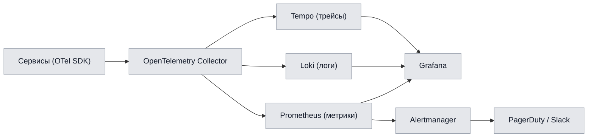

# Глава 11. Наблюдаемость, мониторинг и SRE

## 11.1. Три столпа наблюдаемости

Наблюдаемость платформы строится на трёх столпах — **метрики, логи, трейсы** — объединённых
сквозным `trace_id` и единым стеком визуализации.

| Столп | Технология | Назначение |
|---|---|---|
| Метрики | Prometheus + Grafana | числовые временные ряды, алерты |
| Логи | Loki (+ Promtail) | структурированные события |
| Трейсы | Tempo + OpenTelemetry | распределённая трассировка |
| Профилирование | Pyroscope (опц.) | CPU/mem-профили |

---

## 11.2. Метрики

### 11.2.1. Классификация метрик

| Тип | Метод (RED/USE) | Примеры |
|---|---|---|
| Rate | RED | запросов/с по endpoint |
| Errors | RED | доля 5xx, доля reject в ETL |
| Duration | RED | латентность p50/p95/p99 |
| Utilization | USE | CPU/mem/GPU |
| Saturation | USE | лаг Kafka-консьюмеров, глубина очередей |
| Errors (ресурс) | USE | OOMKilled, рестарты подов |

### 11.2.2. Ключевые бизнес- и системные метрики

| Метрика | Тип | Владелец |
|---|---|---|
| `replay_parse_duration_seconds` | histogram | Replay Parser |
| `etl_consumer_lag` | gauge | ETL Service |
| `ml_predict_latency_seconds` | histogram | ML Service |
| `api_request_duration_seconds` | histogram | API Gateway |
| `wp_brier_score_rolling` | gauge | ML Service |
| `feature_freshness_seconds` | gauge | Feature Store |
| `kafka_topic_lag` | gauge | все консьюмеры |
| `job_completion_rate` | counter | ETL/Gateway |

---

## 11.3. Распределённая трассировка

| Аспект | Реализация |
|---|---|
| Стандарт | W3C Trace Context (`traceparent`) |
| Пропагация | через HTTP, gRPC-метаданные, Kafka-заголовки |
| Инструментирование | OpenTelemetry SDK (авто + ручное) |
| Сэмплирование | tail-based (ошибки и медленные — всегда) |
| Корреляция с логами | `trace_id`/`span_id` в каждом логе |

Трейс сквозного сценария UC-01 охватывает: Gateway → ETL → Parser → ML → LLM, позволяя увидеть,
на каком шаге теряется время.

---

## 11.4. Логирование

| Аспект | Стандарт |
|---|---|
| Формат | JSON |
| Обязательные поля | `timestamp`, `level`, `service`, `trace_id`, `span_id`, `message` |
| Запрещено | PII, секреты, полные payload |
| Ротация/retention | горячие 14 дней, холодные (S3) 90 дней |
| Индексация | по `service`, `level`, `trace_id` |
| Корреляция | клик из трейса → связанные логи |

---

## 11.5. SLO, SLI и Error Budget

### 11.5.1. Каталог SLO

| Сервис | SLI | SLO | Окно |
|---|---|---|---|
| API Gateway | доступность | 99.95% | 30 дней |
| API Gateway | латентность p95 | ≤ 300 мс | 30 дней |
| Replay Parser | успешность парсинга | ≥ 99.5% | 30 дней |
| Replay Parser | время парсинга p95 | ≤ 10 с | 30 дней |
| ML Service | латентность Predict p95 | ≤ 400 мс | 30 дней |
| ETL Service | сквозной лаг p95 | ≤ 30 с | 7 дней |
| Feature Store | GetOnline p95 | ≤ 50 мс | 7 дней |

### 11.5.2. Error Budget

При окне 30 дней и SLO 99.95% допустимый простой ≈ **21.9 мин/мес**. Политика бюджета ошибок:

| Состояние бюджета | Политика |
|---|---|
| Бюджет в норме | обычная скорость релизов |
| Бюджет < 25% | заморозка рискованных изменений |
| Бюджет исчерпан | стоп фич-релизов, фокус на надёжности |

---

## 11.6. Алертинг

### 11.6.1. Принципы

- Алерты **на симптомы** (нарушение SLO), а не на каждый скачок метрики.
- Каждый алерт имеет **runbook** и уровень серьёзности.
- Многоуровневость: warning (Slack) → critical (PagerDuty).

### 11.6.2. Каталог ключевых алертов

| Алерт | Условие | Severity | Runbook |
|---|---|---|---|
| API error budget burn | быстрый расход бюджета | critical | RB-API-01 |
| Parser SLO breach | p95 > 10 с | critical | RB-PARSE-01 |
| Kafka consumer lag | лаг растёт > порога | warning | RB-KAFKA-01 |
| Model drift | PSI > 0.25 | warning | RB-ML-01 |
| WP calibration | Brier > 0.20 | warning | RB-ML-02 |
| DB replication lag | лаг реплики > порога | critical | RB-DB-01 |
| Pod crashloop | рестарты > N/5 мин | critical | RB-K8S-01 |

---

## 11.7. Дашборды Grafana

| Дашборд | Аудитория | Панели |
|---|---|---|
| Platform Overview | все | RED по сервисам, SLO-статус |
| Ingestion Pipeline | backend/SRE | лаг Kafka, throughput парсера, ETL |
| ML Health | ML-инженеры | латентность, дрейф, качество моделей |
| API Gateway | backend/SRE | латентность, коды ответов, rate-limit |
| Data Stores | SRE/DBA | нагрузка PG/CH, репликация, диск |
| Business KPIs | product | MAU, конверсия, обработано матчей |

---

## 11.8. SRE-практики

| Практика | Реализация |
|---|---|
| Runbooks | по каждому алерту, версионируются в репо |
| On-call | ротация, эскалация, PagerDuty |
| Postmortems | безобвинительные, с action items |
| Chaos engineering | плановые fault-инъекции в staging |
| Capacity planning | прогноз по трендам метрик и KPI |
| Game days | тренировки реагирования на инциденты |

### 11.8.1. Классификация инцидентов

| Severity | Описание | Целевое время реакции |
|---|---|---|
| SEV-1 | Полный отказ / потеря данных | ≤ 15 мин |
| SEV-2 | Частичная деградация ключевой функции | ≤ 30 мин |
| SEV-3 | Незначительное влияние | ≤ 4 ч |
| SEV-4 | Косметическое | планово |

### 11.8.2. Health-check эндпоинты

| Эндпоинт | Назначение |
|---|---|
| `/healthz` | liveness (процесс жив) |
| `/readyz` | readiness (готов принимать трафик) |
| `/metrics` | экспорт Prometheus-метрик |
| `/startupz` | startup-проба для медленных стартов |
