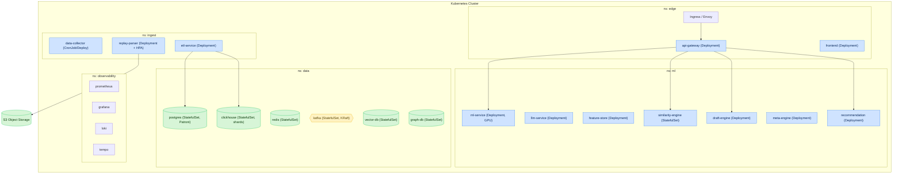

# Глава 12. Развёртывание и инфраструктура (Kubernetes, IaC)

## 12.1. Топология развёртывания

Платформа развёртывается в Kubernetes. Логическое разделение по неймспейсам обеспечивает изоляцию
и управление ресурсами.



---

## 12.2. Kubernetes-манифесты (примеры)

### 12.2.1. Deployment ML Service

```yaml
apiVersion: apps/v1
kind: Deployment
metadata:
  name: ml-service
  namespace: ml
spec:
  replicas: 3
  selector:
    matchLabels: { app: ml-service }
  template:
    metadata:
      labels: { app: ml-service }
    spec:
      containers:
        - name: ml-service
          image: registry/ml-service:{{git_sha}}
          ports: [{ containerPort: 50051 }]
          resources:
            requests: { cpu: "2", memory: "4Gi" }
            limits: { cpu: "4", memory: "8Gi", nvidia.com/gpu: "1" }
          readinessProbe:
            grpc: { port: 50051 }
            initialDelaySeconds: 10
          livenessProbe:
            httpGet: { path: /healthz, port: 8080 }
```

### 12.2.2. HPA парсера (`hpa-parser.yaml`)

```yaml
apiVersion: autoscaling/v2
kind: HorizontalPodAutoscaler
metadata:
  name: replay-parser-hpa
  namespace: ingest
spec:
  scaleTargetRef:
    apiVersion: apps/v1
    kind: Deployment
    name: replay-parser
  minReplicas: 3
  maxReplicas: 50
  metrics:
    - type: External
      external:
        metric:
          name: kafka_consumergroup_lag
          selector:
            matchLabels: { topic: replay.parsed }
        target:
          type: AverageValue
          averageValue: "100"
```

---

## 12.3. Профили ресурсов сервисов

| Сервис | CPU (req/limit) | Mem (req/limit) | GPU | Реплики (min/max) |
|---|---|---|---|---|
| api-gateway | 0.5 / 2 | 512Mi / 1Gi | — | 3 / 20 |
| replay-parser | 2 / 4 | 2Gi / 4Gi | — | 3 / 50 |
| etl-service | 1 / 3 | 2Gi / 4Gi | — | 3 / 20 |
| ml-service | 2 / 4 | 4Gi / 8Gi | 1 (опц.) | 3 / 15 |
| llm-service | 1 / 2 | 2Gi / 4Gi | 1 (опц.) | 2 / 10 |
| feature-store | 1 / 2 | 2Gi / 4Gi | — | 2 / 8 |
| similarity-engine | 2 / 4 | 4Gi / 8Gi | — | 2 / 8 |
| frontend | 0.25 / 1 | 256Mi / 512Mi | — | 3 / 10 |

---

## 12.4. Автоскейлинг

| Сервис | Триггер масштабирования | Метрика |
|---|---|---|
| replay-parser | лаг топика `replay.parsed` | `kafka_consumergroup_lag` |
| etl-service | лаг топика `features.calculated` | лаг + CPU |
| ml-service | RPS / латентность | `ml_predict_latency` + CPU |
| api-gateway | RPS | CPU + RPS |
| frontend | RPS | CPU |

Дополнительно: **KEDA** для событийного масштабирования по Kafka, **Cluster Autoscaler** для
масштабирования узлов, **VPA** (рекомендательный режим) для тюнинга запросов ресурсов.

---

## 12.5. Инфраструктура как код (IaC)

| Слой | Инструмент | Что описывает |
|---|---|---|
| Облачные ресурсы | Terraform | сети, кластеры, БД-инстансы, S3, IAM |
| Приложения | Helm | чарты сервисов, values по окружениям |
| Деплой | ArgoCD | GitOps-синхронизация состояния |
| Секреты | Vault / Sealed Secrets | инъекция секретов |
| Политики | OPA/Gatekeeper | admission-политики безопасности |

### 12.5.1. Структура Terraform (пример)

```hcl
module "network"     { source = "./modules/network" }
module "kubernetes"  { source = "./modules/eks" }
module "postgres"    { source = "./modules/rds-postgres" }
module "clickhouse"  { source = "./modules/clickhouse" }
module "kafka"       { source = "./modules/msk" }
module "object_store"{ source = "./modules/s3" }
```

### 12.5.2. Структура Helm-чартов

```
deployments/
  helm/
    api-gateway/
    replay-parser/
    ml-service/
    ...
    values/
      dev.yaml
      staging.yaml
      production.yaml
```

---

## 12.6. Docker Compose (локальная разработка)

Для локальной разработки используется `docker-compose.yml`, поднимающий облегчённые версии
зависимостей (Kafka, PostgreSQL, ClickHouse, Redis, MinIO) и сервисы в dev-режиме.

| Компонент | Образ (dev) |
|---|---|
| kafka | KRaft single-node |
| postgres | postgres:16 |
| clickhouse | clickhouse/clickhouse-server |
| redis | redis:7 |
| minio | S3-совместимое хранилище |
| kafka-ui / schema-registry | инструменты разработки |

---

## 12.7. Мульти-регион, отказоустойчивость и DR

| Аспект | Стратегия |
|---|---|
| Зоны доступности | распределение подов по AZ (anti-affinity) |
| PodDisruptionBudget | минимум доступных реплик при обслуживании |
| Мульти-регион | активный регион + реплики данных (фаза 2+) |
| Failover БД | Patroni (PG), реплики CH |
| DR | периодические учения восстановления (RPO/RTO — Гл. 4.6) |
| Бэкапы | автоматизированные + проверка восстановления |

---

## 12.8. Управление конфигурацией и окружениями

| Механизм | Использование |
|---|---|
| ConfigMap | некритичная конфигурация |
| Secret (из Vault) | креденшелы, ключи |
| Feature flags | постепенное включение функций |
| Runtime-config фронтенда | `/config.json` без пересборки |
| Namespace-изоляция | edge / ingest / ml / data / observability |

Матрица окружений (`dev`/`staging`/`production`/`ml-training`) — см.
[Главу 2](02-mikroservisnaya-arhitektura.md#262-матрица-окружений).
