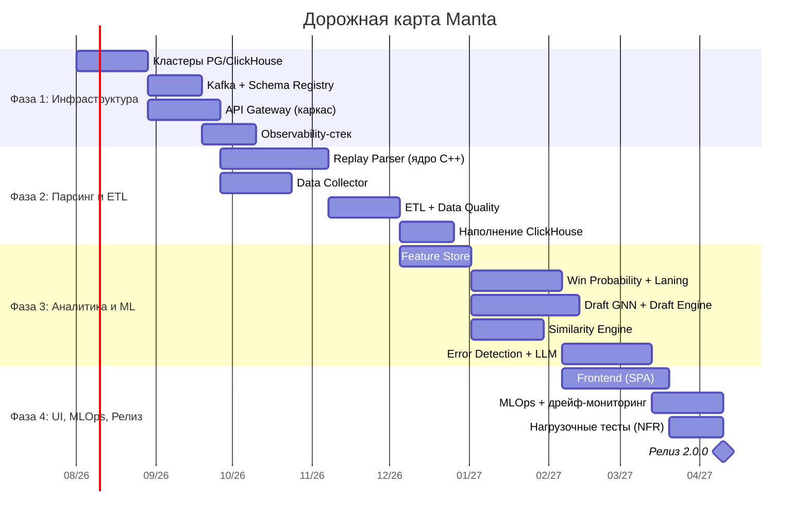
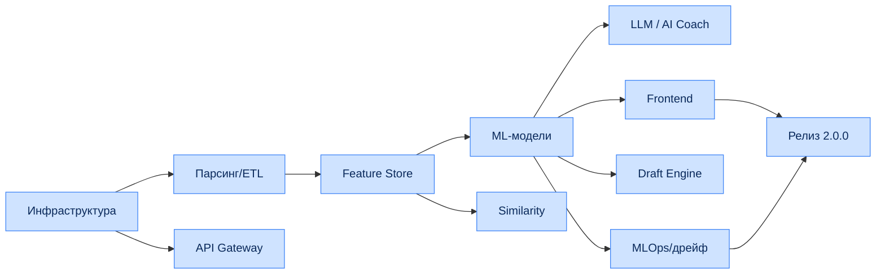

# Глава 14. Дорожная карта реализации (Roadmap)

## 14.1. Фазы проекта

| Фаза | Ключевые контрольные точки (Milestones) | Длительность |
|---|---|---|
| **Фаза 1: Инфраструктура** | Развёртывание кластеров PostgreSQL и ClickHouse, базовая настройка очередей Apache Kafka и API Gateway. | Спринты 1–4 |
| **Фаза 2: Парсинг и ETL** | Завершение разработки ядра Replay Parser на C++, создание конвейеров сборщика данных Data Collector. Наполнение ClickHouse. | Спринты 5–8 |
| **Фаза 3: Аналитика и ML** | Обучение моделей оценки ошибок, развёртывание Feature Store, интеграция сервисов Draft Engine и Similarity Engine. | Спринты 9–14 |
| **Фаза 4: UI, MLOps и Релиз** | Финальная сборка React-приложения, настройка мониторинга дрейфа данных в MLflow, проведение нагрузочных тестов. | Спринты 15–20 |

---

## 14.2. Диаграмма Ганта

---

## 14.3. Детализация спринтов

| Спринт | Фокус | Ключевые результаты |
|---|---|---|
| 1–2 | Bootstrap | репозиторий, CI, кластер K8s, IaC-скелет |
| 3–4 | Хранилища | PG (Patroni), ClickHouse (шарды), Kafka |
| 5–6 | Парсер (ядро) | DemoReader, EntityDecoder, извлечение позиций |
| 7–8 | ETL/Collector | Data Quality, sinks, наполнение CH |
| 9–10 | Feature Store | feature views, online/offline, материализация |
| 11–12 | ML базовый | Win Probability, Laning Evaluator, калибровка |
| 13–14 | Граф/поиск | Draft GNN, Meta Engine, Similarity Engine |
| 15–16 | Error/LLM | Error Detection, RAG, AI Coach |
| 17–18 | Frontend | карта, графики, драфт-симулятор |
| 19 | MLOps | дрейф-мониторинг, автопереобучение |
| 20 | Релиз | нагрузочные тесты, приёмка NFR, go-live |

---

## 14.4. Критерии приёмки по фазам (Definition of Done)

| Фаза | Критерии приёмки |
|---|---|
| Фаза 1 | Кластеры БД доступны с HA; Kafka принимает события; Gateway отдаёт `/healthz`; observability работает |
| Фаза 2 | Парсер укладывается в NFR-PERF-01 на эталоне; ETL наполняет CH; DQ-правила активны |
| Фаза 3 | Модели проходят гейты качества (Гл. 10.2.1); Feature Store отдаёт онлайн-фичи в SLO |
| Фаза 4 | UI проходит e2e (UC-01…UC-08); NFR-PERF/SCAL валидированы нагрузкой; дрейф-мониторинг активен |

---

## 14.5. Зависимости между потоками работ

---

## 14.6. Реестр рисков

| ID | Риск | Вероятн. | Влияние | Стратегия митигации |
|---|---|---|---|---|
| R-01 | Изменение формата `.dem` патчем Valve | Средняя | Высокое | Адаптеры парсера, быстрый релиз-цикл, тесты на фикстурах |
| R-02 | Дрейф меты после мажорного патча | Высокая | Среднее | Автопереобучение (PSI), быстрый rollout моделей |
| R-03 | Недостаточная точность моделей | Средняя | Высокое | Human-in-the-loop разметка, итеративное улучшение |
| R-04 | Лимиты/недоступность внешних API | Средняя | Среднее | Кэш, backoff, несколько источников, ACL |
| R-05 | Пиковые нагрузки (турниры) | Высокая | Среднее | Автоскейлинг, приоритетные очереди |
| R-06 | Стоимость GPU/LLM-инференса | Средняя | Среднее | Кэш ответов, батчинг, квоты, деградация |
| R-07 | Утечка PII | Низкая | Высокое | Шифрование, RBAC, аудит, GDPR-процессы |
| R-08 | Технический долг при спешке | Средняя | Среднее | ADR, code review, порог покрытия тестами |

---

## 14.7. Метрики релиза 2.0.0 (Go-Live checklist)

| Категория | Критерий |
|---|---|
| Функциональность | UC-01…UC-08 проходят e2e |
| Производительность | NFR-PERF-01/02/03/04 валидированы |
| Масштабируемость | NFR-SCAL-01 подтверждён на нагрузке |
| Надёжность | NFR-SLA-01 (99.95%) в staging ≥ 2 недели |
| Безопасность | пройдены SAST/SCA/пентест, GDPR-процессы |
| Наблюдаемость | дашборды, алерты, runbooks готовы |
| MLOps | дрейф-мониторинг и автопереобучение активны |
| Документация | спецификация, ADR, runbooks актуальны |

---

## 14.8. Пострелизная эволюция (Multi-game и за пределами)

| Направление | Описание |
|---|---|
| Multi-game (NFR-EXT-01) | абстракция ядра, адаптеры под Deadlock/LoL |
| Мобильные приложения | нативные клиенты поверх того же API |
| Реальное время на трансляциях | расширение live-контура (WP-оверлеи) |
| Маркетплейс аналитики | B2B-API и партнёрские интеграции |
| Персонализация AI Coach | дообучение под стиль игрока |

На этом основная часть спецификации завершается. Приложения (OpenAPI, gRPC proto) находятся в
каталогах [`openapi/`](../openapi/) и [`proto/`](../proto/).
